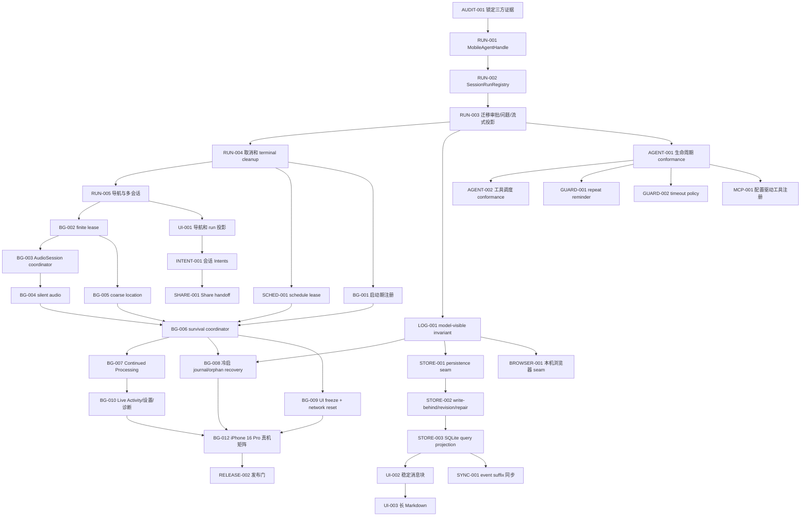

# DeepSeek Harness Mobile 三方对比与 AI 执行进度

> 建立日期：2026-08-24
> 当前 Harness Mobile HEAD：`a9fef03334a3a388ce20438cda0ee50e2e16a5c8`（审计对象包含当前未提交工作树）
> DeepSeek Harness 上游：`b150a551b8d465e31e418e1b2eaf5e79bbb7d28e`（`0.1.1-rc.2`）
> OpenMinis：`9cf3a855fecd27bb5735b84cacbd56852a3ab8dd`
> 当前状态：**`UI-009` / `PLUGIN-011` 自动/模拟器门已闭合；iPhone 16 Pro 的失败重试、真实安装、日志导出、VoiceOver、触控、旋转和性能边界仍保留。**

## 0. 这份文档怎么用

本文件是新的实施真相源：它重新以三方当前源码为证据，回答“DeepSeek Harness 的语义必须保留什么、Harness Mobile 还差什么、OpenMinis 哪些能力可以迁入、AI 应按什么顺序实现”。

- DeepSeek Harness 是产品身份和 Agent 契约来源。
- Harness Mobile 是实际生产代码和当前缺口来源。
- OpenMinis 是 iOS 生命周期、资源管理和产品闭环的参考实现，不是新的核心架构。
- 旧的 DeepSeek Harness 对比/进度文档不作为本轮差异结论的事实来源；后续不得从旧表复制“DONE”。
- 上一版 `Docs/OPENMINIS_COMPARATIVE_AUDIT_2026-08-24.md` **不排除**，但只作为候选池；本文件已经按当前三方源码重新验证并重新分类。
- 不删除旧文档，不覆盖当前工作树中用户已有修改。

AI 每次只能领取本文件中依赖已满足的一个任务。完成代码、自动化测试和该任务规定的验收后，才更新进度表和证据日志。需要真机的任务，没有 iPhone 16 Pro 证据只能保持 `VERIFY`。

## 1. 证据优先级与身份边界

### 1.1 证据优先级

1. 当前锁定源码与当前工作树。
2. DeepSeek Harness 的 `docs/architecture.md`、`docs/agent-lifecycle.md`、对应 package 源码和契约测试。
3. Harness Mobile 生产入口、测试、脚本和实际运行证据。
4. OpenMinis 当前锁定源码。
5. 上一版 Minis 对比结论，仅在 1～4 再次支持时保留。
6. 旧 DeepSeek Harness 对比/进度表不得反向证明代码已经完成。

锁文件为 `Dependencies/upstreams.lock.json`。本轮已经执行：

```text
./Scripts/verify-upstreams.sh            PASS
./Scripts/audit-no-remote-execution.sh   PASS
./Scripts/check-upstream-parity.sh       PASS（仅生成清单，不代表语义 parity）
```

### 1.2 不得改变的 DeepSeek Harness 身份

| 不变量 | 上游证据 | 移植要求 |
| --- | --- | --- |
| 一切能力由 Cordis 插件树组合 | `Vendor/UpstreamSources/deepseekHarness/docs/architecture.md:9-27` | 新行为优先接 service/event/checkpoint/effect，不把特例堆回 Agent loop 或 AppModel |
| 会话历史是 append-only `SessionEvent` | `docs/architecture.md:45-59` | JSONL 事件流是可重放事实；SQLite、UI、搜索只能做投影 |
| 模型可见即必须已记录 | `docs/architecture.md:92-96` | Browser DOM、MCP 输出、注入上下文、路由结果都必须可从日志重建 |
| 一个 live Agent 对应一个 session 身份 | `packages/core/agent/src/index.ts:73-175` | 运行注册表以 durable session ID 为键；同一 session 不得有两个 root Agent |
| turn/step/tool 有固定持久顺序 | `docs/agent-lifecycle.md:19-72` | 取消、超时、后台过期也要闭合 turn/step/tool，不伪造成功 |
| 工具并发按模型顺序提交 | `packages/core/agent-loop/src/tool-calls.ts:113-244` | 保留 bounded rolling pool、exclusive barrier、abort drain、model-order commit |
| 插件注册是可撤销 effect | `docs/architecture.md:9-14`、`docs/cordis-tutorial/02-lifecycle-and-effects.md:90` | 更新 generation 时先准备新代，再撤旧代；dispose 后不得残留工具或监听器 |
| 新能力使用 Service Definition / Provider / Consumer | `docs/architecture.md:98-107` | Browser、MCP、后台、存储均需明确 seam，不能只塞一个 manager |
| 本机执行边界不变 | 根 `AGENTS.md`、`Scripts/audit-no-remote-execution.sh` | 不增加服务器执行回退；工具、插件、命令只在手机或 iSH 沙箱执行 |

### 1.3 iOS 原生替代边界

以下不是“缺失桌面网页代码”，而是允许的原生替代：SwiftUI/UIKit 客户端、ActivityKit、BackgroundTasks、App Intents、Keychain、WorkspaceStore、本机 URLSession、iSH subprocess。替代实现仍须保持上游的 session/event、Agent、tool、service、scope 和 disposal 契约。

以下不迁入：远程执行 fallback、下载后动态加载 Swift/机器码、任意 Web/React 插槽、把模拟器结果写成真机完成。

## 2. 三方重新对比：当前差距

状态含义：`IMPLEMENTED` 表示代码路径已存在且本轮源码能确认；`PARTIAL` 表示核心路径存在但契约或闭环不完整；`GAP` 表示缺失；`VERIFY` 表示代码存在但自动化/真机门未通过；`IOS-REPLACEMENT` 表示有边界诚实的原生替代；`OUT-OF-SCOPE` 表示违反移动端边界或不是稳定能力。

| 领域 | DeepSeek Harness 上游契约 | Harness Mobile 当前 | 当前判断 | 实施任务 |
| --- | --- | --- | --- | --- |
| Cordis 运行时 | 插件、service、event、scope、effect/dispose | `CordisPluginRuntime.swift`、`AgentLoopCheckpoints.swift` 已有 typed service/checkpoint/event；native/iSH 插件有 generation | `PARTIAL`：需补生命周期 invariant 和客户端贡献原生协议 | `PLUGIN-001`、`PLUGIN-002` |
| Agent 所有权 | `AgentRegistry`、每会话 Agent、`AgentHandle`、phase/maintenance/inbox | `AppModel.swift:185-290,426-450,526-536` 仍是单一消息/运行/审批/问题/后台投影 | `GAP P0`：这是后台保活和多会话的前置缺口 | `RUN-001`～`RUN-005` |
| Inbox | followup/steer/inject、bounded claim、wake/idle | Runtime 已有 queued input 和 Cordis inbox checkpoints | `PARTIAL`：需迁入 per-session handle，验证 claim/discard/restart | `RUN-003`、`AGENT-001` |
| turn/step 生命周期 | 固定 durable 顺序，异常和取消也闭合 | `AgentRuntime.swift` 已写 turn/step/chunk/message/tool 事件；已接入锁定上游生命周期 fixture 与差分测试 | `VERIFY`：自动/模拟器门已闭合，真实设备/API/iSH/后台/长会话仍待验收 | `AGENT-001` |
| 工具调度 | bounded parallel、exclusive barrier、model-order commit、abort drain | 已接入锁定上游工具调度 fixture；覆盖 reclassification、rolling pool、exclusive barrier、model-order commit、started/skipped abort 分流与 approval barrier | `VERIFY`：自动/模拟器门已闭合，真实设备/API/iSH/后台/长会话仍待验收 | `AGENT-002` |
| 重复调用保护 | `repeat-tool-reminder` 是提示型插件，不硬 veto | `RepeatToolReminder.swift` 已接入 native Cordis 与 App core catalog；不阻止工具、不设总调用上限 | `VERIFY`：自动/模拟器门已闭合，真实设备/API/iSH/长会话仍待验收 | `GUARD-001` |
| 工具超时 | 工具声明 `timeoutMs`，通过 `tools/execute` 协作取消，等待 quiescence | `TimeoutPolicy.swift` 已在 native Cordis core catalog 接入；工具定义仅本地保留 timeout，wire payload 不含该字段 | `VERIFY`：自动/模拟器门已闭合，真实设备/API/iSH/后台/长会话仍待验收 | `GUARD-002` |
| SessionEvent | 可扩展、unknown required 拒绝、ignorable 可跳过、model-visible invariant | `SessionEventTrajectory.swift` 已有可扩展 envelope、JSONL、torn-tail repair、请求前 source-event 审计 | `VERIFY`：LOG-001 与 STORE-001/002 自动门已闭合，真机 file protection/外部 writer 仍待设备验收 | `STORE-003` |
| 持久化 | persistence service、write-behind、revision、repair、JSONL/SQLite backend | canonical JSONL 已存在；`SessionStore.swift` 仍全量 v4 JSON snapshot | `PARTIAL`：不能用 Minis mutable ChatStore 替换权威日志 | `STORE-001`～`STORE-003` |
| Session query | 从 persistence 建索引/查询，可重建 | 没有上游式 SQLite query projection | `GAP P1` | `STORE-003` |
| Jobs / schedule | durable jobs、completion claim/ack/requeue、schedule 插件 | Jobs 有 lease/ack/requeue；schedule 已补齐 claim owner/lease/ack/requeue/expiration 与 completed 终态 | `VERIFY P0`：自动门已闭合，真机系统 expiration/崩溃恢复仍待验收 | `SCHED-001` |
| LLM seam | adapter registry、typed failures、generation capture | DeepSeek/OpenAI-compatible/Anthropic 等 adapter 已存在 | `VERIFY P2`：route generation、quick test 和 refresh single-flight 自动门已闭合；真实 provider、OAuth/401 与 iPhone 16 Pro 仍待验收 | `PROVIDER-001` |
| MCP | 每 server 一个插件，发现后直接注册 `mcp__server__tool`，stdio + streamable HTTP | MCP-001 已把持久 stdio 配置映射为本机 Cordis 插件；本机退出后有界重连并原子替换直接工具代际 | `VERIFY P1`：iSH stdio 真机未验收；远程 HTTP/OAuth/Keychain 因工具执行边界列为 `OUT-OF-SCOPE` | `MCP-001` |
| 附件 | attachment service/provider/tool/UI | `WorkspaceStore` 已私有 staging PDF/音频/视频；OpenAI-compatible/Anthropic 仅可见文件名、类型、大小元数据，未发送文件字节或推测性 `file_id` | `VERIFY P1`：自动/模拟器门已闭合；真实 provider 与 iPhone 16 Pro 文件选择器、安全作用域 URL、过期行为仍待验收 | `ATTACH-001` |
| 浏览器 | 能力应通过 capability seam 和已记录结果进入模型 | 仅 search/fetch，无隔离交互式 WKWebView broker | `GAP P2` | `BROWSER-001` |
| 原生客户端 | 上游 client modules/slots 渲染 session/event | SwiftUI 原生界面存在，但 AppModel 与 ChatView 状态集中 | `IOS-REPLACEMENT/PARTIAL` | `UI-001`～`UI-005`、`PLUGIN-002` |
| iOS 后台 | 上游只规定 Agent/jobs/session 所有权；OS lease 由 iOS provider 补齐 | 静态 BGProcessing 已在 launch entry 注册并由 launch coordinator 暂存；UIKit finite lease 已接入并按 run token 共享；仍无完整 audio/location/audio retry/分层总协调器 | `GAP P0`：BG-001/BG-002 自动门闭合，真实系统回调与资源腿未验收 | `BG-003`～`BG-012` |
| 系统入口 | 应写 Agent inbox/session，而非临时 UI 草稿 | App Intents 已通过 durable inbox 提交 List/Status/Open/Retry/SendPrompt；Share 已通过受限 App Group handoff 接纳 WorkspaceStore；Widget 已通过只读脱敏 projection 展示 live runs 并 deep link 到准确 session | `VERIFY/PARTIAL`：Intent/Share/Widget 自动与模拟器门已闭合；Shortcut、冷启、审批、Share Extension/Widget 真机行为、真实 provider 和 iPhone 16 Pro 验收仍待执行 | `INTENT-001`、`SHARE-001`、`WIDGET-001` |
| 诊断 | module-owned invariants；telemetry capture/delivery 分离；fail-closed redaction | trajectory/trace/export 已有；后台资源和隐私边界不完整 | `PARTIAL P1` | `OBS-001`、`OBS-002` |
| 测试门 | package contract、snapshot、E2E、type/lint/invariant/catalog gates | SwiftPM 测试较多；`Package.swift` 排除生产目录和 AppModel/Xcode 测试 | `PARTIAL` | `RELEASE-001`、`RELEASE-002` |
| Web server/API gateway/远程 sandbox | 桌面/web/headless 可组合能力 | 产品边界明确只在手机或 iSH 执行 | `OUT-OF-SCOPE`，不作为移动端缺口 | 永久负面 gate |

## 3. 上一版 Minis 结论：保留、改写、删除

### 3.1 原样保留为目标

| 上一版结论 | 本轮处理 | 原因 |
| --- | --- | --- |
| 音频 + 定位增强保活必须加入 | **保留，P0** | 用户明确要求；OpenMinis 当前源码存在完整生命周期骨架 |
| 有限 UIKit 后台任务作为第一层 lease | **保留，P0** | 可覆盖进入后台后的短窗口，并提供 expiration 信号 |
| 后台冻结高频 SwiftUI/Markdown 投影 | **保留，P0** | 只降低 UI 工作，不暂停 Agent 或持久日志 |
| 网络接口实变时重建失效 LLM connection pool | **保留，P0** | 提升 Wi-Fi/蜂窝/VPN 切换后的长流稳定性 |
| Live Activity、通知、冷启 orphan cleanup | **保留，改成多会话投影** | 系统可见状态必须来自 registry + 已记录事件 |
| 新会话导航、Accessibility XXXL、44pt 触控目标 | **保留，P0/P1** | 上一轮已有本项目运行证据，仍需独立修复和回归 |
| MetricKit、hang/watchdog、性能采样 | **保留，P1** | 需接上游 invariant/telemetry 和本项目脱敏管线 |
| 10/30/60 分钟真机矩阵 | **保留，强制门** | 后台能力不能以模拟器或代码存在代替真机证据 |

### 3.2 保留能力，但必须按 Harness 契约改写

| OpenMinis 能力 | 本轮判定 | Harness 改写方式 |
| --- | --- | --- |
| `SessionActivityTracker` | `TAKE/ADAPT` | 改为 per-session `SessionRunRegistry` + `MobileAgentHandle`；不是 ViewModel registry |
| `BackgroundKeepAliveManager` | `ADAPT` | 仅拥有进程级 OS 资源 lease；不拥有或暂停 Agent loop |
| `ChatStore` SQLite | `ADAPT` | 只借 WAL/索引经验；SQLite 是可重建 read model，JSONL `SessionEvent` 仍是权威源 |
| 多会话 Live Activity | `ADAPT` | 从 registry aggregate + durable event projection 渲染，隐私模式 fail closed |
| UICollectionView 消息列表 | `ADAPT` | 先拿稳定 block ID、测量 cache、offscreen 策略；Instruments 证明需要后再换容器 |
| 分段 Markdown | `TAKE/ADAPT` | 只分渲染，不改变完整原文或代码围栏/表格语义；阈值以本项目真机基线确定 |
| MCP store/OAuth | `ADAPT` | 持久配置生成 Cordis server plugin，工具直接按 generation 原子注册；token 只在 Keychain |
| Provider refresh/quick test | `TAKE/ADAPT` | 按 provider/profile single-flight；quick test 走现有 adapter，不污染会话 |
| BrowserUse | `ADAPT` | 新建 Browser service/provider/tools；每 session tab pool；DOM/截图若模型可见必须记录 |
| App Intents / SendPrompt | `ADAPT` | 写 durable inbox/admission request，不写单槽 draft；每次有幂等 request ID |
| Share Extension | `ADAPT` | App Group 只放受限 handoff；主 App 接纳进 WorkspaceStore 后才形成 session event |
| Cloud sync envelope | `ADAPT/P2` | 只同步 immutable event suffix、metadata、显式允许 assets；禁止 LWW 覆盖已接受事件 |

### 3.3 明确删除或拒绝

| 上一版或 Minis 方案 | 本轮判定 | 禁止原因 |
| --- | --- | --- |
| 给 Agent 主循环加总步数、总工具数、总 token 硬上限 | **删除** | 上游本身使用开放循环；`HarnessMobile/Core/Agent/AGENTS.md` 明确禁止人工总量限制 |
| 把 Minis `ToolLoopDetector` critical breaker 放进核心循环 | **拒绝** | 应移植上游 advisory `repeat-tool-reminder`；提醒写入日志但不硬 veto |
| 用 Minis mutable `ChatStore`/消息复制 fork 作为权威 | **拒绝** | 破坏 append-only event source 和 balanced contiguous prefix fork |
| 隐藏的 `ModelGroupRouter`/provider fallback 进入核心 | **拒绝当前实现** | 会使实际 model route 不可重建并削弱 DeepSeek-first；未来只能做记录完整的可选 plugin |
| 原始 HTTP request/response body trace | **拒绝** | prompt、response、cookie、URL query、命令正文泄漏风险 |
| 自制 signal handler 写完整运行上下文 | **拒绝** | 用 MetricKit、OSLog 和最小 next-launch marker 替代 |
| Browser cookie 备份和默认任意 JS | **拒绝首版** | 凭据和脚本权限面过大；后续需独立 permission scope 才能评估 |
| FileProvider 直接写 Workspace | **拒绝当前阶段** | 会绕过 WorkspaceStore、fs policy、approval 和事件记录；首版只读导出 |
| CloudKit/SQLite 成为第二个会话真相源 | **拒绝** | 所有投影必须可以从 canonical SessionEvent 重建 |
| 服务器执行 fallback、动态 Swift/机器码、任意 Web UI 插件 | **永久拒绝** | 违反本项目边界 |

## 4. OpenMinis 可迁入能力清单

`TAKE` 指采用能力和设计；直接复用 GPL-3.0 源码时必须保留来源并完成项目许可检查。文件均位于 `Vendor/UpstreamSources/openminis/src/ios`，除非另有说明。

| ID | 能力 | 判定/优先级 | OpenMinis 证据 | Harness 插入点 | 验收摘要 |
| --- | --- | --- | --- | --- | --- |
| MINIS-01 | 多会话活动注册表 | `TAKE/ADAPT P0` | `Agent/Chat/ChatLifecycleSupport.swift:9-26,108-168` | `Core/Agent/SessionRunRegistry.swift` | A/B 同时运行、停止 B 不影响 A、无串 session |
| MINIS-02 | 分层后台保活 | `ADAPT P0` | `Agent/Background/BackgroundKeepAliveManager.swift:15-46,322-452,931-1015,1071-1237` | `Core/Background/` | continued/finite/audio/location 可降级、幂等清理 |
| MINIS-03 | 有限后台任务 | `ADAPT P0` | `Agent/Chat/AIChatViewModel+BackgroundTask.swift:12-83` | `LegacyBackgroundTaskLease.swift` | expiration 只产生一次 terminal outcome，收尾不丢 |
| MINIS-04 | 多会话 Live Activity | `ADAPT P1` | `AgentLiveActivityManager.swift:120-197` | 现有 Harness Live Activity | 一个 run 完成不结束其他 run；删除和隐私正确 |
| MINIS-05 | 稳定消息块/测量缓存 | `ADAPT P1` | `Agent/MessageList/MessageListInfrastructure.swift:18-127`、`MessageListLayout.swift:43-248` | Chat presentation layer | 1,000 消息流式、旋转/字号后锚点稳定 |
| MINIS-06 | 超长 Markdown 分段 | `TAKE/ADAPT P1` | `Views/Chat/PaginatedMarkdownView.swift:5-20,56-98` | `MessageBubble.swift` | 50k/250k/1M 字符，无 TextKit/CALayer 崩溃 |
| MINIS-07 | SQLite WAL/索引经验 | `ADAPT P1` | `Agent/Chat/ChatStore.swift:352-470` | session query projection | 删除 DB 可从 JSONL 重建，崩溃水位自动补齐 |
| MINIS-08 | 同步 envelope/unknown fields/tombstone | `ADAPT P2` | `Agent/Sync/V2/PortableRecord.swift:3-163`、`TombstoneManager.swift:5-28` | Sync plugin | 两设备追加不重排；secret canary 不进 transport |
| MINIS-09 | ChatStore/fork 核心 | `DO_NOT_TAKE` | `ChatStore.swift:352-470`、`SessionForkManager.swift:56-167` | — | 负面 invariant 永久通过 |
| MINIS-10 | 本机交互浏览器 | `ADAPT P2` | `Agent/BrowserUse/BrowserUseManager.swift:241-321`、`BrowserTabPool.swift:10-258` | Browser capability seam | session 隔离、串行 tab action、jetsam/停止有结构化结果 |
| MINIS-11 | Cookie 备份/默认任意 JS | `DO_NOT_TAKE` | `BrowserUseManager.swift:241-300` | — | 首版工具目录不得暴露 |
| MINIS-12 | 配置驱动 MCP | `TAKE/ADAPT P1` | `Agent/Session/MCPStore.swift:245-300`；上游 `packages/mcp/mcp-client` 为契约 | `Core/Tools/MCP/` + Cordis | qualified tools 原子发布、stdio/HTTP、dispose 撤销 |
| MINIS-13 | MCP OAuth UX | `ADAPT P2` | `MCPOAuthController.swift:5-300` | CredentialStore + MCP settings | token 不进 config/trajectory/report；PKCE 失败不落盘 |
| MINIS-14 | OAuth refresh single-flight/quick test | `TAKE/ADAPT P2` | `Providers/OAuthRefreshSingleFlight.swift:3-43`、`ModelQuickTestSheet.swift:133-188` | provider adapter/profile | 10 个并发 401 只 refresh 一次；测试不污染会话 |
| MINIS-15 | 隐藏 ModelGroupRouter | `DO_NOT_TAKE` | `Providers/ModelGroupRouter.swift:6-124` | — | 负面 gate：核心不得静默切模型 |
| MINIS-16 | List/Status/Open/Retry Intents | `TAKE/ADAPT P1` | `Agent/Intents/*Session*Intent.swift` | `SystemIntegration/HarnessAppIntents.swift` | 幂等、冷启一次消费、不过 approval |
| MINIS-17 | SendPrompt/Share | `ADAPT P1/P2` | `SendPromptIntent.swift:6-84`、`ShareExtension/ShareViewModel.swift:39-175` | durable inbox + App Group handoff | 并发请求不覆盖、TTL/字节限制、无 token/env |
| MINIS-18 | FileProvider 写工作区 | `DO_NOT_TAKE` | `FileProviderExtension.swift:233-315` | 首版仅只读导出 | 不存在绕过 WorkspaceStore 的写入口 |
| MINIS-19 | 性能/资源/MetricKit | `TAKE/ADAPT P1` | `Debug/PerfTrace.swift:31-164`、`Diagnostics/BrowserResourceMonitor.swift:23-215`、`CrashReporter.swift:8-35` | Trace/invariants/telemetry | opt-in、有界、默认诊断不含会话正文 |
| MINIS-20 | 原始 body trace/signal 上下文写盘 | `DO_NOT_TAKE` | `Debug/AgentRequestTrace.swift:11-105`、`CrashReporter.swift:86-179` | — | prompt/body/cookie/query/命令 canary 全部不出现 |

OpenMinis 的静音音频实现不能整段照抄：`BackgroundKeepAliveManager.swift:1188-1265` 中有 retry helper，但 `engine.start()` 的 catch 没有接通它。Harness 必须把启动失败交给 coordinator，执行可取消的 0.5 秒间隔、最多 3 次重试，并在最终失败时真实降级和记录。

## 5. 固定依赖图



任何 AI 不得越过依赖图直接做 `BG-005` 或后续后台任务。音频/定位是进程级资源；`BG-004` 只有在 `RUN-001…RUN-005`、`SCHED-001`、`BG-001`、`BG-002`、`BG-003` 已完成后才允许接入，避免制造无法可靠回收的孤儿 lease。

当前用户交付车道固定为：`RUN-001 → RUN-002 → RUN-003 → RUN-004 → RUN-005 → LOG-001 → SCHED-001 → BG-001…BG-012`。`AGENT-*`、`GUARD-*`、`PLUGIN-*` 可在依赖满足后由独立分支并行，但不得把后台主车道挤到后面；同一工作树串行执行时优先主车道。

## 6. 总进度表

项目状态只使用根规范：`TODO`、`VERIFY`、`DONE`、`IOS-REPLACEMENT`、`OUT-OF-SCOPE`。队列使用 `BLOCKED`、`READY`、`RUNNING`、`CLOSED`。`DONE` 必须同时满足代码、自动化测试和任务规定的设备/上游门。

证据另分五级：`SRC`（源码/行号/commit）、`AUTO`（命令/退出码/测试数）、`SIM`（模拟器与 `.xcresult`）、`DEVICE`（真机型号/系统/时长/日志）、`FIELD`（TestFlight 或长期观察）。真实 API、iSH、插件、后台、长会话和诊断导出必须有 `DEVICE`；`SRC/AUTO/SIM` 不能代替它。

| 顺序 | ID | 任务 | 依赖 | 状态 | 队列 | 主要来源 |
| ---: | --- | --- | --- | --- | --- | --- |
| 0 | AUDIT-001 | 锁定并验证三方 commit、边界和当前工作树 | — | `DONE` | `CLOSED` | 本轮 2026-08-24 三条 PASS |
| 1 | RUN-001 | 定义 `RunIdentity`、`MobileAgentHandle`、terminal ownership | AUDIT-001 | `DONE` | `CLOSED` | DeepSeek `AgentHandle` |
| 2 | RUN-002 | 建立 actor `SessionRunRegistry` | RUN-001 | `DONE` | `CLOSED` | DeepSeek AgentRegistry + MINIS-01 |
| 3 | RUN-003 | 将 task/审批/问题/inbox/stream/background lease 迁入每 run entry | RUN-002 | `VERIFY` | `CLOSED` | 生产读路径已切到 run projection；会话切换自动验收已由 RUN-005 闭合 |
| 4 | RUN-004 | 修复取消、完成、过期的唯一 terminal cleanup | RUN-003 | `VERIFY` | `CLOSED` | registry terminal owner + MINIS-03 |
| 5 | RUN-005 | 切换/新建会话不取消其他 Agent，先支持 2 个 root run | RUN-004 | `VERIFY` | `CLOSED` | DeepSeek per-session Agent + MINIS-01；自动/模拟器门已通过，真机仍待验收 |
| 6 | AGENT-001 | 上游 turn/step/inbox/phase differential fixtures | RUN-003 | `VERIFY` | `CLOSED` | 已锁定上游 commit 的 9 个生命周期场景夹具与自动差分测试；真机仍待验收 |
| 7 | AGENT-002 | 工具池/barrier/model-order/abort conformance | AGENT-001 | `VERIFY` | `CLOSED` | 已锁定上游 commit 的工具调度夹具与自动差分测试；真机仍待验收 |
| 8 | GUARD-001 | 移植 advisory `repeat-tool-reminder` Cordis 插件 | AGENT-001 | `VERIFY` | `CLOSED` | 上游 guard；自动/模拟器门已通过，真机仍待验收 |
| 9 | GUARD-002 | 移植 cooperative `timeout-policy` | AGENT-001 | `VERIFY` | `CLOSED` | 上游 guard；自动/模拟器门已通过，真机仍待验收 |
| 10 | LOG-001 | model-visible-means-logged invariant 与 unknown-event gate | RUN-003 | `VERIFY` | `CLOSED` | DeepSeek SessionEvent 契约 |
| 11 | PLUGIN-001 | scope/effect/disposal/generation invariant | LOG-001 | `VERIFY` | `CLOSED` | Cordis 生命周期；自动门已通过，真机插件长会话仍待验收 |
| 12 | PLUGIN-002 | 原生 client contribution/slot 协议 | PLUGIN-001 | `VERIFY` | `CLOSED` | 上游 client slots 的 iOS replacement；自动门已通过，真机/UI 仍待验收 |
| 13 | SCHED-001 | schedule claim lease、ack、requeue、expiration ownership | RUN-004 | `VERIFY` | `CLOSED` | 复用 HarnessJobs completion lease |
| 14 | BG-001 | 把静态 BGProcessing 注册移到 launch 入口 | RUN-004,SCHED-001 | `VERIFY` | `CLOSED` | 当前 SwiftUI `.task` 注册缺口 |
| 15 | BG-002 | 引用计数 UIKit finite background task lease | RUN-005 | `VERIFY` | `CLOSED` | MINIS-03 |
| 16 | BG-003 | 统一 `AVAudioSession` intent/refcount coordinator | BG-002 | `VERIFY` | `CLOSED` | MINIS-02 音频竞态；自动门已通过，真机待验收 |
| 17 | BG-004 | 静音音频保活腿、健康检查、可取消重试 | BG-003 | `VERIFY` | `CLOSED` | MINIS-02；已修正其 retry 缺口，真机待验收 |
| 18 | BG-005 | 3km 粗定位 + `CLBackgroundActivitySession` 保活腿 | BG-002 | `VERIFY` | `CLOSED` | MINIS-02 |
| 19 | BG-006 | 分层 `BackgroundKeepAliveCoordinator` | BG-001,BG-004,BG-005,SCHED-001 | `VERIFY` | `CLOSED` | MINIS-02 |
| 20 | BG-007 | Continued Processing 变成 coordinator 的一条腿 | BG-006 | `VERIFY` | `CLOSED` | 现有 controller |
| 21 | BG-008 | persistent run journal、冷启 interrupted/recovery、orphan audit | BG-006,LOG-001 | `VERIFY` | `CLOSED` | `BackgroundRunJournal` 已生产接入；自动/模拟器门通过，force-quit、锁屏和 iPhone 16 Pro 真机仍待验收 |
| 22 | BG-009 | 后台 UI presentation freeze 与 LLM network reset | BG-006 | `VERIFY` | `CLOSED` | 上一版 Minis 结论；自动门已通过，真机待验收 |
| 23 | BG-010 | 多会话 Live Activity、通知、设置状态、脱敏时间线 | BG-007,BG-008 | `VERIFY` | `CLOSED` | MINIS-04/19；自动门已通过，真机待验收 |
| 24 | BG-011 | 后台单元/集成/故障注入矩阵 | BG-006～BG-010 | `VERIFY` | `CLOSED` | 自动故障矩阵已通过；真机系统回调仍待验收 |
| 25 | BG-012 | iPhone 16 Pro 10/30/60 分钟真机验收 | BG-011 | `VERIFY` | `BLOCKED` | 强制设备门 |
| 26 | STORE-001 | 统一 canonical SessionPersistence seam | LOG-001 | `VERIFY` | `CLOSED` | 上游 persistence；canonical JSONL 已接入生产 seam，真机冷恢复仍待验收 |
| 27 | STORE-002 | write-behind、revision、flush、torn repair/cold recovery | STORE-001 | `VERIFY` | `CLOSED` | canonical JSONL write-behind 已接入；真机 file protection/外部 writer 仍待验收 |
| 28 | STORE-003 | 可删除重建的 SQLite session query read model | STORE-002 | `VERIFY` | `CLOSED` | 上游 query + Minis ChatStore/SQLite；自动门已通过，真机长列表与冷启仍待验收 |
| 29 | UI-001 | 修复新会话导航并投影多 run 状态 | RUN-005 | `VERIFY` | `CLOSED` | 会话切换不再取消其他 session；registry live-root 状态已投影到会话列表，自动门通过，真机触控/VoiceOver 仍待验收 |
| 30 | UI-002 | stable presentation item + block render/measure cache | STORE-003,UI-001 | `VERIFY` | `CLOSED` | event/message/reasoning/tool/block 稳定 ID、精确内容/宽度/Dynamic Type 有界缓存、工具调用分页和千条消息自动门通过；真机 Instruments 仍待验收 |
| 31 | UI-003 | 超长 Markdown 语义分段 | UI-002 | `VERIFY` | `CLOSED` | 50k/250k/1M lossless 语义分段、可见性 lazy render 与模拟器门通过；真机性能/完整拖选仍待验收 |
| 32 | UI-004 | Accessibility XXXL、VoiceOver、44pt、横屏回归 | UI-001 | `VERIFY` | `CLOSED` | 首页、终端、聊天、设置的 XXXL/深色/横屏/关键 44pt 自动门已通过；真机 VoiceOver、真实触控、完整旋转和 Dynamic Type 仍待验收 |
| 33 | UI-005 | 首页/设置渐进披露和后台状态入口 | UI-001,BG-010 | `VERIFY` | `CLOSED` | 首页保留继续/新建/最近会话/后台状态；工作区与终端移入工具二级页；设置按模型、后台、工具插件、存储同步、隐私诊断分组；自动/模拟器门已闭合，真机边界仍待验收 |
| 34 | UI-006 | 缓存命中率精度与无数据展示 | UI-005 | `VERIFY` | `CLOSED` | Trajectory/Chat/Trace 统一一位小数格式；服务商未提供 cached/uncached 字段时显示 `—`，显式 0% 仍保留；自动门已闭合，iPhone 16 Pro 长轨迹视觉验收仍待执行 |
| 35 | MCP-001 | 持久配置驱动、qualified tools 直接原子注册 | PLUGIN-001,AGENT-001 | `VERIFY` | `RUNNING` | DeepSeek MCP + MINIS-12；配置、直出、隔离、bounded reconnect、工具代际和 recovery disposal 测试已通过；SwiftPM 全量 756 项、3 跳过、0 失败，arm64 generic Simulator build 与边界审计均通过；仍缺真机 iSH |
| 35 | MCP-002 | 远程 streamable HTTP、OAuth、Keychain、容错设置 UX | MCP-001 | `OUT-OF-SCOPE` | `CLOSED` | 远程 MCP 会把工具执行委托给任意网络 server，违反本机/iSH-only 边界；配置形状已 fail-closed 拒绝 |
| 36 | PROVIDER-001 | refresh single-flight、quick test、generation capture | AGENT-001 | `VERIFY` | `CLOSED` | MINIS-14；自动/模拟器门已闭合，OAuth/401 refresh 与真实 provider/iPhone 16 Pro 仍待验收 |
| 37 | ATTACH-001 | PDF/音频/视频统一 attachment capability | LOG-001,PLUGIN-001 | `VERIFY` | `CLOSED` | 私有 staging、持久化投影、UI 选择器与 metadata-only provider wire 已完成自动/模拟器验证；不上传非图片文件字节；仍缺真机与真实 provider 验收 |
| 38 | MEMORY-001 | 可查看/删除/禁用/导出的默认 memory plugin | LOG-001,PLUGIN-001 | `VERIFY` | `CLOSED` | 本地 Cordis memory plugin；仅显式写入持久化、不硬编码进 loop；管理/删除/禁用/导出与自动/模拟器门已通过，iPhone 16 Pro 与真实 provider 仍待验收 |
| 39 | INTENT-001 | List/Status/Open/Retry/SendPrompt Intents | RUN-005,BG-002 | `VERIFY` | `CLOSED` | `AppIntentInboxStore` durable idempotent queue、运行投影与 Shortcut 注册；SessionStoreTests 13/13 和 arm64 generic Simulator build 通过，iPhone 16 Pro 仍待验收 |
| 40 | SHARE-001 | 受限 App Group Share handoff | INTENT-001,ATTACH-001 | `VERIFY` | `CLOSED` | `ShareHandoffStore` 受限 envelope、FIFO/原子 publish、Processing force-close recovery、TTL/数量/字节上限、重复消费幂等；WorkspaceStore manifest admission 与 Share Extension target 已通过自动/模拟器门，iPhone 16 Pro 与真实 Share Extension/provider 仍待验收 |
| 41 | WIDGET-001 | 只读 session/run projection Widget | INTENT-001 | `VERIFY` | `CLOSED` | `HarnessWidgetProjection` 受限 App Group 原子快照、privacy-mode 脱敏、live-run count/status、准确 session deep link；Widget 不读取 prompt/args/output、不启动 Agent；自动/模拟器门通过，iPhone 16 Pro WidgetKit 行为仍待验收 |
| 42 | BROWSER-001 | 隔离 WKWebView Browser service/provider/tools | LOG-001,PLUGIN-001 | `PARTIAL` | `BLOCKED` | MINIS-10 |
| 43 | SYNC-001 | immutable event suffix 同步 envelope/tombstone | STORE-003,ATTACH-001 | `PARTIAL` | `BLOCKED` | MINIS-08 |
| 44 | OBS-001 | runtime invariant registry + 默认无正文诊断 | LOG-001,PLUGIN-001 | `VERIFY` | `CLOSED` | typed invariant registry、默认无正文 summary 与自动/模拟器门已闭合；真实 provider/iSH/后台/插件/长会话及 iPhone 16 Pro 仍待验收 |
| 45 | OBS-002 | MetricKit、hang/watchdog、opt-in perf/resource trace | OBS-001,BG-010 | `TODO` | `BLOCKED` | MINIS-19 |
| 46 | RELEASE-001 | Capability Manifest 与生产目录/Xcode 测试覆盖 | AGENT-002,PLUGIN-001 | `VERIFY` | `CLOSED` | `Docs/CAPABILITY_MANIFEST.json` 与 `Scripts/verify-capability-manifest.sh` 已建立；脚本校验 manifest schema、production/catalog/UI/boundary 覆盖、AppModel/ProductionToolCatalog 的 SwiftPM/Xcode/audit 输入覆盖与规范化 diff；真机/签名 entitlement 仍待验收 |
| 47 | RELEASE-002 | 全门禁、真机报告、上游升级差异门 | BG-012,RELEASE-001,OBS-002 | `VERIFY` | `BLOCKED` | 发布验收 |

## 7. P0 任务卡：AI 必须逐卡执行

### RUN-001 — `RunIdentity` 与 `MobileAgentHandle`

- 状态/队列：`DONE / CLOSED`
- 完成证据（2026-08-25）：新增 `MobileAgentHandle.swift` 与 8 项并发测试；完整 `RunIdentity` 拒绝旧 generation，cancel 仅发信号，唯一 terminal owner 以 CAS 记录一次 outcome，重复 dispose 共用 stop/drain/cleanup 完成边界。SwiftPM 聚焦 8/8、iPhone 17 Pro Simulator iOS 27.0 TSan 8/8 且未报告数据竞争；功能仍未接入 AppModel/UI。
- 目标：先建立上游式 ownership，不改变 UI，不打开多会话开关。
- 上游证据：`packages/core/agent/src/index.ts:73-175`。
- 允许修改：新增 `HarnessMobile/Core/Agent/MobileAgentHandle.swift`；新增对应测试。若需要最小接线，可对 `AgentRuntime` 增加返回/回调协议，但不得重写主循环。
- 禁止：把 AppModel 搬进新文件；增加总步数/总工具/总 token 限制；让 handle 持有 UI View。
- 步骤：
  1. 定义 `RunIdentity(sessionID, runID, generation)`，三者均参与相等和 stale callback 判定。
  2. 定义 `MobileAgentPhase`：`idle/maintenance/running/cancelling/terminal`，terminal outcome 只能 CAS 一次。
  3. 定义 handle 的 `followup/steer/inject/cancel/whenIdle/dispose`；所有调用可重复，dispose 必须幂等。
  4. 定义 `TerminalOwner`：cancel 只发信号，真正清理在 runtime 退出后的唯一 terminal path。
  5. 先写并发测试：重复 cancel、cancel 与 success 竞态、旧 generation 回调、dispose 两次。
- 自动化验收：Swift 并发测试在 Thread Sanitizer 可用的 Xcode 测试中无数据竞争；四种 terminal 竞态各只记录一个 outcome。
- 完成定义：协议和测试通过；未接 AppModel 时仍保持 feature hidden；更新本文件证据日志。
- 回滚点：只删除新增 handle 和最小适配层即可回到原行为。

### RUN-002 — `SessionRunRegistry`

- 状态/队列：`DONE / CLOSED`
- 完成证据（2026-08-25）：新增 actor `SessionRunRegistry` 与 8 项并发测试；配置、同步 publication commit、原子 publish 和 rollback 边界已建立，同一 durable session 的 100 次并发注册仅 1 次发布、其余 99 次结构化冲突并回滚；A/B session 可并存且停止 B 不改变 A；terminal owner 在清理前原子认领全部 background lease，清理后无孤儿 entry。iPhone 17 Pro Simulator iOS 27.0 TSan 8/8，结果包见证据日志；功能仍未接入 AppModel/UI。
- 依赖：RUN-001。
- 目标：一个 durable session 最多一个 live root Agent；多个 session 可同时存在。
- 允许修改：新增 `HarnessMobile/Core/Agent/SessionRunRegistry.swift`、测试；不得先改 Chat UI。
- 步骤：
  1. actor 字典以 session ID 为主键，entry 包含 handle、phase、created generation、background lease token 集合和只读 snapshot。
  2. `publish` 前必须先完成 provider/tool/plugin scoped configuration；配置失败不得留下 entry。
  3. 提供 `register/snapshot/lookup/cancel/dispose/aggregate`，所有释放由 handle terminal owner 触发。
  4. 同 session 第二个 root Agent 必须结构化失败；不同 session 可并存。
  5. 注册 invariant：terminal entry 不持有 task/lease，registry entry 与 trajectory session ID 一致。
- 验收：并发注册 100 次只有一个成功；A/B 同时存在；停止 B 后 A snapshot 不变；无孤儿 entry。

### RUN-003 — 迁移所有 per-run 可变状态

- 状态/队列：`VERIFY / CLOSED`
- 完成证据（2026-08-25）：新增 actor `SessionRunState` 与 `SessionBackgroundResumeCoordinator`，并把 AppModel 的 root task、审批、问题、inbox、流式/工具投影、run-local trace key、后台运行投影和恢复监控切到完整 `RunIdentity` 路由；AppModel 不再保存这些旧全局单槽，只读取当前 session 的 `SessionRunPresentation`。任务在 actor 隔离区内创建并发布所有权，启动失败会终结并移除 entry；旧 generation 被拒绝并累计 `staleCallbackCount`。没有保留运行时 feature flag：该能力尚未发布，采用同一工作树原子切读并删除旧槽，测试直接覆盖新/旧行为不串线。22 项聚焦测试及 iPhone 17 Pro Simulator iOS 27.0 TSan 均通过，`runtimeWarnings` 为空；AppModel 的真正多会话切换仍由 RUN-005 验收，所以当前状态保持 `VERIFY`，不写成多会话或后台保活完成。
- 依赖：RUN-002。
- 风险：这是原子迁移，不能出现“task 已多会话、approval 仍是全局单槽”的可见中间版本。
- 允许修改：`HarnessMobile/App/AppModel.swift`、Agent control state、小型新增 projection 类型及测试；修改前必须读 `HarnessMobile/App/AGENTS.md` 和 `Core/Agent/AGENTS.md`。
- 步骤：
  1. 列出 AppModel 当前 `runTask/activeRunID/isRunning/currentStep/approval/question/inbox/stream/background` 所有读写点。
  2. 把 task、approval、question、inbox claim、stream buffer、current tool、run-local trace key 放进 registry entry/handle-owned state。
  3. AppModel 只保留 `selectedSessionID` 和所选 session 的 read-only presentation projection。
  4. 所有事件处理先按完整 `RunIdentity` 路由；旧 generation 只能被丢弃并计入诊断，不能污染当前 run。
  5. feature flag 下完成双写比较，确认旧/新投影一致后一次性切读路径并删除旧单槽。
- 验收：A/B 同时请求 approval/question 时分别响应；A 的 delta/tool/trace 不出现在 B；切换页面不改变 registry 数量。

### RUN-004 — 取消与 terminal cleanup

- 依赖：RUN-003。
- 状态/队列：`VERIFY / CLOSED`。
- 完成实现（2026-08-25）：`SessionRunRegistry` 的 terminal owner 先 claim lease 并把 entry 标为 terminal，再等待实际 root task/continued-processing completion；唯一清理顺序为 trajectory flush → 精确 session checkpoint → iSH context projection best-effort sync → continued/Live Activity/notification lease 结束 → projection 刷新 → registry remove。`MobileAgentHandle` 保持 cancelling 身份和 task，不在 runtime 退出前清空 identity；system expiration 只提升 cancellation proposal 为 `interrupted`，恢复监控额外等待 registry entry 移除。业务 failed/cancelled/interrupted outcome 会传回 Continued Processing worker，避免失败被系统标成 success。
- 竞态修补：重复 cancel 不会覆盖已有 worker 的 completion；旧 generation 不能 finish/cleanup 当前 generation；cancel 后立即 replacement 在 cleanup gate 打开前被拒绝，旧 generation 在 replacement 发布后返回 stale identity。
- 步骤：
  1. `cancel()` 只把 phase 改为 `cancelling` 并向 runtime 发 signal；不清空 identity/task。
  2. runtime 按既有契约写 partial assistant message（如有）、tool result/abort、step/end、turn/end。
  3. terminal owner 依次 flush trajectory、checkpoint session、结束 BG/Live Activity/notification lease，再从 registry 移除。
  4. success/provider failure/user cancel/system expiration 都走同一个 exactly-once terminal reducer。
  5. 旧回调用 generation 拒绝；本 run 的取消收尾不得被拒绝。
- 验收：流式中取消、工具副作用后取消、后台过期、取消后立即新 run；每种只有一组闭合事件和一个 terminal outcome。
- 验收结果：SwiftPM 聚焦 `SessionRunState/SessionRunRegistry/ContinuedProcessingStateMachine` 32/32，取消流/工具/推理/approval/trajectory closure 与 `MobileAgentHandle` 14/14；SwiftPM 全量 666、3 skipped、0 failed；iPhone 17 Pro Simulator iOS 27.0 Thread Sanitizer 46/46，`runtimeWarnings` 为空，结果包 `/tmp/hm-run004-xcode-tsan/Logs/Test/Test-HarnessMobile-2026.08.25_01-45-59-+0800.xcresult`；arm64 generic Simulator build、Plugin Host、upstream lock、device-only audit、parity inventory、`git diff --check` 均通过。由于没有 iPhone 16 Pro 真实后台/系统 expiration 设备证据，状态保持 `VERIFY`，不写成真机保活完成。

### RUN-005 — 导航与两个并发 root Agent

- 依赖：RUN-004。
- 步骤：
  1. 删除“运行中禁止切换/新建会话”的产品约束；切换只更换 AppModel projection。
  2. 第一阶段并发上限为 2，作为移动资源策略，不是 Agent 总步骤限制；超限时明确排队/拒绝，不取消旧 run。
  3. fork 只能从 balanced contiguous completed prefix 创建；未闭合 tool turn 不复制。
  4. 内存警告只降 UI/cache 和后台并发，不偷偷终止 Agent；若必须终止，写 durable interrupted outcome。
- 验收：A 流式时创建并运行 B；来回切换 100 次；停止 B 不影响 A；两个 JSONL 无串写；fork fixture 通过。

本轮已落地的生产改动：

1. `AppModel.startRun` 以 2 个 live root 为移动资源上限，注册配置携带启动时的完整消息、队列、控制状态、preset 和 context window 快照。
2. `createConversation`、`switchConversation` 和可见 session/subagent 导航不再因为当前 run 正在运行而取消或拒绝；切换后从 `SessionRunRegistry.presentation(sessionID:)` 恢复对应 run projection。
3. `performRun` 的 prompt、权限、压缩、preset、context window、session reference 注入均使用 run 快照；不再因切换页面读取另一个 session 的控制状态。
4. terminal cleanup 通过精确 `RunIdentity` 从 `SessionRunState` 取得已提交消息，并对对应 session 执行 checkpoint；A 切到 B 后，A 的完成消息仍写入 A。
5. approval 路径按 registry exact identity 处理，页面切换不会把后台 run 的 approval 静默拒绝；删除会话也只取消被删 session，并等待它退出，不会误停当前选中的另一个 run。

验收结果（2026-08-26）：Xcode Beta arm64 iPhone Simulator 聚焦运行 `AppModelProviderProfileTests.testSwitchingSessionsKeepsBothLiveRootRunsAndProjectsNonSelectedStatus` 与 `HarnessMobileConcurrentRunsUITests.testCreatingAndSwitchingSessionsKeepsBothRootRunsVisible` 均通过，结果包 `/tmp/hm-run005-xcode/Logs/Test/Test-HarnessMobile-2026.08.26_12-29-24-+0800.xcresult`。前者走真实 `createConversation`/`switchConversation` 路径，确认创建 B 后 A 的 root 仍在 registry 且两边投影独立；后者从首页验证两行均显示 `运行中`、进入 B 显示运行状态、返回后两行仍保留。SwiftPM 全量 740、3 skipped、0 failed；Plugin Host check、device-only audit、upstream parity 与 `git diff --check` 均通过。状态为 `VERIFY / CLOSED`：尚未完成 A/B 真实流式切换 100 次、双 JSONL 无串写、iPhone 16 Pro 真机触控/VoiceOver、真实 API/iSH、后台与长会话验收，不能写成多会话或后台保活 `DONE`。

### AGENT-001 — 上游生命周期差分夹具

- 依赖：RUN-003。
- 步骤：
  1. 从锁定上游为普通回答、空回答、tool turn、steer、inject、followup、pre-step reject、request failure/retry、cancel 生成规范事件序列。
  2. 在 `CompatibilityFixtures/deepseek/` 增加版本化 fixtures 和 upstream commit。
  3. 当前 Runtime 对同输入输出 event type/order/sourceEventSeqs/closure 进行比较。
  4. iOS-only extra event 必须标为 ignorable 或有明确 SessionEvent 扩展；未知 required event 必须 fail loud。
- 实现：`CompatibilityFixtures/deepseek/agent-lifecycle-v1.json` 锁定 `b150a551b8d465e31e418e1b2eaf5e79bbb7d28e`，覆盖 normal response、empty response、tool turn、steer、inject、followup、pre-step rejection、request failure/retry、cancellation；测试同时比较 durable event type/order、`sourceEventSeqs`、turn/step 开闭合计数和 terminal kind，并要求 fixture commit 与 `Dependencies/upstreams.lock.json` 一致。
- 验收结果（2026-08-26）：`DEVELOPER_DIR=/Applications/Xcode-beta.app/Contents/Developer swift test --build-path /tmp/hm-build-agent001 --skip-build --filter AgentRuntimeTests.testPinnedDeepSeekAgentLifecycleDifferentialFixture` 通过；`AgentRuntimeTests` 61/61 通过；Xcode Beta arm64 iPhone 17 Pro Simulator 聚焦 XCTest 1/1 通过，结果包 `/tmp/hm-agent001-xcode/Logs/Test/Test-HarnessMobile-2026.08.26_12-46-04-+0800.xcresult`。Plugin Host check、无远程执行审计、upstream parity 和 `git diff --check` 均通过。状态为 `VERIFY / CLOSED`：尚无 iPhone 16 Pro 真实 API、iSH、后台、长会话或设备级生命周期证据。

### AGENT-002 — 工具调度差分夹具

- 依赖：AGENT-001。
- 步骤：覆盖 parallel rolling pool、exclusive barrier、执行模式在启动前重分类、不同完成顺序但模型顺序 commit、abort 时 started drain 与 skipped synthetic result、approval barrier。
- 禁止：为了通过测试串行化全部工具，或在 scheduler 自己失败时伪造成功。
- 实现：新增 `CompatibilityFixtures/deepseek/tool-scheduler-v1.json`，锁定 `b150a551b8d465e31e418e1b2eaf5e79bbb7d28e`；`AgentRuntimeTests` 增加 reclassification-before-launch 与 abort-started-vs-skipped 两个场景，验证 bounded rolling pool、exclusive barrier、模型顺序提交和 `TOOL_INTERRUPTED`/`TOOL_ABORTED_BEFORE_DISPATCH` 分流。
- 验收：事件和 tool result 顺序与上游一致；副作用工具不重复执行。SwiftPM 聚焦测试与 `AgentRuntimeTests` 全集通过；Xcode Beta arm64 iPhone 17 Pro Simulator 聚焦 XCTest 1/1 通过，结果包 `/tmp/hm-agent002-xcode.xcresult`。
- 状态：`VERIFY / CLOSED`（自动/模拟器门）；没有 iPhone 16 Pro 真实 API、iSH、后台、长会话或设备级工具调度证据，仍保留 VERIFY 边界。下一项：`GUARD-002`。

### GUARD-001 — advisory repeat reminder

- 依赖：AGENT-001。
- 上游源：`packages/guard/repeat-tool-reminder/src/index.ts`。
- 步骤：
  1. 做成 Cordis 插件，监听 `tools/post-execute` 和 `agent/pre-step`，按 Agent identity 保存 chain。
  2. 对完整 canonical tool name + 深排序完整 args 比较；默认 thresholds `[3,5,8]`。
  3. reminder 作为 `{kind: plugin}` 的用户消息上下文进入下一步并写日志；用户插话重置 chain。
  4. include/exclude wildcard、参数预览上限和配置 fail-loud 与上游一致。
- 禁止：阻止工具、终止 turn、添加总调用上限、只按 args preview 比较。
- 实现：新增 `RepeatToolReminder` native Cordis plugin；`tools/post-execute` 在下游完成前计数（包含 denied/error attempt），`agent/pre-step` 只在发现新的直接用户消息 ID 时重置；excluded/untracked tools 对 chain 透明；提醒通过 `CordisToolExecutionResult.additionalContexts` 持久化为 `{kind: plugin, plugin: repeat-tool-reminder, form: notice}` 用户上下文；App core catalog 安装 `core.repeat-tool-reminder`。
- 测试：`CordisPluginRuntimeTests` 新增 canonical JSON 深排序、数组顺序保持、preview 截断不影响 key、threshold gentle/detailed、下游 text/value/additionalContexts 保留、include/exclude、用户边界、Agent 隔离和无效配置 fail-loud 回归。
- 验收：SwiftPM 全量 745 项（3 skipped、0 failures）；Xcode Beta arm64 iPhone 17 Pro Simulator `CordisPluginRuntimeTests` 19/19，结果包 `/tmp/hm-guard001-xcode-rerun.xcresult`；Plugin Host `npm run check`、`./Scripts/audit-no-remote-execution.sh`、`./Scripts/check-upstream-parity.sh`、`git diff --check` 均 PASS。
- 状态：`VERIFY / CLOSED`（自动/模拟器门）；没有 iPhone 16 Pro 真实 API、iSH、后台、长会话或设备级插件安装证据，仍保留 VERIFY 边界。下一项：`GUARD-002`。

### GUARD-002 — cooperative timeout policy

- 依赖：AGENT-001。
- 上游源：`packages/guard/timeout-policy/src/index.ts`。
- 步骤：在 `tools/execute` 包装器读取 tool-declared `timeoutMs`，派生 signal，等待工具响应取消并 quiesce，再返回结构化 `TOOL_TIMEOUT`；finally 恢复上游 signal。
- 禁止：超时后丢弃仍在运行的工具 promise；把外层取消误报成 timeout；给所有工具写同一个硬编码 deadline。
- 验收：无 timeout 的工具原样；自身 timeout 返回唯一结构化结果；外层 cancel 保留 cancelled；超时后无延迟副作用写入。
- 实现：新增 native `TimeoutPolicy` 和可替换的 `ToolCancellationSignal`；仅在工具自身声明预算时，`tools/execute` 临时派生 deadline signal 并等待工具协作退出，deadline 赢得后替换为 `ToolTimeoutError`/`TOOL_TIMEOUT`，finally 恢复上游 signal。`ModelToolDefinition.timeoutMs` 只供本地 registry 读取，Codable wire payload 故意省略该字段；web fetch/search 从各自既有 limits 声明预算。
- 测试：`CordisPluginRuntimeTests` 覆盖 quiescence、快速结果、外层取消、post-execute signal 恢复、禁用 policy 和无预算 passthrough；`DeepSeekWireTests` 覆盖 `timeoutMs` 不泄漏到 OpenAI-compatible wire。SwiftPM 全量 749 tests（3 skipped、0 failures）通过；Xcode Beta arm64 iPhone 17 Pro Simulator 定向 XCTest 24/24 通过，结果包 `/tmp/hm-guard002-xcode.xcresult`；Plugin Host、无远程执行审计、upstream parity、`git diff --check` 均通过。
- 状态：`VERIFY / CLOSED`（自动/模拟器门）；没有 iPhone 16 Pro 真实 API、iSH、后台、长会话或设备级插件安装证据，仍保留 VERIFY 边界。下一项：`LOG-001`。

### LOG-001 — model-visible invariant

- 依赖：RUN-003。
- 步骤：
  1. 建立 model request 的 source event seq 清单；每个 message/tool schema/Browser/MCP/注入上下文都能追溯。
  2. 扩展事件注册表：未知 required type 拒绝加载；`ignorable: true` 可保存并跳过投影。
  3. debug/test 下请求发出前运行 invariant；release 中记录脱敏诊断并安全停止该请求。
- 验收：故意注入未记录 Browser DOM/MCP response 时请求被拒；正常 fixtures 不误报。

**2026-08-25 实施结果：** `SessionEventTrajectory.swift` 新增 `ModelVisibleEventAuditor`、脱敏失败类型和 `llm/request-audit` ignorable 事件。它按 durable sequence 校验 request header（含系统提示和完整工具 schema）、user/assistant message、tool result 与注入上下文来源；`AgentRuntime` 在 provider/Cordis dispatch 前执行，缺失来源时写入仅含 kind/index 的 trace 并 fail-closed，禁止把 prompt、tool args、tool output 或 API key 写入诊断。AppModel 的 root/child runtime 提供 lossless trajectory snapshot；正常 request、缺失消息来源、缺失工具响应、缺失 header 均有回归测试。`SessionEvent` 原有 unknown required 拒绝与 `ignorable: true` 跳过行为保持不变。

验证：`SessionEventTrajectoryTests` 21/21；SwiftPM 全量 707 tests、3 skipped、0 failures；Xcode arm64 generic iOS Simulator `/tmp/hm-log001-xcode3` `BUILD SUCCEEDED`；Plugin Host、无远端执行审计、upstream parity、`git diff --check` 均通过。当前状态 `VERIFY/CLOSED`（自动门）；真实 Browser/MCP DOM/response 注入链路和 iPhone 16 Pro 真机仍待后续 BROWSER/MCP、BG-012 验收。下一项：`PLUGIN-001`。

### SCHED-001 — schedule lease/ack/requeue

- 依赖：RUN-004。
- 当前缺陷：`HarnessSchedules.swift:9-13,122-147` claim 后无 ack/requeue；可复用 `HarnessJobs.swift:162-173,638-683`。
- 步骤：给 claim 加 owner/claimedAt/leaseUntil/attempt；run durable admission 成功后 ack；session 缺失、已有冲突、expiration、启动失败时 requeue 或按策略 failed；冷启回收超时 claim。
- 验收：claim 后每个退出分支都有 ack/requeue；崩溃后恰好执行一次；旧 BG task expiration 不取消新前台 run。

### BG-001 — 启动期静态注册

- 依赖：RUN-004、SCHED-001。
- 当前缺陷：`DeepSeekHarnessMobileApp.swift:58` 在 SwiftUI `.task` 才注册普通 BGProcessing。
- 步骤：引入 AppDelegate 或等价 launch entry，在 `didFinishLaunching` 注册固定 handler；handler 只接 task 并转交持久 background coordinator，不依赖 root view 或当前 session 已加载；Continued Processing 动态标识仍按其系统契约处理，不混为静态注册。
- 验收：不创建 SwiftUI root 的冷启动夹具能接收、expiration、complete；重复注册无副作用。

### BG-002 — finite background lease

- 依赖：RUN-005。
- 目标文件：新增 `Core/Background/LegacyBackgroundTaskLease.swift`。
- 步骤：进程级引用计数；第一个 active run 获取 UIKit task，最后一个释放；每个 run token 幂等；expiration 路由准确 identity；若其他 survival leg 已接管也必须关闭 finite lease。
- 验收：N run 只占一个或受控数量的系统 task；token 重复释放无崩溃；expiration 不清空错误 run。

### BG-003 — 单一音频会话协调器

- 依赖：BG-002。
- 目标文件：新增 `Core/Background/HarnessAudioSessionCoordinator.swift`。
- 步骤：把 keepalive、TTS、媒体、录音/VAD 表达成带优先级和引用计数的 intent；只由 coordinator 调 `AVAudioSession`；处理 interruption、route change、media services reset；记录状态而不记录媒体正文。
- 验收：电话、蓝牙切换、TTS、录音和 keepalive 竞争可复现；最后 intent 结束后恢复原 category/active 状态。

**2026-08-25 实施结果：** `HarnessAudioSessionCoordinator.swift` 已进入生产 target。协调器提供 `backgroundKeepAlive`、`replyTTS`、`mediaAttachment`、`capture` 四级 intent 的引用计数和优先级解析；首次 begin 保存原始会话状态，最后 end 恢复；interruption、route change、media services reset 统一重新应用当前 profile。AVAudioSession 的 category/active 调用只存在于平台适配器，测试通过注入 fake platform 验证。`HarnessAudioSessionCoordinatorTests` 3/3 通过。当前项目尚无 TTS/录音/keepalive 生产调用点，未启用 audio background mode；真实电话、蓝牙、锁屏和 iPhone 16 Pro 仍为 `VERIFY`，下一项 BG-004。

### BG-004 — 静音音频保活腿

- 依赖：BG-003。
- 目标文件：新增 `Core/Background/BackgroundAudioKeepAlive.swift`。
- 步骤：仅在后台且 coordinator 需要 extended survival 时启动 `AVAudioEngine` 循环缓冲；engine/node 双健康检查；停止防抖；中断后按最新 generation 恢复；启动失败 0.5 秒间隔最多 3 次并可取消；最终失败降级并写诊断。
- 验收：前台不无故播放/占用；快速 bg→fg→bg 不产生旧 generation 反转；媒体竞争时 suspend/refcount 正确；无声缓冲无可听杂音。

**2026-08-25 实施结果：** 新增 `Core/Background/BackgroundAudioKeepAlive.swift`，真实 iOS 路径使用 `AVAudioEngine` + `AVAudioPlayerNode` 循环播放 bit-for-bit 静音缓冲；AppModel 依据 scenePhase、`SessionRunRegistry.aggregate().liveRootCount` 和 `BackgroundPreferences.isEnhancedBackgroundEnabled` 统一驱动，未开启增强后台或无 live root 时不启动。引擎与 player 双健康检查；启动失败按 0.5 秒间隔最多 3 次重试；每个新 generation 复位重试预算；中断/媒体服务重置按当前 generation 重启；前台停止有 1.5 秒防抖；媒体暂停使用嵌套引用计数。新增 `audio` background mode。`BackgroundAudioKeepAliveTests` 5/5 通过。真实 iPhone 锁屏、电话/蓝牙竞争、低电量和热压力仍为 `VERIFY`，下一项 BG-005。

### BG-005 — 粗粒度定位保活腿

- 依赖：BG-002。
- 目标文件：新增 `Core/Background/BackgroundLocationKeepAlive.swift`。
- 步骤：3km 粗精度；进入后台延迟约 15 秒后、仍有 run 才启动；进程级唯一 `CLBackgroundActivitySession`；权限 denied/when-in-use/always 明确降级；回前台或最后 run 结束立即停止；generation 防止延迟 task 反转新状态；同步更新 `project.yml`/Info.plist 的 `audio`、`location` background mode 和对应权限说明，未显式启用时不得请求权限。
- 验收：权限三态、撤权、快速切换、多个 run、冷启 orphan cleanup；不得存储位置坐标到 trajectory/diagnostic。

**2026-08-25 实施结果：** 新增 `Core/Background/BackgroundLocationKeepAlive.swift`，真实 iOS 路径使用约 3 公里精度的 `CLLocationManager` 与进程级唯一 `CLBackgroundActivitySession`；仅在用户独立开启定位保活、App 在后台、存在 live root 且授权为 Always 时，后台延迟约 15 秒启动。普通一次定位工具仍只申请 when-in-use；定位保活开关关闭时不会请求 Always。when-in-use、denied、restricted、unavailable 均明确降级；回前台、最后 live root 消失或撤权立即停止；generation 绑定延迟任务，冷启动执行 orphan activity retract；不读取、不记录、不写入 trajectory/diagnostic、不上传坐标。设置页显示授权和运行阶段，并提供显式 Always 授权按钮；`Info.plist`/`project.yml` 增加定位权限说明和 `location` background mode。新增 `BackgroundLocationKeepAliveTests` 6/6，`BackgroundPreferencesTests` 覆盖默认 false、round-trip 与旧 payload 兼容。自动门已通过，真实 iPhone 16 Pro 权限弹窗、锁屏、低电量、热压力和长时保活仍为 `VERIFY`。

### BG-006 — 分层总协调器

- 依赖：BG-001、BG-004、BG-005、SCHED-001。
- 目标文件：新增 `Core/Background/BackgroundKeepAliveCoordinator.swift`、`BackgroundKeepAliveState.swift`。
- 生存层：`.foreground`、`.finiteBackgroundTask`、`.continuedProcessing`、`.extended(audio/location/audioAndLocation)`、`.degraded(reason)`。
- 步骤：串行接收 registry aggregate、scene phase、权限、设置、thermal/low-power、系统 expiration；只管理 lease，不管理 Agent loop；每个 transition 带 generation；最后 run 结束幂等释放所有腿。
- 验收：状态机表驱动测试覆盖每个转换；100 次 bg/fg；任意顺序 stop 均无 orphan；降级原因在 UI/诊断一致。

**2026-08-25 实施结果：** 新增 `BackgroundKeepAliveState.swift` 与 `BackgroundKeepAliveCoordinator.swift`，统一接收 scene/live-root、增强音频开关、定位开关、finite lease、Continued Processing、低电量和热约束，按 generation 发布 `.foreground`、`.finiteBackgroundTask`、`.continuedProcessing`、`.extendedAudio`、`.extendedLocation` 和 `.degraded(reason)` 层。协调器只管理 OS survival legs，不拥有 Agent loop；AppModel 的音频/定位刷新、媒体 suspend/resume 和显式定位授权均改走协调器，`ContinuedProcessingController.hasActiveRun` 作为只读输入。新增 `BackgroundKeepAliveCoordinatorTests` 3/3；全量 SwiftPM 691 tests、3 skipped、0 failures；arm64 generic iOS Simulator `/tmp/hm-bg006-xcode` `BUILD SUCCEEDED`。当前低电量/热压力只发布降级状态，具体腿的策略矩阵留给 BG-011；真实 iPhone 16 Pro 后台层级、系统 expiration、长时保活仍为 `VERIFY`。

### BG-007 — Continued Processing 接入

- 依赖：BG-006。
- 步骤：改造 `ContinuedProcessingController.swift`，request/worker/system handoff 绑定准确 `RunIdentity`；它只是一条 survival leg；第二个 run 不因全局 current run 静默失败；系统 completion 与 Agent terminal exactly once。
- 验收：两个 run 的 request 不串；一个 expiration 不取消另一个；拒绝/提交/系统接管均有结构化状态。

**2026-08-25 实施结果：** `ContinuedProcessingController` 从全局单槽状态机改为按 `runID` 保存独立 `ContinuedProcessingStateMachine` 的 `ContinuedProcessingRunBook`；每个请求携带可选完整 `RunIdentity`，system task attach 通过 request identifier 精确找到对应 run，expiration、worker report/finish/cancel/release 都校验 identity，旧 generation 不得操作当前 run。AppModel 启动 Continued Processing 时显式传入当前 identity，finite lease 仍只在对应 system task handoff 时释放；controller 只拥有 OS survival leg，不拥有 Agent loop。新增 run book 双 run、未知 request、同 run stale generation 测试，`ContinuedProcessingStateMachineTests` 12/12。SwiftPM 全量 694 tests、3 skipped、0 failures；arm64 generic iOS Simulator `/tmp/hm-bg007-xcode2` `BUILD SUCCEEDED`；Plugin Host、无远端执行审计、upstream parity、`git diff --check` 通过。真实 iPhone 16 Pro Continued Processing 提交/接管/expiration 和多 session 长时运行仍为 `VERIFY`。

### STORE-001 — canonical persistence seam

- 依赖：LOG-001。
- 步骤：以现有 `SessionTrajectoryRepository`/JSONL 为 canonical backend，定义 `SessionPersistence` 协议的 create/append/flush/load/readFrom/fork/repair/revision；AppModel snapshot 改成缓存/迁移层，不再作为消息权威；保持 complete file protection 的锁屏真实错误可观测。
- 验收：现有会话迁移不丢；append 后崩溃可重建；fork 是 balanced contiguous prefix；未知 required event fail loud。

### BG-008 — run journal 与冷启恢复

- 依赖：BG-006、LOG-001。首版直接复用现有 `SessionTrajectoryRepository`/canonical JSONL，不等待后续存储重构。
- 步骤：持久化最小 run descriptor（session/run/generation/phase/last durable seq/OS request IDs，不含 prompt/key）；启动、回前台、run terminal 时做 orphan audit；force quit 后把悬挂事务按上游修复规则闭合为 interrupted，除非有明确可继续的 durable inbox。
- 禁止：声称 force quit 后继续执行；从临时 ViewModel cache 恢复工具副作用。
- 验收：kill/launch、expiration/launch、崩溃尾部、孤儿 Live Activity/audio/location/BG request 全部幂等处理。

**2026-08-26 核验结果：** `BackgroundRunJournal` 以 application-support 原子 JSON 和 iOS complete file protection 保存最小 descriptor；AppModel 已在 bootstrap、回前台、run publication、Continued Processing handoff 与 terminal cleanup 接入。冷启/前台 audit 将非终态 run 幂等闭合为 `interrupted`，精确取消残留 Continued Processing request 并清除 finite/audio/location/Live Activity 标识，绝不恢复 Agent 或工具副作用。`BackgroundRunJournalTests` 在 SwiftPM 聚焦门 `3/3` 通过，Xcode Beta arm64 generic iOS Simulator 使用 `/tmp/hm-bg008-verify` 构建 `BUILD SUCCEEDED`。因此自动/模拟器门为 `VERIFY/CLOSED`；force-quit、系统 expiration、锁屏、低电量/热压力和 iPhone 16 Pro 真机仍未验收。

### BG-009 — UI freeze 与网络恢复

- 依赖：BG-006。
- 步骤：inactive/background 时停止高频 Markdown/layout/presentation revision，delta 继续写 canonical event/stream buffer；前台只合并 flush 一次；新增按 network path interface set 变化去抖的 LLM session registry reset，当前 stream 失败必须明确，下一连接使用新 pool。当前 `ISHGuestNetworkMonitor.swift` 只刷新 iSH DNS；LLM reset 参考 Minis `Shared/NetworkMonitor.swift:45-78` 和 `Shared/LLMSessionRegistry.swift:23-58`，但仍通过 Harness provider/transport seam 接入。
- 验收：后台 200 delta/s 时 presentation revision 不增长；回前台内容完整；Wi-Fi→蜂窝→VPN 只 reset 一次且不重复工具副作用。

**2026-08-25 实施结果：** 新增 `HarnessLLMSessionRegistry` 与 `HarnessLLMNetworkPathMonitor`。OpenAI-compatible client 注册其长期 `URLSession`，接口集合发生真实变化时只触发一次 reset；活动 SSE 流收到明确的 `ModelClientError.networkPathChanged` 并结束，后续请求使用清空连接池后的同一 session。`SessionRunState` 新增 per-run presentation gate：inactive/background 时停止 streaming/tool presentation task 与 revision 发布，但继续累积运行态和本地 canonical trajectory；回到 active 时 flush streaming/tool buffer 并只发布一次快照。新增 `HarnessLLMSessionRegistryTests` 1/1 与 `SessionRunStateTests.testBackgroundPresentationIsFrozenAndForegroundFlushesOnce`；真实 Wi-Fi/蜂窝/VPN 切换、长流重连和 iPhone 16 Pro 后台 UI 仍为 `VERIFY`。

**2026-08-25 BG-010 实施结果：** `HarnessLiveActivityManager` 改为按 `runID` 管理 Activity 与最后状态，`start/update/finish/end/applyPrivacyMode` 均只影响精确 run；清理孤儿 Activity 时保留 registry 中仍存活的 run，因此完成一个任务不会结束其他任务。新增 `BackgroundSystemProjection`，由 `SessionRunRegistry.aggregate()` 与 `BackgroundKeepAliveCoordinator.state` 组合出活动任务数、真实 survival tier、权限标签、降级原因和隐私开关；首页 `SessionsView`、设置 `BackgroundSettingsView` 均订阅同一投影。投影变化只写 `background_projection_changed` 脱敏时间线，禁止 prompt/tool args/output/body。新增多 run 投影隔离与 Continued Processing 优先级测试；SwiftPM 全量 `701 tests、3 skipped、0 failures`。自动/构建门闭合；真实 iPhone 16 Pro Live Activity、通知权限、锁屏多 run、低电量/热压力和删除会话仍为 `VERIFY`。

**2026-08-25 BG-011 实施结果：** 将故障矩阵落实为可重复 XCTest 覆盖：`BackgroundKeepAliveCoordinatorTests` 新增权限撤回与音频启动失败的确定性 degraded outcome、无敏感内容的失败证据、低电量/温度降级详情和 100 次前后台生命周期抖动；既有 `BackgroundAudioKeepAliveTests` 覆盖 interruption/media-services reset、重试耗尽和新 generation 重置预算，`BackgroundLocationKeepAliveTests` 覆盖 Always/when-in-use/denied、延迟竞态和撤权释放，`LegacyBackgroundTaskLeaseTests` 覆盖 BG expiration 精确 owner，`HarnessLLMSessionRegistryTests` 覆盖 network path 去抖，`ContinuedProcessingStateMachineTests` 覆盖 cancel/success/expiration 竞态，`BackgroundRunJournalTests` 覆盖冷启动 interrupted 与 orphan 幂等清理，`HarnessLiveActivityStateTests` 覆盖多 run 投影隔离和隐私。新增 `BackgroundKeepAliveState.degradedDetails`，只保留有界错误标签/文本，随 `background_projection_changed` 进入脱敏证据时间线。自动矩阵与构建门闭合；系统真实电话/蓝牙/权限回调、iPhone 16 Pro 锁屏和长时后台继续标记 `VERIFY`。

### BG-010 — 系统状态闭环

- 依赖：BG-007、BG-008。
- 步骤：Live Activity、通知、首页和设置全部订阅 registry aggregate；展示真实 survival tier、权限、active session 数和 degraded reason；默认隐私不显示 prompt/tool args；后台 transition 写脱敏时间线；同步删除设置页中“拒绝静音音频/Always Location”的旧说明，改成显式 opt-in、权限、耗电和当前降级状态。
- 验收：N 个 run 计数准确；完成一个不结束其他；删除 session 清理；所有系统表面状态一致。

### BG-011 — 自动化故障矩阵

- 依赖：BG-006～BG-010。
- 覆盖：权限撤回、audio interruption/route reset、location failure、BG expiration、network path change、thermal/low power、cancel vs success、cold launch、orphan cleanup、100 次 lifecycle 抖动。
- 验收：所有 fixture 有确定 outcome；无吞异常、无 mock success；失败文本进入下方证据日志。

### BG-012 — iPhone 16 Pro 真机门

- 依赖：BG-011。
- 状态规则：开始前 `VERIFY`；只有完整设备证据才能 `DONE`。
- 矩阵：

| 场景 | 10 分钟 | 30 分钟 | 60 分钟 | 必查 |
| --- | --- | --- | --- | --- |
| 锁屏 + Wi-Fi | 必测 | 必测 | 必测 | SSE/工具/iSH、事件闭合、Live Activity |
| 锁屏 + 蜂窝 | 必测 | 必测 | 必测 | 重连、无重复副作用 |
| 低电量/thermal | 必测 | 必测 | 必测 | 可降级但不无声消失 |
| 电话/音频中断 | 必测 | 必测 | — | suspend/refcount/恢复 |
| 蓝牙 route change | 必测 | 必测 | — | engine/node 自愈 |
| 定位权限三态/撤回 | 必测 | 必测 | — | 降级和资源释放 |
| bg→fg→bg | 100 次 | — | — | 无状态反转/重复 session |
| 用户取消后立即新 run | 100 次 | — | — | 旧回调不污染新 run |
| Wi-Fi→蜂窝→VPN | 必测 | 必测 | — | reset 去抖、无重复工具 |
| 200 delta/s | 必测 | 必测 | — | durable 继续、UI 冻结、前台一次 flush |

证据必须包含：设备型号/系统/build commit、开始结束时间、设置/权限、OSLog/脱敏 trajectory、最终 JSONL closure audit、资源释放结果。强制结束 App 后只验收“状态诚实和下次冷启修复”，不把继续运行写成保证。

## 8. P1/P2 紧凑任务卡

以下任务仍须逐项完成，不允许合并成一次大改。

| ID | 精确动作 | 关键禁止项 | 自动化/设备完成门 |
| --- | --- | --- | --- |
| PLUGIN-001 | 为 service/tool/checkpoint/event 注册建立 owner package + generation + disposer invariant；热更新先发布完整新代再撤旧代 | dispose 后残留工具；in-flight 调用换 generation | install/update/rollback/dispose/restart fixtures；registry 零残留 |
| PLUGIN-002 | 定义原生 settings card、conversation renderer、sidebar/action contribution DTO，全部固定 Swift renderer allowlist | 下载 Swift/机器码；任意 Web/React 插槽 | 未知 contribution fail loud/ignorable 规则；卸载即撤 UI |
| STORE-002 | 增加 write-behind queue、revision watermark、flush barrier、crash repair 和读后采用 | append 成功前更新投影；吞 file-protection 错误 | crash at every boundary；revision 单调；锁屏错误真实暴露 |
| STORE-003 | SQLite WAL 保存 session list/search/stat read model，以 canonical seq watermark 增量构建 | mutable DB 成为权威；双写覆盖 event | 删除 DB 全量重建；append 后 index 前崩溃自动补；10k session 基线 |
| UI-001 | 修复“新会话”不进聊天；所有 run 状态来自 registry；导航不取消其他 session | 用 UI local bool 猜 run；依赖中文文案定位测试 | 当前 UI tests 全绿；A/B 运行切换；stable accessibility identifiers |
| UI-002 | `ConversationPresentationItem` ID = event seq/message/tool call/block kind；Markdown/tool/reasoning cache key 包括内容、宽度、Dynamic Type | 数组 index ID；丢完整原文 | 1,000 messages、100 tools、5 分钟 stream；锚点与内存基线 |
| UI-003 | 对 50k/250k/1M Markdown 做语义安全分段和 lazy render | 切断 fence/table/quote；改变复制文本 | 完整选择复制、链接/表格/代码正确、首屏时间和 crash gate |
| UI-004 | 首页/终端/聊天/设置跑 Accessibility XXXL、VoiceOver、横屏、深色、44pt audit | 仅缩小字体解决 | 截图与可访问性树回归；关键动作完整可读可点 |
| UI-005 | 首页只保留继续/新建/最近/后台状态；设置按模型、后台、工具插件、存储同步、隐私诊断分组 | 删除已有能力；把 VERIFY 伪装成可用 | 标准流程 UI test；状态/错误/恢复入口齐全 |
| MCP-001 | server config 变 Cordis plugin；启动发现后原子注册 `mcp__server__tool`；stdio 走 iSH；模型不再暴露 connect/list/call/disconnect meta tools | 模型传任意 command/env 动态改目录；半代工具 | 两 server namespace、dispose、注册冲突回滚、bounded reconnect、重同步、失败上限、在途旧代和 recovery disposal 已有 fixture；仍缺真机 iSH fixture |
| MCP-002 | OUT-OF-SCOPE：不接入 URLSession streamable HTTP、PKCE/resource indicator 或 Keychain token | 远程 MCP 把工具执行委托给网络 server，违反本机/iSH-only 边界；未知 transport 配置被拒绝 | 配置 fixture 拒绝顶层及 server 内的 remote transport 形状；不产生 token 或网络请求 |
| PROVIDER-001 | provider/profile refresh single-flight；quick test 走 adapter；request 捕获 generation 和最终 route | quick test 写 conversation；旧 refresh 覆盖新 token；静默 fallback | 同 profile 10 并发 refresh operation 一次执行；quick test 无会话/工具/轨迹；route 变更 fail-closed；DeepSeek wire fixture 不变 |
| ATTACH-001 | `WorkspaceStore` 私有 staging PDF/MP3/WAV/M4A/MP4/MOV，64 MiB 上限、签名复验、7 天 TTL、security-scoped access 成对释放；UI 选择器和 durable metadata projection 完整接线；provider 仅发送 metadata marker | 把文件字节、data URL 或推测性 `file_id` 塞入 provider 请求；绕 WorkspaceStore；放宽过期、路径或签名校验 | `WorkspaceStoreTests`、DeepSeek/Anthropic wire、trajectory projection；iPhone 16 Pro Files picker/security-scoped URL、PDF/音频/视频接受与过期、真实 provider 行为 |
| MEMORY-001 | 用 Cordis memory service + `memory/record` event 提供可查看、删除、禁用、导出和 session scope | 在 Agent loop 硬编码 memory tools；未记录注入 | disable 后不注入；删除/导出一致；model-visible invariant |
| INTENT-001 | List/Status/Open/Retry/SendPrompt 读取 session projection + registry；durable idempotent inbox request | 单槽 draft；绕过 approval/permission | 并发两个 Shortcut 不覆盖；冷启一次消费；准确 session ID |
| SHARE-001 | App Group 写受限 handoff envelope，主 App 原子接纳 WorkspaceStore；类型/数量/总字节/TTL | App Group 写 token/env；直接生成伪 session | A/B 连续 share、force-close、过期/超限/重复消费 fixtures |
| WIDGET-001 | 只读显示脱敏 session/run aggregate，deep link 到准确 session | Widget 启动 Agent 或读取 prompt/args | 多 run 计数、隐私、删除/完成、deep link tests |
| BROWSER-001 | Browser service/provider/tools；每 session 最多 3 tab、进程 cap、每 tab actor；记录模型可见 DOM/截图/下载 | 默认 cookie/任意 JS；共享 session data store | A/B 隔离、serial action、eviction、WebContent termination、secret canary |
| SYNC-001 | transport-neutral envelope 同步 immutable event suffix/metadata/允许 assets；保留 unknown fields；tombstone | LWW 覆盖已接受事件；同步 credentials/env | 两设备并发 append、不重排、unknown round-trip、secret canary |
| OBS-001 | module-owned invariants：一 session 一 root、model-visible logged、lease owner exists、terminal 无资源、seq contiguous；默认运行诊断无正文 | 用 credential regex 代替隐私策略；导出 endpoint query/title/body | secret/private-content canary；错误含 module/session/run ID |
| OBS-002 | MetricKit、launch marker、hang/watchdog/background timeout、opt-in 有界 perf/resource sample | 原始 request body；自制 signal 写完整上下文 | 次启动读取最小 marker；样本有界；真机 MetricKit 注入/采集证据 |
| RELEASE-001 | 生成 Capability Manifest：compiled/unit/simulator/device/entitlement/experimental/lastVerified；让 Xcode 覆盖 SwiftPM exclude 的生产 catalog/AppModel | 入口可见但 device/entitlement 未验收；用清单脚本代替测试 | manifest diff gate；生产目录、catalog、UI、boundary 全覆盖 |
| RELEASE-002 | 执行全部构建、测试、Node、边界、diff、真机、上游 lock；输出版本化报告 | queued/未跑写成 PASS；模拟器写成设备通过 | 所有要求证据可定位；剩余 VERIFY 明列且不发布为完成 |

## 9. 每个 AI 的固定执行协议

### 9.1 开始任务前

1. 读根 `AGENTS.md`，若触及 App/Agent/Plugins，再读最近的模块 `AGENTS.md`。
2. 运行 `git status --short`，记录并保护任务开始前已有修改；不覆盖、回退或格式化无关文件。
3. 优先从第 5 节的当前用户交付车道选择依赖均为 `DONE` 的 `READY` 任务；把它的队列改成 `RUNNING`，其余任务不动。
4. 重新打开任务列出的上游/Minis/current 文件窗口；不得仅凭本文实现。
5. 若上游 lock 已变化，先停下本任务，重新跑 AUDIT-001 并更新差异。
6. 在任务日志中先写 `allowed_files` 白名单和这些文件的既有 diff；需要扩范围时先更新任务卡，不能静默扩权。

### 9.2 实施中

1. 先写失败的契约测试或 fixture，再做最小生产改动。
2. 优先复用 `Vendor/`、`Dependencies/`、现有 service/checkpoint/test helper；禁止重复造轮子。
3. 大文件先 `rg -n` 定位，再读小窗口；`AppModel.swift` 和 `AgentRuntime.swift` 不得整文件重构。
4. 每次只解决一个任务 ID；发现相邻问题写入本表的新任务，不顺手扩大改动。
5. 不通过放宽校验、吞异常、mock 成功或硬编码 fixture 结果让测试变绿。
6. model-visible 输入必须先有 durable event；OS/UI-only projection 不得反向成为 Agent 真相源。
7. 新增 Swift 文件时同步检查 `project.yml`、生成的 Xcode project、`Package.swift` 和 `Scripts/device-audit-inputs.xcfilelist` 是否需要登记；不能让新文件只在一种构建入口可见。

### 9.3 最小验证命令

按改动范围执行，收尾至少执行 SwiftPM、边界和 diff；生产目录/AppModel/UI 改动必须加 Xcode 门。

```bash
DEVELOPER_DIR=/Applications/Xcode-beta.app/Contents/Developer \
  swift test --build-path /tmp/hm-build

DEVELOPER_DIR=/Applications/Xcode-beta.app/Contents/Developer \
  xcodebuild -project HarnessMobile.xcodeproj \
  -scheme HarnessMobile \
  -sdk iphonesimulator \
  -destination 'generic/platform=iOS Simulator' \
  ARCHS=arm64 ONLY_ACTIVE_ARCH=YES build

(cd HarnessMobile/Resources/PluginHost && npm run check)
./Scripts/audit-no-remote-execution.sh
./Scripts/verify-upstreams.sh
./Scripts/check-upstream-parity.sh
git diff --check
```

注意：项目内 `.build` 不得作为缓存；统一使用 `/tmp/hm-build`。SwiftPM 排除了 `ProductionToolCatalog.swift`、部分 AppModel/production catalog 测试，因此 SwiftPM 通过不能替代 Xcode 测试。

### 9.4 完成和交接

只有满足任务卡全部完成定义后：

1. 把项目状态更新为 `DONE`；若只欠真机/真实 API/entitlement，保持 `VERIFY`。
2. 把本任务队列改成 `CLOSED`，把依赖已满足的下一项改成 `READY`。
3. 在第 11 节新增一条证据日志，包含真实命令、退出结果、设备、文件和剩余边界。
4. 检查负面 gate 没被破坏。
5. 交接消息必须指出“下一任务 ID”，不能只写“继续优化”。

## 10. AI 任务交接模板

```markdown
### YYYY-MM-DD HH:mm — TASK-ID

- 开始状态：TODO / READY
- 结束状态：DONE | VERIFY | TODO
- 基线：Harness HEAD/工作树摘要；DeepSeek commit；OpenMinis commit
- 变更文件：绝对或仓库相对路径
- allowed_files：本任务实际白名单；若曾扩展，说明原因
- 上游契约：路径:行号
- Minis 参考：路径:行号；说明 TAKE/ADAPT 部分
- 实现摘要：只写本任务实际变化
- 证据等级：SRC | AUTO | SIM | DEVICE | FIELD
- 测试：完整命令、exit code、测试数量、artifact/xcresult -> PASS/FAIL/NOT RUN
- 真机：设备/系统/时长/场景；没有则写 NOT RUN
- 失败原文：若有，保留真实错误文本
- 负面 gate：逐项说明未引入的禁止行为
- 剩余边界：为什么仍是 VERIFY/TODO
- 下一任务：TASK-ID
```

## 11. 证据与进度日志

| 时间 | 任务 | 结果 | 证据 | 剩余边界 | 下一项 |
| --- | --- | --- | --- | --- | --- |
| 2026-08-24 | AUDIT-001 | `DONE` | `verify-upstreams` PASS；`audit-no-remote-execution` PASS；`check-upstream-parity` PASS；三方 commit 与锁文件一致 | 当前工作树含用户既有修改；语义任务尚未实施 | RUN-001 |
| 2026-08-24 | AUDIT-001 基线门 | `AUTO/SIM PASS` | SwiftPM：633 tests、3 skipped、0 failures；arm64 generic iOS Simulator：`BUILD SUCCEEDED`；Plugin Host `npm run check`：PASS | 未运行本轮 UI tests 和真机；SwiftPM 有一条既有 `SlashCommandCoreTests.swift:172` 无效 `let` pattern warning | RUN-001 |
| 2026-08-25 | RUN-001 | `DONE` | `RunIdentity`、actor `MobileAgentHandle`、唯一 `MobileAgentTerminalOwner` 和 8 项并发测试已进入 Xcode 工程及设备审计清单；复用 `QueuedAgentInput`，未改 Agent 主循环、AppModel 或 UI | feature hidden；尚未支持多会话，也没有后台保活或 iPhone 16 Pro 证据 | RUN-002 |
| 2026-08-25 | RUN-001 验证门 | `AUTO/SIM PASS` | SwiftPM 聚焦 8/8；iPhone 17 Pro Simulator iOS 27.0 TSan 8/8、0 failure、无数据竞争报告，结果包 `/tmp/hm-run001-tsan/Logs/Test/Test-HarnessMobile-2026.08.25_00-07-40-+0800.xcresult`；SwiftPM 全量 641 tests、3 skipped、0 failures；arm64 generic Simulator build、Plugin Host check、upstream verify、device-only audit、parity、`git diff --check` 均 PASS | 未运行真机；既有 `SlashCommandCoreTests.swift:172` warning、定位 API deprecated warning 和 `try?` 未使用 warning 不属于 RUN-001 新增告警 | RUN-002 |
| 2026-08-25 | RUN-002 | `DONE` | 新增 `SessionRunRegistry.swift`：准备配置、同步 publication commit、原子 publish、失败 rollback、只读 lookup/aggregate、完整 identity 控制能力和 terminal owner lease 交接均位于生产路径；100 次同 session 并发注册只有 1 次发布，多个 session 可并存，未修改 AppModel/UI | feature hidden；AppModel 的 task/审批/问题/inbox/stream/background 仍是全局单槽，尚未形成真实多会话或后台保活 | RUN-003 |
| 2026-08-25 | RUN-002 验证门 | `AUTO/SIM PASS` | SwiftPM 聚焦 8/8；iPhone 17 Pro Simulator iOS 27.0 TSan 8/8、0 failure、`runtimeWarnings` 为空，结果包 `/tmp/hm-run002-tsan/Logs/Test/Test-HarnessMobile-2026.08.25_00-29-08-+0800.xcresult`；SwiftPM 全量 649 tests、3 skipped、0 failures；arm64 generic Simulator build、Plugin Host check、upstream verify、device-only audit、parity、`git diff --check` 均 PASS | 未运行 iPhone 16 Pro 真机；真正的 per-run 状态、后台任务与保活能力仍待 RUN-003 及后续 BG 任务 | RUN-003 |
| 2026-08-25 | RUN-003 | `VERIFY / CLOSED` | `SessionRunState` 接管 task、approval、question、inbox claim、stream/tool presentation、trace key、prompt summary 与 background projection；`SessionBackgroundResumeCoordinator` 按完整 generation 管理恢复监控；AppModel 生产读写已切到 registry entry 和所选 session 的只读 projection，旧全局单槽删除 | 当前 `switchConversation` 仍按旧策略取消所选 run，真正 A/B 同时留存与页面切换数量验收属于 RUN-005；没有 iPhone 16 Pro 真机后台证据 | RUN-004 |
| 2026-08-25 | RUN-003 验证门 | `AUTO/SIM PASS` | SwiftPM 聚焦 22/22；iPhone 17 Pro Simulator iOS 27.0 TSan 22/22、0 failure、`runtimeWarnings` 为空，结果包 `/tmp/hm-run003-xcode-tsan-final`；SwiftPM 全量 663 tests、3 skipped、0 failures；arm64 generic Simulator build、Plugin Host check、upstream lock、device-only audit 和 parity inventory 均 PASS | Xcode 既有 `DevicePermissionCenter` deprecated 与 `AppModel+NativePluginLifecycle` unused `try?` warning 不属于 RUN-003；`git diff --check` 需在文档落盘后执行 | RUN-004 |

| 2026-08-25 | RUN-004 | `VERIFY / CLOSED` | 统一取消、成功、失败、system expiration 的 terminal owner；trajectory flush、精确 checkpoint、iSH context sync、continued/Live Activity/notification lease 和 registry removal 只由一条 exactly-once 链执行；completion signal 等待真实 continued worker；重复 cancel、旧 generation、cancel→immediate replacement 均有回归测试 | iPhone 16 Pro 真机后台过期、真实 API、长任务和 10/30/60 分钟保活仍未验收；不能以模拟器替代设备证据 | RUN-005 |
| 2026-08-25 | RUN-004 验证门 | `AUTO/SIM PASS` | SwiftPM 全量 666 tests、3 skipped、0 failures；聚焦 32+14 项通过；iPhone 17 Pro Simulator iOS 27.0 TSan 46/46、0 failure、`runtimeWarnings` 为空，结果包 `/tmp/hm-run004-xcode-tsan/Logs/Test/Test-HarnessMobile-2026.08.25_01-45-59-+0800.xcresult`；arm64 generic Simulator build、Plugin Host `npm run check`、`audit-no-remote-execution`、`check-upstream-parity`、`verify-upstreams`、`git diff --check` 均 PASS | 既有 deprecated/unused try? warning 非 RUN-004 新增；真实 iPhone 设备门仍待后续 BG-012 | RUN-005 |
| 2026-08-25 | SCHED-001 | `VERIFY / CLOSED` | `HarnessScheduleSnapshot` 增加 `claimOwner`、`claimedAt`、`leaseUntil`、`attempt`、`lastError`，新增 `.completed` 终态；claim 先回收过期租约并按 exact owner 写入 lease，ack/requeue 拒绝错 owner，冷启动自动回收过期 claimed（包括旧记录缺失 lease），旧 `schedules.json` 缺字段按默认值迁移。AppModel 的 schedule BG 任务为每次唤醒生成唯一 claim owner，成功 ack，session 缺失/冲突/取消/失败/expiration requeue，不再取消无关前台 run。`HarnessScheduleTests` 6/6。 | SwiftPM 聚焦 6/6；全量 671 tests、3 skipped、0 failures；旧列表仍只展示 pending，completed/claimed 持久记录不暴露为待处理项；真实 iPhone schedule 崩溃恢复和系统 expiration 尚未验证 | BG-001 |
| 2026-08-25 | BG-001 | `VERIFY / CLOSED` | 新增 `HarnessMobileAppDelegate`，在 `didFinishLaunching` 调用固定 `BGProcessingTask` 标识注册；`ScheduleBackgroundLaunchCoordinator` 在 SwiftUI root/session 尚未加载时暂存 task，AppModel attach 后再交付；pending task 自带 expiration 兜底并结构化 complete(false)；重复注册幂等，移除 SwiftUI `.task` 注册，Continued Processing 未混入静态注册。 | Xcode arm64 generic iOS Simulator `BUILD SUCCEEDED`，缓存 `/tmp/hm-bg001-xcode`；未运行无-root 冷启动夹具、系统 expiration/complete 回调和 iPhone 16 Pro 真机，不能写成后台保活 DONE | BG-002 |
| 2026-08-25 | BG-002 | `VERIFY / CLOSED` | 新增 `LegacyBackgroundTaskLease`：进程内引用计数，多个 root run 共享一个 UIKit finite task；每个 run 有独立 `SessionRunBackgroundLeaseToken`，重复 release 幂等；系统 expiration 回调按 token 对应的完整 `RunIdentity` 路由；Continued Processing handoff 后释放 finite lease，terminal cleanup 再次释放不产生副作用。 | `LegacyBackgroundTaskLeaseTests` 3/3；Xcode arm64 generic iOS Simulator `BUILD SUCCEEDED`，缓存 `/tmp/hm-bg002-xcode`；未执行 iPhone 16 Pro 锁屏/低电量/热压力和真实 UIKit expiration，不能写成真机保活 DONE | BG-003 |

后续 AI 只在表尾追加，不改写历史记录。失败也必须记录；不能删除失败行后重新写成 PASS。

| 2026-08-25 | BG-005 | 新增 `BackgroundLocationKeepAlive`：3km 粗精度、Always 授权显式 opt-in、后台约 15 秒延迟、live-root gate、进程级 `CLBackgroundActivitySession`、generation 取消/重启、撤权与前台立即回收、冷启 orphan retract；AppModel、设置 UI、偏好持久化和 Info.plist/project.yml 已接入，坐标不进入日志或持久化。 | `BackgroundLocationKeepAliveTests` 6/6；SwiftPM 全量 688 tests、3 skipped、0 failures；arm64 generic iOS Simulator `/tmp/hm-bg005-xcode` `BUILD SUCCEEDED`；Plugin Host、`audit-no-remote-execution`、`check-upstream-parity`、`git diff --check` PASS。 | BG-005 VERIFY/CLOSED（自动门）；未执行真实 iPhone 16 Pro 权限、锁屏、低电量、热压力和 10/30/60 分钟验收；下一项 BG-006 |
| 2026-08-25 | BG-006 | 新增分层 `BackgroundKeepAliveCoordinator`/`BackgroundKeepAliveState`，统一 finite、continued、audio、location 和 degraded 层；AppModel 刷新与媒体控制接入协调器，保留 Agent terminal owner 边界。 | `BackgroundKeepAliveCoordinatorTests` 3/3；SwiftPM 全量 691 tests、3 skipped、0 failures；arm64 generic iOS Simulator `/tmp/hm-bg006-xcode` `BUILD SUCCEEDED`；Plugin Host、`audit-no-remote-execution`、`check-upstream-parity`、`git diff --check` PASS。 | BG-006 VERIFY/CLOSED（自动门）；低电量/热压力具体降级策略与真实 iPhone 16 Pro 系统回调、锁屏、长时保活仍待验收；下一项 BG-007 |
| 2026-08-25 | BG-007 | Continued Processing 改为多 run `ContinuedProcessingRunBook`，每个请求、worker、system task 和 terminal callback 按完整 `RunIdentity` 隔离；AppModel 显式传入 identity，finite lease 只在对应 handoff 释放。 | `ContinuedProcessingStateMachineTests` 12/12；SwiftPM 全量 694 tests、3 skipped、0 failures；arm64 generic iOS Simulator `/tmp/hm-bg007-xcode2` `BUILD SUCCEEDED`；Plugin Host、无远端执行审计、upstream parity、`git diff --check` PASS。 | BG-007 VERIFY/CLOSED（自动门）；真实 iPhone 16 Pro Continued Processing 提交/接管/expiration 和多 session 长时运行仍待验收；下一项 BG-008 |
| 2026-08-25 | BG-008 | 新增独立 application-support `BackgroundRunJournal` actor，原子 JSON + iOS complete file protection 保存最小 `RunIdentity`/phase/last durable sequence/OS lease flags/request ID；AppModel 在 bootstrap、前台、run publication、Continued Processing handoff 和 terminal cleanup 接入。冷启/前台 audit 将所有非终态标记 `interrupted`，精确取消持久 Continued Processing request，清空 finite/audio/location/Live Activity 标识并幂等，不恢复 Agent 或工具副作用。 | `BackgroundRunJournalTests` 3/3；SwiftPM 全量 `697 tests、3 skipped、0 failures`；arm64 generic iOS Simulator `/tmp/hm-bg008-xcode` `BUILD SUCCEEDED`；Plugin Host、无远程执行审计、upstream parity、`git diff --check` PASS。 | BG-008 VERIFY/CLOSED（自动/构建门）；未执行 force-quit、系统 expiration、锁屏、低电量/热压力和 iPhone 16 Pro 真机，不能写成后台保活 DONE；下一项 BG-009 |

| 2026-08-25 | PLUGIN-001 | `CordisPluginRuntime` 增加 owner + generation 校验、staged replacement、完整新代 commit 后再撤旧代、失败候选 disposer 回滚、service reservation 恢复和 inventory 零残留；in-flight checkpoint/event 在 owner 失效后丢弃陈旧结果；并发 disable/replacement 和重复 replacement 均 fail-closed。 | `CordisPluginRuntimeTests` 16/16；SwiftPM 全量 711 tests、3 skipped、0 failures；Xcode arm64 generic iOS Simulator `/tmp/hm-plugin001-xcode` `BUILD SUCCEEDED`；Plugin Host、无远程执行审计、上游 parity、`git diff --check` 均 PASS。 | `PLUGIN-001 VERIFY/CLOSED`（自动门）；真实 iPhone 16 Pro 插件安装/热更新、iSH、Browser/MCP 长会话和设备级 in-flight 竞态仍待验收；上一版 Minis 对比文档保留为 `Docs/OPENMINIS_COMPARATIVE_AUDIT_2026-08-24.md`；下一项 PLUGIN-002 |
| 2026-08-25 | PLUGIN-002 | 复用 `ISHNativeClientProtocol` 的 settings/card/command manifest，新增 `ISHNativeClientSlotRegistry`，将三类贡献投影为固定 Swift `settings.card`、`conversation.renderer`、`sidebar.action` DTO；内部 key 按 plugin namespace 隔离，generation 不匹配、未知贡献和非 allowlist renderer fail-closed；注册 token 纳入 native Cordis activation disposer，卸载即撤 UI 贡献。 | `ISHNativeClientTests` 10/10；SwiftPM 全量 713 tests、3 skipped、0 failures；Xcode arm64 generic iOS Simulator `/tmp/hm-plugin002-xcode` `BUILD SUCCEEDED`；Plugin Host、无远程执行审计、上游 parity、`git diff --check` 均 PASS。 | `PLUGIN-002 VERIFY/CLOSED`（自动门）；还未在 iPhone 16 Pro 验收真实插件 UI、settings 写入、conversation renderer 长会话和多插件切换；未知 Web/React/Swift 下载代码仍拒绝；下一项 `STORE-002` |
| 2026-08-25 | STORE-001 | 新增统一 `SessionPersistence` capability seam、opaque `SessionPersistenceRevision`/snapshot 和 session listing；`SessionTrajectoryRepository` 作为 canonical JSONL provider 实现协议。AppModel、原生插件生命周期和 `SessionTrajectoryToolSuite` 改为依赖 `any SessionPersistence`，不引入第二套持久事件类型，SessionStore 的 v4 snapshot 仍只是派生/兼容面。 | `SessionTrajectoryRepositoryTests` 10/10（含 seam append/flush/revision/list/delete）；SwiftPM 全量 714 tests、3 skipped、0 failures；Xcode arm64 generic iOS Simulator `/tmp/hm-store001-xcode` `BUILD SUCCEEDED`；Plugin Host、无远程执行审计、上游 parity、`git diff --check` 均 PASS。 | `STORE-001 VERIFY/CLOSED`（自动门）；真实 iPhone file protection、冷启动 repair、锁屏写入失败和外部 writer 竞争仍待 `STORE-002`/真机验收；下一项 `STORE-002` |
| 2026-08-26 | AGENT-002 | 新增锁定上游 commit 的 `CompatibilityFixtures/deepseek/tool-scheduler-v1.json`，覆盖启动前模式重分类、bounded rolling pool、exclusive barrier、模型顺序提交，以及取消时 started drain 与 skipped synthetic result；`AgentRuntimeTests` 增加两个差分场景并验证 `TOOL_INTERRUPTED`/`TOOL_ABORTED_BEFORE_DISPATCH`。 | SwiftPM `AgentRuntimeTests` 62/62、聚焦 fixture 1/1；Xcode Beta arm64 iPhone 17 Pro Simulator 聚焦 XCTest 1/1 通过，结果包 `/tmp/hm-agent002-xcode.xcresult`；Plugin Host、无远程执行审计、upstream parity、`git diff --check` 均 PASS。 | `AGENT-002 VERIFY/CLOSED`（自动/模拟器门）；没有 iPhone 16 Pro 真实 API、iSH、后台、长会话或设备级工具调度证据，仍保留 VERIFY 边界；下一项 `GUARD-001` |
| 2026-08-26 | GUARD-001 | 移植上游 `repeat-tool-reminder` 为 native Cordis advisory plugin；按 Agent identity 统计连续相同 tool name + 深排序完整 args，3/5/8 阈值生成 gentle/detailed notice，include/exclude、用户边界重置、denied/error attempt 计数、下游结果与额外上下文保留、配置 fail-loud 均接入；新增 Xcode 审计输入清单。 | SwiftPM 全量 745 tests、3 skipped、0 failures；`CordisPluginRuntimeTests` 聚焦 3/3；Xcode Beta arm64 iPhone 17 Pro Simulator `CordisPluginRuntimeTests` 19/19，结果包 `/tmp/hm-guard001-xcode-rerun.xcresult`；Plugin Host、无远程执行审计、upstream parity、`git diff --check` 均 PASS。 | `GUARD-001 VERIFY/CLOSED`（自动/模拟器门）；没有 iPhone 16 Pro 真实 API、iSH、后台、长会话或设备级插件安装证据，仍保留 VERIFY 边界；下一项 `GUARD-002` |
| 2026-08-26 | GUARD-002 | 新增 native `TimeoutPolicy` 与 `ToolCancellationSignal`，在 `tools/execute` 对 tool-declared `timeoutMs` 派生协作 deadline，等待工具退出后仅把 policy 自身 timeout 映射为 `ToolTimeoutError`/`TOOL_TIMEOUT`；外层取消保留 cancellation，post-execute 恢复上游 signal。`ModelToolDefinition.timeoutMs` 是本地字段，provider wire 明确省略；web fetch/search 使用已有 limits 声明预算。 | `CordisPluginRuntimeTests` 新增 4 项，定向 SwiftPM 24/24；SwiftPM 全量 749 tests、3 skipped、0 failures；Xcode Beta arm64 iPhone 17 Pro Simulator 定向 XCTest 24/24，结果包 `/tmp/hm-guard002-xcode.xcresult`；Plugin Host `npm run check`、无远程执行审计、upstream parity、`git diff --check` PASS。 | `GUARD-002 VERIFY/CLOSED`（自动/模拟器门）；没有 iPhone 16 Pro 真实 API、iSH、后台、长会话或设备级插件安装证据，仍保留 VERIFY 边界；下一项 `LOG-001` |

## 12. 永久负面 gate
| 2026-08-25 | STORE-002 | `SessionEventJSONLStore` 增加 write-behind pending batch queue；logical `nextSequence` 与 durable revision watermark 分离；`flush()` 以 barrier offset/revision 回滚整批失败写入或同步错误并保留 pending，不吞 file-handle 错误；`.synchronized` 自动 flush，prepare/close/delete/read-after-write 走 flush barrier；冷启动 torn-tail repair 和 synthetic interruption closers 继续 append-only、幂等；空 JSONL 不列入 session。canonical SessionEvent/JSONL 仍是唯一权威源。 | `SessionEventTrajectoryTests` 24/24；`SessionTrajectoryRepositoryTests` 11/11；SwiftPM 全量 718 tests、3 skipped、0 failures；Xcode arm64 generic iOS Simulator `/tmp/hm-store002-xcode` `BUILD SUCCEEDED`；Plugin Host、无远程执行审计、upstream parity、`git diff --check` 均 PASS。 | `STORE-002 VERIFY/CLOSED`（自动门）；真实 iPhone file protection、锁屏写入失败、外部 writer 竞争和强制结束后的设备级 repair 仍待验收；下一项 `STORE-003` |
| 2026-08-25 | STORE-003 | 新增 actor 隔离的 SQLite FTS5 session query read model：WAL、schema/application ID 校验、query_sessions/query_events 派生表、literal phrase 搜索、current/shadowed surface、canonical durable sequence watermark 增量 suffix；数据库删除、watermark 回退、行数不一致会 session-local/full rebuild，canonical 删除会清理 stale rows；SQLite 永不写回 SessionEvent JSONL。AppModel 的会话摘要刷新/搜索已最小接线到该派生索引，失败仍回退 SessionStore。复用上游 `session-query`/`session-query-sqlite` 的 FTS、disposable DB 和 fail-closed foreign DB 原则，并保留上一版 Minis 对比结论。 | `SessionQueryReadModelTests` 6/6（含 WAL/search、literal FTS、suffix repair、DB delete rebuild、revision rewind、10k session bounded baseline，10k rebuild/list 14.307s）；SwiftPM 全量 724 tests、3 skipped、0 failures；Xcode arm64 generic iOS Simulator `/tmp/hm-store003-xcode6` `BUILD SUCCEEDED`；Plugin Host、无远程执行审计、upstream parity、`git diff --check` PASS。 | `STORE-003 VERIFY/CLOSED`（自动门）；当前 SQLite 是可删除派生查询投影，canonical JSONL/SessionPersistence 仍是权威源；iPhone 16 Pro 长列表、冷启/锁屏 file protection 和真实 session 数据仍待设备验收；下一项 `UI-001` |
| 2026-08-25 | UI-001 | 会话切换与创建路径不再调用 `cancelRun()`；新增 `sessionRunSnapshots` 只读投影，来自 `SessionRunRegistry.aggregate()`，非选中 session 的 live root 也显示运行中/排队状态；run presentation 回调按 session 更新 projection，terminal 清理移除对应项；前后台切换重新聚合 registry。保留 SessionStore 作为 durable metadata 源，未用 UI local bool 推断其他 session 状态。 | `SessionRunRegistryTests` 11/11；新增 `AppModelProviderProfileTests.testSwitchingSessionsKeepsBothLiveRootRunsAndProjectsNonSelectedStatus`（Xcode test target 编译通过）；SwiftPM 聚焦 11/11；Xcode arm64 generic iOS Simulator `/tmp/hm-ui001-xcode2` `BUILD SUCCEEDED`；Plugin Host、无远程执行审计、upstream parity、`git diff --check` PASS。 | `UI-001 VERIFY/CLOSED`（自动门）；真实 iPhone 16 Pro 新建/切换/A-B 并行触控、VoiceOver、横屏仍待验收；下一项 `UI-002` |
| 2026-08-26 | UI-002 | 参考 OpenMinis 的稳定 message/block identity 与 measured-height cache，将 conversation event/message/reasoning/tool/Markdown block 改为非数组下标 ID；每个 `ForEach` 只产出一个顶层 row；解析、inline render 和真实测量使用有界缓存，测量键精确包含完整内容、宽度和 Dynamic Type；完整消息仍由 `AgentMessage`/`SessionEvent` 持有且 UI 不再截断。100 个回退工具调用默认只构造末 4 个并按 20 个向前分页，流式 reasoning 不写逐 delta 测量缓存。 | SwiftPM `NativeMarkdownTextTests` 8/8、全量 728 tests（3 skipped）零失败；arm64 generic iOS Simulator `/tmp/hm-ui002-xcode` `BUILD SUCCEEDED`；iPhone 17 Pro Simulator iOS 27.0 的 1000 messages + 100 tools + tail stream + 80-row paging UI test 通过，最终结果包 `/tmp/hm-ui002-xcode/Logs/Test/Test-HarnessMobile-2026.08.26_00-12-53-+0800.xcresult`。失败记录保留：首次测试误点侧栏文本而未进入聊天，结果包 `Test-HarnessMobile-2026.08.25_23-54-39-+0800.xcresult`；修正入口后第二次暴露子按钮 accessibility ID 被消息容器覆盖，结果包 `Test-HarnessMobile-2026.08.26_00-04-01-+0800.xcresult`；均已修复并回归。Plugin Host、upstream lock、无远程执行审计、parity、`git diff --check` PASS。 | `UI-002 VERIFY/CLOSED`（自动/模拟器门）；未把模拟器写成真机完成，iPhone 16 Pro Instruments hitch/CPU/memory、Dynamic Type、旋转、VoiceOver 仍待验收；下一项 `UI-003` |
| 2026-08-26 | UI-003 | 参考并改造 OpenMinis `PaginatedMarkdownView`：50k UTF-8 字节起在后台按空行语义边界线性分段，保留完整换行和原文字节；共享 fence marker 同时支持反引号/波浪号及匹配长度，分段不切断 fence/table/quote；ID 使用内容 fingerprint + occurrence，不使用数组下标。首尾分段作为确定页眉/页脚立即解析，中间分段仅在进入滚动视口后 detached 解析并以 `LazyVStack` 承载；完整 Markdown/回答复制始终直接使用 canonical 原文。 | `NativeMarkdownTextTests` 13/13；50k/250k/1M 的分段拼接与整篇解析结果逐项等价，1M crash gate 0.212s；SwiftPM 全量 733 tests、3 skipped、0 failures。iPhone 17 Pro Simulator iOS 27.0 百万字符首屏约 10.1s，链接、引用、代码、2 列表格和复制动作通过；Markdown UI 2/2 PASS，最终结果包 `/tmp/hm-ui003-xcode/Logs/Test/Test-HarnessMobile-2026.08.26_08-31-44-+0800.xcresult`。失败证据保留：`08-01-03`（测试进入旧空会话）、`08-18-36`（嵌套 lazy 未实例化尾段）、`08-28-39`（XXXL 套件状态未隔离），均定位修复并回归；XCTest 跨进程读回 1MB pasteboard 会挂起，UI 门改为真实点击，逐字节完整性由 lossless 单测覆盖。Plugin Host、upstream lock、无远程执行审计、parity、`git diff --check` PASS。 | `UI-003 VERIFY/CLOSED`（自动/模拟器门）；未把模拟器写成 iPhone 16 Pro 真机完成，仍待 Instruments hitch/CPU/memory、跨 lazy 分段完整拖选、VoiceOver、Dynamic Type、旋转验收；下一项 `UI-004` |

| 2026-08-26 | UI-004 | 首页、终端、聊天、设置统一执行 Accessibility XXXL、深色、横屏和关键控件 44pt 回归；补齐终端命令/聊天输入/反馈与工具详情等控件的可访问名称与最小触控尺寸，系统 toolbar 仅验证 AX 存在、命名和可点击；新增 DEBUG `-force-dark-mode-for-ui-testing` 以稳定模拟器深色门。 | `HarnessMobileAccessibilityUITests` 4/4（iPhone 17 Pro Simulator，iOS 27.0，XXXL + 深色 + 横屏）；结果包 `/tmp/hm-ui004-xcode/Logs/Test/Test-HarnessMobile-2026.08.26_09-09-42-+0800.xcresult`，四页最终深色截图与 AX 树 `/tmp/hm-ui004-final-dark-0909/`；SwiftPM 全量 733 tests、3 skipped、0 failures；arm64 generic Simulator build、Plugin Host check、无远程执行审计、upstream lock/parity、`git diff --check` 均 PASS。 | `UI-004 VERIFY/CLOSED`（自动/模拟器门）；iPhone 16 Pro VoiceOver 手势、真实触控、完整旋转、Dynamic Type 和设备级性能仍待验收；下一项 `UI-005` |

| 2026-08-26 | UI-005 | 首页/设置渐进披露和后台状态入口：首页首屏仅保留继续/新建、最近会话和统一后台状态投影；工作区、任务轨迹、iSH 终端、插件和设置通过“工具”二级页访问；后台状态可直达后台设置；设置重组为模型、后台、工具与插件、存储与同步、隐私与诊断，并明确同步“未启用”、执行边界折叠详情。工具页将 iSH 终端置于首个工作入口，保留原能力和稳定 accessibility identifiers。 | `HarnessMobileProgressiveDisclosureUITests` 2/2；`HarnessMobileAccessibilityUITests.testTerminalAtAccessibilityXXXLInDarkLandscape` 通过；Xcode Beta iPhone 17 Pro Simulator iOS 27.0 UI 回归 `/tmp/hm-ui005-xcode6`，终端回归 `/tmp/hm-ui005-xcode4`；SwiftPM 全量 733 tests、3 skipped、0 failures；Plugin Host、无远程执行审计、upstream parity、`git diff --check` 均 PASS。 | `UI-005 VERIFY/CLOSED`（自动/模拟器门）；iPhone 16 Pro VoiceOver 手势、真实触控、完整旋转、Dynamic Type、后台系统回调和设备级性能仍待验收；下一项 `UI-006` |
| 2026-08-26 | UI-006 | 缓存命中率精度与无数据展示：`HarnessTraceStore` 仅在 provider 提供 `cachedPromptTokens` 或 `uncachedPromptTokens` 时计算命中率；普通 prompt token 不再伪造 0%，显式 cached=0/uncached=prompt 仍显示 0%。Chat、Trajectory 与 SessionEvent 指标统一使用 `CacheHitRateFormat`，无数据统一显示 `—`。 | `HarnessTraceStoreTests` 新增“字段缺失为 nil”和“显式 0% 保留”2 项；UI-006 相关聚焦测试 4/4；SwiftPM 全量 737 tests、3 skipped、0 failures；Plugin Host、无远程执行审计、upstream parity、`git diff --check` PASS。 | `UI-006 VERIFY/CLOSED`（自动门）；尚未在 iPhone 16 Pro 长轨迹上完成视觉、VoiceOver 和真实 provider 字段组合验收；下一项 `UI-007` |
| 2026-08-26 | UI-007 | 长对话/流式输出自动门收口：保留稳定 80-row 分页、完整内容与有界 render/measure cache、超长 Markdown 语义分段和 100 ms 工具输出合并；修复工具输出先到、terminal 先到以及 running event replacement 时的 presentation race，replacement 仅按 output chunk ID 去重，不再按 callID 丢弃未 flush 输出。 | `SessionRunStateTests` 16/16、`ConversationMessageWindowTests` 6/6、`NativeMarkdownTextTests` 13/13；SwiftPM 全量 740 tests、3 skipped、0 failures；Xcode Beta arm64 generic iOS Simulator `/tmp/hm-ui007-xcode` `BUILD SUCCEEDED`；Plugin Host、无远程执行审计、upstream parity、`git diff --check` 均 PASS。 | `UI-007 VERIFY/CLOSED`（自动/模拟器门）；仍需 iPhone 16 Pro Instruments hitch/CPU/memory、跨分段拖选、Dynamic Type、旋转和 VoiceOver 轨迹；设备证据完成前继续保持 `VERIFY` |
| 2026-08-26 | UI-008 | Trajectory Inspect 自动/模拟器门收口：`presentTrajectoryForUITesting()` 写入 stable canonical JSONL fixture，覆盖 request header/context、turn/step、user/assistant、tool call/result 与 usage/cache/reasoning；`HarnessMobileTrajectoryUITests.testTrajectoryLedgersSearchCollapseAndInspect` 通过真实点击验证统计、Calls/Turns、Tool call 和 Tool result 的独立 Inspect、折叠与搜索。 | SwiftPM 全量 740 tests、3 skipped、0 failures；iPhone 17 Pro Simulator iOS 27.0 UI test 通过，结果包 `/tmp/hm-ui008-xcode/Logs/Test/Test-HarnessMobile-2026.08.26_11-32-33-+0800.xcresult`。 | `UI-008 VERIFY/CLOSED`（自动/模拟器门）；iPhone 16 Pro 长轨迹 VoiceOver、真实触控、旋转和设备性能仍待验收；下一项 `UI-009` |
| 2026-08-26 | UI-009 / PLUGIN-011 | 编译失败 UI 夹具固定源码、阶段、日志和 `UNSUPPORTED_CLIENT_CONTRIBUTION` 结构化诊断；覆盖 native/iSH 跳过状态。修复 `DisclosureGroup` 标识继承，详细日志使用可点击的独立按钮标识；测试夹具模式禁止异步市场刷新覆盖固定目录。 | `HarnessMobilePluginManagementUITests.testCompilationFailureTraceExposesStagesLogsAndStructuredDiagnostic` 在 iPhone 17 Pro Simulator iOS 27.0 通过，结果包 `/tmp/hm-ui009-xcode/Logs/Test/Test-HarnessMobile-2026.08.26_12-17-05-+0800.xcresult`（1 passed, 0 failed）；SwiftPM 全量 740 tests、3 skipped、0 failures；Plugin Host、无远程执行审计、upstream parity、`git diff --check` 均 PASS。 | `UI-009` / `PLUGIN-011 VERIFY/CLOSED`（自动/模拟器门）；iPhone 16 Pro 失败重试、真实安装路径、日志导出、VoiceOver、触控、旋转和性能仍待验收，继续保持 `VERIFY`。 |
| 2026-08-26 | PROVIDER-001 | 新增 immutable `ProviderRequestRoute`，在 Cordis 组装后捕获 profile ID、in-memory generation 和最终 endpoint，并贯穿普通请求、retry/continuation 与 compaction route；adapter 在发送前验证 endpoint，变更即 fail-closed，不静默 fallback。新增 `ProviderQuickTester`，复用生产 streaming adapter 发起无 session、无轨迹、无 tools 的单请求；新增按 profile 的 `ProviderRefreshSingleFlight`。当前凭据仍仅是 API key，single-flight 只为未来 refreshable credential 流程提供并发基础设施，不代表 OAuth/401 refresh 已实现。 | `ProviderRequestLifecycleTests` 4/4；`AppModelProviderProfileTests` 7/7；SwiftPM 全量 760 tests、3 skipped、0 failures；iPhone 17 Pro Simulator iOS 27.0 聚焦 XCTest 11/11，结果包 `/tmp/hm-provider001-xcode/Logs/Test/Test-HarnessMobile-2026.08.26_15-27-14-+0800.xcresult`；Xcode Beta arm64 generic iOS Simulator `/tmp/hm-provider001-generic` `BUILD SUCCEEDED`；Plugin Host、无远程执行审计与 upstream parity PASS。 | `PROVIDER-001 VERIFY/CLOSED`（自动/模拟器门）；尚未执行真实 provider quick test、401/OAuth token rotation、API-key 失效恢复或 iPhone 16 Pro 设备验证，不能写成 `DONE`；下一项 `ATTACH-001`。 |
| 2026-08-26 | ATTACH-001 | 增加 durable `AgentFileAttachmentRef`，旧会话解码默认空附件；`WorkspaceStore` 仅私有 staging PDF、MP3/WAV/M4A、MP4/MOV，64 MiB 上限、签名/类型复验、UUID 路径、complete file protection 和 7 天 TTL。读回拒绝过期、符号链接、越界路径、异常大小和签名失配。Chat `fileImporter` 可选择对应文件，AppModel 支持仅附件发送并在发送后清空 staged 槽位；active run 拒绝新非图片附件。fork、trajectory command run 与 conversation projection 均保留 metadata。OpenAI-compatible/Anthropic provider wire 只发送文件名、MIME 类型和大小的文本 marker，明确不发送字节、data URL、upload 或推测性 `file_id`。 | `WorkspaceStoreTests`、`DeepSeekWireTests`、`AnthropicMessagesWireTests`、`SessionTrajectoryRepositoryTests` 聚焦共 64 tests、0 failures；SwiftPM 全量通过；Plugin Host `npm run check`、`audit-no-remote-execution.sh`、`check-upstream-parity.sh` 通过；Xcode Beta arm64 generic iOS Simulator `/tmp/hm-attach001-generic` `BUILD SUCCEEDED`。 | `ATTACH-001 VERIFY/CLOSED`（自动/模拟器门）；未在 iPhone 16 Pro 验证 Files picker、安全作用域 URL、PDF/音频/视频接受与过期行为，且未以真实 provider 验证 metadata-only delivery，不能写成 `DONE`；下一项 `MEMORY-001`。 |
| 2026-08-26 | INTENT-001 | `AppIntentInboxStore` 使用 application-support 原子快照保存 FIFO 请求、已消费 ID 和运行 session 投影；`AppIntentInboxNotifier` 只作为 process-local 唤醒信号。List/Status 仅读取本地摘要与运行投影；Open/Retry/SendPrompt 先校验 session、再写 durable request，由 ready/configured 的 AppModel 复用既有 switch/create/send/retry 路径，保持原有 provider、权限和审批策略。`HarnessAppShortcuts` 已注册 Compose、Send、List、Status、Open 和 Retry。 | `SessionStoreTests` 13/13；SwiftPM 全量 777 tests、3 skipped、0 failures；Xcode Beta arm64 generic iOS Simulator `/tmp/hm-intent001-generic` `BUILD SUCCEEDED`，并完成 App Intents metadata extraction；Plugin Host `npm run check`、`audit-no-remote-execution.sh`、`check-upstream-parity.sh` 均 PASS。 | `INTENT-001 VERIFY/CLOSED`（自动/模拟器门）；仍须在 iPhone 16 Pro 验证 Shortcut 并发/冷启一次消费、配置与审批行为、辅助功能，以及真实 provider 请求，不能写成 `DONE`；下一项 `SHARE-001`。 |
| 2026-08-26 | SHARE-001 | 新增 `ShareHandoffStore`：Share Extension 仅写入受限 App Group envelope，单 envelope 最多 8 项、16 KiB inline text、64 MiB 单项/总量，队列最多 16 个/128 MiB，5 分钟 TTL；staging 目录 rename 原子发布，Inbox→Processing claim 支持 force-close 恢复，durable consumed ledger 使重复 ack 幂等，过期/非法项 fail-closed 丢弃且不阻塞后续 FIFO。主 App 通过 `WorkspaceStore.admitShareHandoff` 以 deterministic manifest 原子接纳，图片/文件再次走既有签名与路径校验；安装到当前 composer，不伪造 session，不把 token/env/工具状态写入 handoff。新增 Share Extension target、App Group entitlements 与 URL/text/image/PDF/audio/movie provider routing。 | `ShareHandoffTests` 5/5（A/B FIFO、Processing force-close、TTL、数量/字节上限、重复消费、WorkspaceStore rollback/idempotent manifest）；SwiftPM 全量 782 tests、3 skipped、0 failures（首次并发运行出现 1 个未复现失败，随后同命令重跑全绿）；Xcode Beta arm64 generic iOS Simulator `/tmp/hm-share001-generic` build 退出码 0，`HarnessMobileShare.appex` 已嵌入且 Info.plist activation rule/ShareViewController 正确；Plugin Host、无远程执行审计、upstream parity、`git diff --check` PASS。 | `SHARE-001 VERIFY/CLOSED`（自动/模拟器门）；仍须在 iPhone 16 Pro 执行真实 A/B 连续分享、扩展 force-close/冷启、Files/Photos/Share Sheet 行为、真实 provider 与 VoiceOver/触控验收，不能写成 `DONE`；下一项 `WIDGET-001`。 |
| 2026-08-26 | WIDGET-001 | 新增 `HarnessWidgetProjection` 脱敏共享模型与 App Group 原子 JSON 快照；主 App 从 `SessionRunRegistry` 只写 live-root 的 session/run UUID、preparing/running/cancelling 状态和排队数量，WidgetKit `StaticConfiguration` 只读加载，限制 32 个 session。privacy mode 下不展示 session rows；每行 Link 使用 `harnessmobile://session/<UUID>`，AppRootView 冷启动/配置完成后复用正常 `switchConversation`，不创建 run、不读取 prompt/args/output。完成/取消、删除 session 都刷新 projection；Widget 与 Share 共用 App Group 但不共用会话权威源。 | `WidgetProjectionTests` 3/3（live-run filtering/sort、privacy/no-sensitive-fields round-trip、deep-link exact/rejection）；SwiftPM 全量 785 tests、3 skipped、0 failures；Xcode Beta arm64 generic iOS Simulator `/tmp/hm-widget001-generic` build 通过，Live Activity/Widget extension 的 WidgetKit extension point、主 App/扩展 App Group entitlement 与 `HarnessSessionWidget` bundle registration 产物检查通过；Plugin Host、无远程执行审计、upstream parity、`git diff --check` PASS。 | `WIDGET-001 VERIFY/CLOSED`（自动/模拟器门）；仍须在 iPhone 16 Pro 验证 Widget 添加/刷新、隐私模式、完成/删除、deep link 冷启动、VoiceOver/触控和真实 provider 状态，不能写成 `DONE`；下一项 `BROWSER-001`。 |
| 2026-08-27 | BROWSER-001 download/provenance | 在受限 Browser seam 上加入本机会话工作区下载：每个 session 以 SHA-256 派生 `Downloads/session-<digest>`；WebKit 对 `<a download>`、attachment 和不可显示 MIME 转为 `WKDownload`，64 MiB 上限，记录 started/completed/failed，并在 close、LRU discard、页面进程终止时取消活跃下载、删除 partial 文件。模型只收到文件名、状态、字节数和有界的工作区相对路径；响应 URL、headers、设备绝对路径不进入结果。tab descriptor、结果和 provenance 同时剥离 URL query/fragment，service 对回报下载目录、文件名、数量和大小 fail-closed。 | `HarnessBrowserServiceTests` 9/9（原隔离/LRU/输出/termination/provenance/schema 加上下载目录约束与 URL secret canary）；`WorkspaceStoreTests` 覆盖目录哈希、session canary 不泄漏与工作区 containment；SwiftPM 全量 801 tests、3 skipped、0 failures；Xcode Beta arm64 generic iOS Simulator `/tmp/hm-browser001-generic` `BUILD SUCCEEDED`，已编译真实 WebKit download delegate 分支；Plugin Host、无远程执行审计和 upstream parity PASS。 | `BROWSER-001 PARTIAL/BLOCKED`：自动 service/编译门已补，但无 iPhone 16 Pro 对真实 attachment、未知长度/超限、取消、进程终止、Files 可见性和 secret-canary 下载路径的运行证据。不能写成完整 BrowserUse 或 DONE。 |
| 2026-08-27 | SYNC-001 canonical suffix admission | `HarnessSyncEnvelope` 继续作为 transport-neutral 的有界单 session immutable suffix 契约；`SessionTrajectoryRepository` 现在从 durable canonical JSONL 导出 suffix，并只在本地 durable `nextSequence` 正好衔接 `baseSequence + 1` 时，以原始 seq/type/data 接纳事件，绝不 LWW 覆盖或重写已接受历史。asset 引用和 tombstone 因尚无复制/协调策略明确 fail-closed。 | `HarnessSyncEnvelopeTests` 3/3；`SessionTrajectoryRepositoryTests` 15/15（精确事件交接、空 suffix、并发本地 append 冲突保留、asset/tombstone 拒绝且不改 log）；Xcode Beta arm64 generic iOS Simulator `/tmp/hm-sync001-generic` `BUILD SUCCEEDED`；`audit-no-remote-execution.sh`、`plutil -lint` 与 `git diff --check` PASS。 | `SYNC-001 PARTIAL/BLOCKED`：本地 durable canonical suffix export/admission 已有，但仍无跨设备 transport、并发分支 reconciliation、asset transfer/tombstone reconciliation 或 iPhone 16 Pro 证据；不能写成同步已完成。 |
| 2026-08-27 | RELEASE-001 capability manifest | 新增 `Docs/CAPABILITY_MANIFEST.json`，以固定 schema 记录每项能力的 `compiled/unit/simulator/device/entitlement/experimental/lastVerified`，并列出 production source、test、boundary paths 与 surfaces。新增 `Scripts/verify-capability-manifest.sh`：校验 schema/ID/date/路径 containment、production/catalog/UI/boundary 覆盖、`AppModel` 与 `ProductionToolCatalog` 的 SwiftPM exclude、Xcode Sources 和 `device-audit-inputs.xcfilelist` 覆盖，以及 `jq -S` 规范化 diff；`Scripts/upgrade-check.sh` 纳入该门。 | `Scripts/verify-capability-manifest.sh` PASS；非法 capability ID 负例 fail-closed；后续 SwiftPM 全量、Xcode arm64 generic Simulator、Plugin Host、无远程执行审计、upstream parity 和 `git diff --check` 收尾复跑。 | `RELEASE-001 VERIFY/CLOSED`：清单和自动/模拟器覆盖门已建立；没有 iPhone 16 Pro 真机、签名 entitlement 或长期现场证据，不能写成 `DONE`；下一项 `RELEASE-002`。 |
| 2026-08-28 | OBS-001 runtime invariant registry | 新增 typed `RuntimeInvariantRegistry`，覆盖一 session 一 root、model-visible durable 记录、background lease owner、terminal 无资源和 durable sequence contiguous；`AppModel.agentDiagnosticSnapshot` 在读取 durable session events 后刷新 registry。默认 summary 只返回无正文 runtime summary、invariant counts 和脱敏 violation identity/code；error 详情、trace/session 内容仍须显式 scope，默认不含 prompt/body、URL query、cookie、API key、环境变量或命令正文。 | `SessionRunRegistryTests|BackgroundRunJournalTests` 16/16；Xcode Beta arm64 generic iOS Simulator `/tmp/hm-obs001-xcode` `BUILD SUCCEEDED`；自动测试/编译门已闭合。 | `OBS-001 VERIFY/CLOSED`：真实 provider、iSH、插件、后台/长会话和 iPhone 16 Pro 诊断导出仍待验收，不能写成 `DONE`；下一项 `OBS-002`。 |

每个阶段收尾都必须确认：

- [ ] 没有服务器执行 fallback；shell、PTY、LSP、MCP stdio 仍只走手机/iSH。
- [ ] 没有下载后动态加载 Swift、机器码或任意 Web/React UI 插件。
- [ ] 没有把 SQLite、CloudKit、Widget、Live Activity 或 ViewModel 变成会话权威源。
- [ ] 没有给 Agent 增加人工总步数、总工具调用、总 token 硬限制。
- [ ] 没有用 Minis hard breaker 替代 DeepSeek advisory repeat reminder。
- [ ] 没有静默切换 provider/model；任何未来路由结果均可记录、可重放。
- [ ] 没有把 cookie、API key、env、prompt/body、URL query、命令正文写入默认诊断。
- [ ] 没有让 FileProvider/Share/Intent 绕过 WorkspaceStore、permission、approval 或 durable admission。
- [ ] 没有把模拟器、mock、代码存在或排队中的测试写成真机 `DONE`。
- [ ] 没有直接复制 OpenMinis 已知的静音音频 retry 断链缺陷。

## 13. 目标完成形态

完成这条路线后，产品仍是 DeepSeek Harness 的 iOS 原生移植：Agent、SessionEvent、Cordis、tools、jobs、plugins、provider 和 fork 语义与上游一致；同时吸收 OpenMinis 已在移动端证明有价值的后台资源协调、多会话系统状态、长列表/Markdown、MCP/OAuth、App Intents、Share、浏览器、同步 envelope 和诊断闭环。

最先交付的用户可感知里程碑不是“复制一个 Minis 聊天页”，而是：两个 DeepSeek Harness session 可独立运行；锁屏后由 finite/continued/audio/location 分层保活；取消、过期、网络切换和冷启都不丢闭合事件；系统状态真实、可诊断、可恢复。
