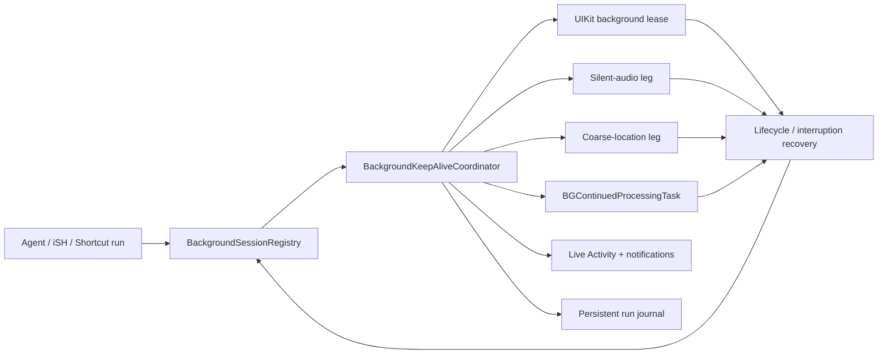
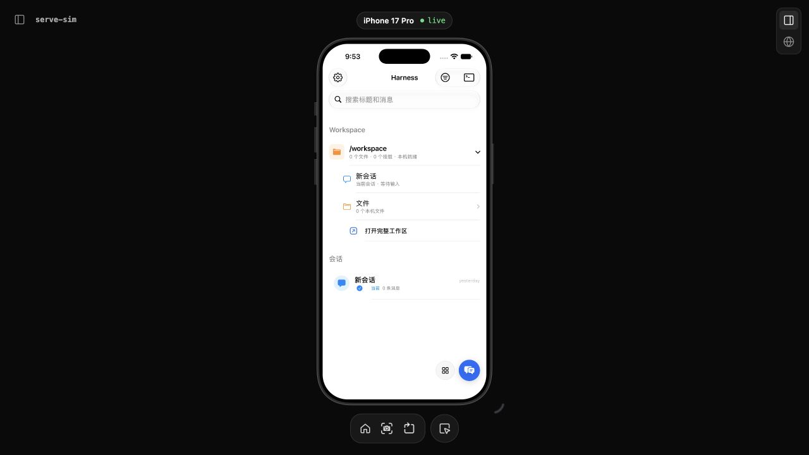
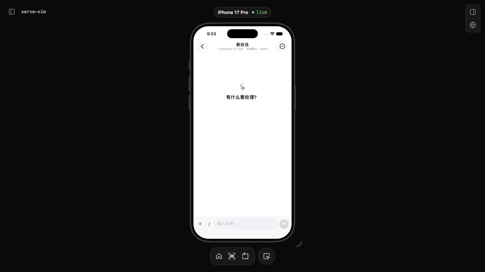
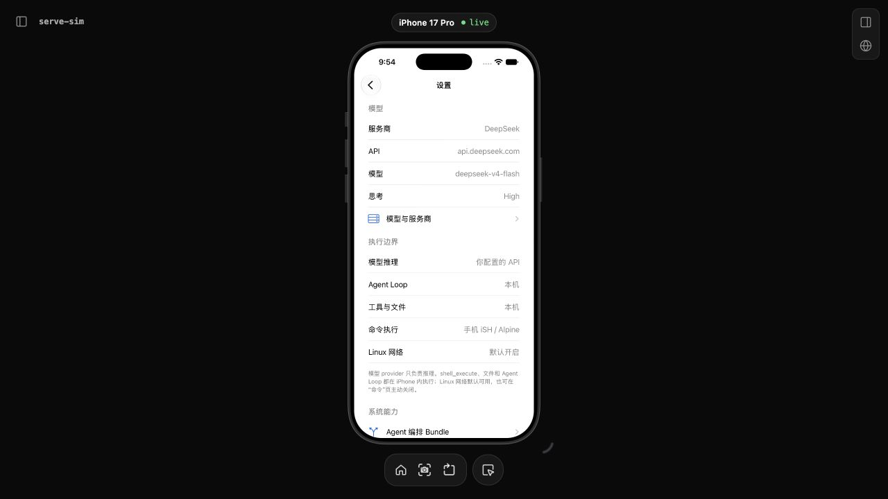
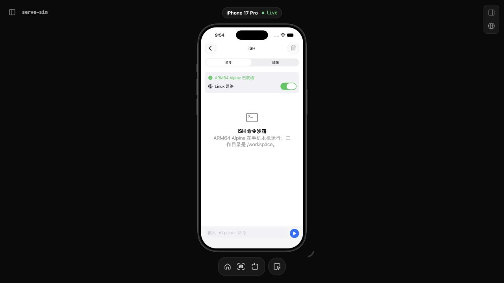
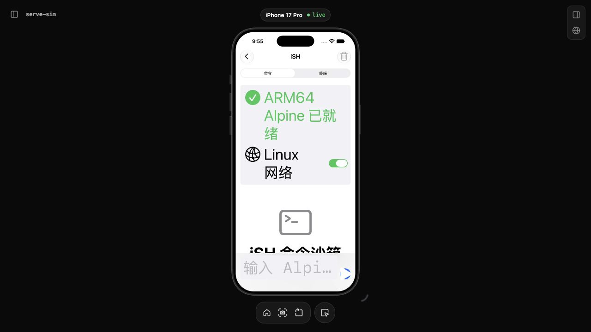
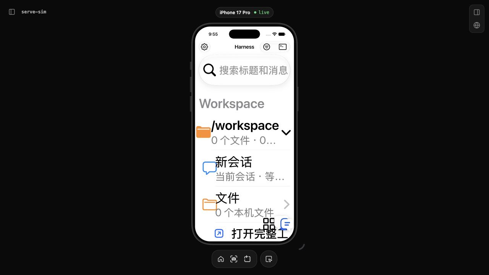

# Harness Mobile × OpenMinis 逐项对比与改进清单

> 日期：2026-08-24
> Harness 基线：`a9fef03334a3a388ce20438cda0ee50e2e16a5c8`
> OpenMinis 基线：`9cf3a855fecd27bb5735b84cacbd56852a3ab8dd`
> 结论优先级：**增强后台保活为 P0，必须实现，包含音频保活和定位保活。**

## 0. 结论

OpenMinis 的体感优势不是某一个 API 更强，而是把后台、会话、UI、系统扩展、恢复和诊断做成了纵向闭环：

1. 后台不是只依赖 `BGTaskScheduler`，而是由活跃会话注册表统一驱动有限后台任务、静音音频、粗粒度定位、Live Activity、通知和恢复。
2. 用户功能不是只把 handler 放进工具目录，而是同时完成入口、状态、错误、恢复、设置和系统集成。
3. UI 按消息列表、输入栏、浏览器、媒体、设置等领域拆分，并围绕真实使用不断补状态和恢复逻辑。
4. 真机故障有 MetricKit、crash/hang/performance 信号回流，容易把线上问题转成修复。

Harness 的优势是 Agent 编排工具更多、轨迹与脱敏导出更强、当前 Swift 单元契约数量更多；主要问题是 90 项能力仍处于 `VERIFY`，但已经集中进入生产状态树，导致组合状态、UI 密度和回归面同时膨胀。

本轮决定：不再把音频/定位增强保活列为 `OUT-OF-SCOPE`。后续实现完成时，必须同步改写 `Docs/DESKTOP_PARITY_REMEDIATION.md` 中 BG-004～BG-006 的旧边界和状态。

## 1. 对比方法与证据边界

| 项目 | Harness Mobile | OpenMinis |
| --- | --- | --- |
| 源码基线 | 当前工作树，HEAD `a9fef03` | `Vendor/UpstreamSources/openminis`，commit `9cf3a85` |
| iOS 生产 Swift | 160 个文件，约 85,519 行 | 346 个文件，约 183,741 行 |
| 当前最大热点 | `AppModel.swift` 7,130 行；`AgentRuntime.swift` 4,295 行 | `SelectableMarkdownView.swift` 8,006 行；`ChatStore.swift` 6,211 行；`AIChatViewModel.swift` 5,830 行 |
| 本轮 Harness 构建 | arm64 Simulator 构建通过 | — |
| 本轮 Harness 单测 | 633 通过、3 跳过、0 失败 | — |
| 本轮 OpenMinis 运行截图 | — | 未能生成：本地 Vendor 缺 `Configs/ProviderCustomization.xcconfig` 和预构建依赖 |

因此，本报告对 Harness UI 使用本轮模拟器截图和可访问性树；对 OpenMinis UI 使用源码结构和交互实现证据，不把旧图或 README 宣传图当作本轮运行证据，也不声称 OpenMinis “没有 bug”。

## 2. 后台保活：逐项对比

### 2.1 为什么 OpenMinis 保活明显更强

| 编号 | 机制 | OpenMinis | Harness 当前 | 差距与动作 |
| --- | --- | --- | --- | --- |
| BG-01 | 后台模式声明 | `Info.plist:33-51` 声明 audio、location、fetch、remote-notification | `HarnessMobile/Resources/Info.plist:72-79` 只有 processing | P0：加入 audio/location，并补对应权限说明和设置入口 |
| BG-02 | 单一保活协调器 | `BackgroundKeepAliveManager.swift:14-46` 统一表达 short/extended survival tier | 后台能力分散在 AppModel、ContinuedProcessing、Schedule、Live Activity | P0：新增独立协调器，AppModel 只提交 run 生命周期事件 |
| BG-03 | 活跃会话真相源 | `ChatLifecycleSupport.swift:12-105` 的 `SessionActivityTracker` 管多个 session/tool 状态 | 全局 `isRunning` + 单 `activeRunID` | P0：新增 `BackgroundSessionRegistry`，键为 `sessionID/runID/generation` |
| BG-04 | 有限后台租约 | `AIChatViewModel+BackgroundTask.swift:14-40` 使用 UIKit background task，过期时按保活实际状态决定续接或中断 | 主要依赖 Continued Processing；旧系统只是前台 worker | P0：加入引用计数的 UIKit 租约作为第一层保护 |
| BG-05 | 静音音频腿 | `BackgroundKeepAliveManager.swift:1179-1234` 使用 `AVAudioEngine` 循环缓冲，并检查 engine/node 实际存活 | 无 | P0：完整迁移音频 session、engine、健康检查和自动恢复 |
| BG-06 | 音频竞态 | 同文件 `:251-307,467-593` 有 suspend 引用计数、interruption、route change、debounce | 无 | P0：媒体播放、语音输入、电话/蓝牙中断不能和保活 engine 互相抢占 |
| BG-07 | 粗粒度定位腿 | 同文件 `:312-317,931-999` 使用 3km 精度、后台请求和 `CLBackgroundActivitySession` | 无 | P0：15 秒延迟激活、单全局 session、任务结束立即停止 |
| BG-08 | 前后台快速切换 | 同文件 `:345-417` 防止 bg→fg→bg 的异步状态反转 | 生命周期状态散落 | P0：所有 scene/app 通知进入同一状态机并具备代际号 |
| BG-09 | 孤儿资源清理 | 同文件 `:327-341,902-927` 冷启/回前台清理孤儿 location session 和过期 Live Activity | 有 Live Activity 结束逻辑，但没有统一 orphan audit | P0：启动、前台、run 完成、取消、崩溃恢复均执行幂等清理 |
| BG-10 | 多会话 | 一个全局保活层服务多个活跃 session，保活资源不按会话重复创建 | `ContinuedProcessingController` 只有一个 current run | P1：先支持 2 个 run 并发，保活资源仍保持全局单例 |
| BG-11 | App Intent 预热 | `SendPromptIntent.swift:32-67` 在首个 await 前 setup/eager-arm，并清理占位 session | Harness Intent 只把任务送入草稿 | P1：真正 headless 的发送、状态、继续、重试，并在首个挂起点前占用保活租约 |
| BG-12 | 系统可见状态 | Live Activity 汇总活跃会话、工具名、完成/中断 | 已有 Harness Live Activity，但绑定单 run | P0：改为 registry 投影，隐私模式继续脱敏 |
| BG-13 | 冷启恢复 | OpenMinis 有 active session、orphan、Live Activity、shortcut tracker 的恢复/清理 | Harness `pendingRunID` 主要在内存，回前台才恢复 | P0：持久 run journal；冷启把悬挂副作用标成 interrupted/resumable |
| BG-14 | 诊断 | 生命周期、音频、定位、会话数和系统状态都有时间线日志 | 有 trajectory/diagnostics，但后台腿的事件不完整 | P0：保活每次状态跃迁写脱敏事件，禁止只写“后台失败” |
| BG-15 | 后台 UI 降载 | `ChatLifecycleSupport.swift:510-548` 在 inactive 时冻结流式 presentation，前台一次 flush；durable run 继续 | delta 先进入 `@MainActor AppModel`，scene phase 未冻结高频 UI | P0：后台只写 durable state，不做 Markdown/SwiftUI 高频投影 |
| BG-16 | 网络切换恢复 | `LLMSessionRegistry.swift:3-58` + `NetworkMonitor.swift:45-78` 在 Wi-Fi/5G/VPN 接口集变化时重建失效连接池 | 模型 URLSession 主要到 deinit 才 invalidate；当前网络监控只服务 iSH DNS | P0：统一 LLM session registry，网络路径实变时单次 reset |

OpenMinis 的保活链路可以概括为：

### 2.2 Harness 当前两个会直接伤害长任务的 P0 代码问题

#### P0-BUG-1：取消顺序会让运行完成路径提前失去所有权

`HarnessMobile/App/AppModel.swift:1944-1956` 在 `runTask.cancel()` 前先把 `activeRunID` 置空；而 `:4922` 的完成清理以 `activeRunID == runID` 为 guard。结果是取消与 Runtime 最后一批部分输出/轨迹提交竞态，完成路径可能直接退出。

修复要求：

- 引入 `.cancelling` 状态，不在发送 cancel 时提前清空 run identity。
- 等 Runtime 完成取消提交、trajectory flush、session projection 后，再原子完成 run。
- 用 `sessionID/runID/generation` 拒绝旧回调，但不能拒绝本 run 的取消收尾。
- 增加“流式输出中取消”“工具副作用后取消”“后台过期取消”“取消后立即新建 run”四类回归测试。

#### P0-BUG-2：BGProcessing 注册发生在 SwiftUI `.task` 中，时机过晚

`HarnessMobile/App/DeepSeekHarnessMobileApp.swift:13-60` 进入根视图 `.task` 后才调用 `registerBackgroundTasksIfNeeded()`；实际注册位于 `AppModel.swift:765-773` 和 `ScheduleBackgroundController.swift:15-34`。系统后台唤醒的 handler 应在应用启动阶段完成注册，不能依赖根视图任务已经执行。

修复要求：

- 把静态 BGProcessing handler 注册移到 `AppDelegate.application(_:didFinishLaunchingWithOptions:)` 或等价 launch 入口。
- handler 只接收 task 并转交持久 `BackgroundRunCoordinator`；不依赖根视图或当前会话已加载。
- 添加“无 UI 冷启动收到 BGProcessing task”的集成夹具。

#### P0-BUG-3：schedule claim 后缺 ack/requeue

`HarnessMobile/Core/Jobs/HarnessSchedules.swift:9-13,122-147` 只有 pending/claimed/cancelled；`AppModel.swift:6757-6815` 在 session 缺失、前台已有任务、过期或执行失败时，没有可靠地把 claimed schedule 确认完成或退回。修复时直接复用现有 Job 的 completion lease/ack/requeue 契约（`HarnessJobs.swift:162-173,638-683`），并保证旧后台 task 的 expiration 不能取消后来启动的前台 run。

### 2.3 P0 保活迁移切片

| ID | 实现切片 | 建议生产位置 | 完成定义 |
| --- | --- | --- | --- |
| KA-001 | 生存等级、偏好和状态快照 | `Core/Background/BackgroundKeepAliveState.swift` | 能区分 short、audio、location、audio+location，并向设置与诊断发布同一状态 |
| KA-002 | 多 run 活跃注册表 | `Core/Background/BackgroundSessionRegistry.swift` | start/tool/wait/cancel/finish 全部幂等；相同 run 不重复计数 |
| KA-003 | UIKit 有限后台租约 | `Core/Background/LegacyBackgroundTaskLease.swift` | 首个 run 获取、最后 run 释放、过期事件可测试，不能泄漏 task identifier |
| KA-004 | 静音音频腿 | `Core/Background/BackgroundAudioKeepAlive.swift` | 后台才启动；engine/node 双健康检查；电话、蓝牙、媒体、VAD 中断后按条件恢复 |
| KA-005 | 定位腿 | `Core/Background/BackgroundLocationKeepAlive.swift` | 3km 粗精度；后台 15 秒后激活；单 session；回前台/最后任务完成立即清理 |
| KA-006 | 总协调器 | `Core/Background/BackgroundKeepAliveCoordinator.swift` | registry、scenePhase、权限、设置共同驱动；所有转换串行化、可重入、可观测 |
| KA-007 | 统一 Continued Processing | 改造 `ContinuedProcessingController.swift` | iOS 26 系统 task 成为一条腿，不再成为唯一后台真相源 |
| KA-008 | 修复取消提交 | 改造 `AppModel.cancelRun()` 和 run completion | 取消后部分输出、工具状态、trajectory、checkpoint 顺序一致 |
| KA-009 | 启动注册与冷启 | AppDelegate + `BackgroundRunCoordinator` | 未创建 SwiftUI root 也能注册/接收；悬挂 run 可恢复或明确 interrupted |
| KA-010 | Live Activity/通知投影 | 改造现有 Harness Live Activity | 多 run 汇总、完成一次、取消一次、隐私模式不泄漏内容 |
| KA-011 | 设置 UI | `Features/Settings/BackgroundSettingsView.swift` | 总开关、音频腿、定位腿、权限状态、当前生存等级、活动会话数清楚可见 |
| KA-012 | 故障时间线 | trajectory + diagnostics | 音频/定位/任务租约的 start/stop/retry/expire/recover 全部可导出且脱敏 |
| KA-013 | 单一音频会话 owner | `Core/Background/HarnessAudioSessionCoordinator.swift` | keepalive/TTS/媒体/录音通过 intent 优先级协调，禁止多处直接抢 `AVAudioSession` |
| KA-014 | schedule lease | 改造 `HarnessSchedules.swift` | claimed 有超时 lease、ack、失败 requeue；冷启唤醒恰好执行一次 |
| KA-015 | 后台 UI 冻结和网络恢复 | AppRootView + Network | inactive 期间 presentation revision 不增长；网络接口实变后旧连接池只重建一次 |

迁移顺序固定为：`KA-002 → KA-008/009/014 → KA-003/013 → KA-004 → KA-005 → KA-006/007 → KA-010/011/012/015`。先修 run identity 和冷启真相源，再接会持续占用系统资源的两条腿。

迁移时不要把 OpenMinis 的音频启动重试缺口一并带过来：其 `BackgroundKeepAliveManager.swift:1188-1195` 注释称会 retry，但 `engine.start()` 的 catch（`:1225-1236`）只记录错误，现有 `scheduleSilentAudioActivationRetry()`（`:1239-1265`）没有从该 catch 接通。Harness 的 coordinator 必须传播真实启动失败，并执行 0.5 秒间隔、最多 3 次、有取消条件的重试。

### 2.4 真机验收矩阵

10/30/60 分钟保活矩阵没有真机证据只能保持 `VERIFY`；单次签名、安装或启动首页证据不能替代持续运行验收。目标机先按项目要求使用 iPhone 16 Pro：

| 场景 | 10 分钟 | 30 分钟 | 60 分钟 | 必查结果 |
| --- | --- | --- | --- | --- |
| 屏幕关闭，Wi-Fi | 必测 | 必测 | 必测 | SSE/工具/iSH 继续；消息、轨迹和 Live Activity 一致 |
| 屏幕关闭，蜂窝 | 必测 | 必测 | 必测 | 网络切换后重连且不重复副作用 |
| 低电量模式 | 必测 | 必测 | 必测 | 降低资源占用但 run 不无声消失 |
| 音频中断/电话 | 必测 | 必测 | — | 音频腿暂停、引用计数正确、结束后恢复 |
| 蓝牙 route change | 必测 | 必测 | — | engine/node 状态自愈，无抢占用户媒体 |
| 定位权限切换 | 必测 | 必测 | — | 拒绝/仅使用期间/始终三态都能降级，资源无泄漏 |
| 前后台快速切换 | 100 次 | — | — | 不发生状态反转、重复 session、残留指示 |
| 系统 expiration | 必测 | 必测 | — | 保存 interrupted/resumable，不能丢最后一批输出 |
| App 冷启 | 必测 | 必测 | — | 清理孤儿资源并恢复 run journal |
| 用户取消后立即新 run | 100 次 | — | — | 旧回调不能污染新 run，取消收尾不丢失 |
| Wi-Fi→蜂窝→VPN | 必测 | 必测 | — | 当前流继续或明确失败；下一连接 5 秒内建立；不重复工具副作用 |
| 200 delta/s 后台压力 | 必测 | 必测 | — | durable state 继续，inactive 期间 presentation revision 不增长，回前台一次 flush |

另外要记录技术边界：用户从多任务界面强制结束 App 后，不把继续运行写成保证；验收重点是资源清理、状态诚实和下次冷启恢复。

## 3. UI/UX：逐流程对比

### 3.1 本轮 Harness 真实流程健康度

| 流程 | 结果 | 当前问题 |
| --- | --- | --- |
| 首页/工作区/会话列表 | 可用但需收口 | 首屏同时展示工作区层级、搜索、排序、设置、终端、工具、新建会话，密度高，二级字过小 |
| 新建会话 → 进入聊天 | 不稳定 | 本轮 UI test 点击“新会话”后没有进入会话页，后续找不到“会话选项” |
| 空会话聊天 | 可用 | 空态、provider/model、composer 信息层级偏弱，底部操作含义依赖图标 |
| 设置 | 可用但过密 | 长列表的副说明字号小、状态和动作混排，缺少按任务分组的渐进披露 |
| iSH 终端 | 标准字号可用 | 最大辅助字号下标题、说明、空态和输入区严重重叠/裁切 |
| 最大辅助字号 | 不通过 | 首页和终端均出现裁切、内容被底部按钮覆盖，关键动作不可完整读取 |
| 可访问性树 | 部分通过 | 搜索框只有通用 `search text field`；部分顶部按钮视觉框小于 44×44pt |

本轮截图：

### 3.2 为什么 OpenMinis UI 体感更完整

| 维度 | OpenMinis | Harness | 改进 |
| --- | --- | --- | --- |
| 信息架构 | 会话、聊天、浏览器、文件、Skills、MCP、设置均有稳定的专属入口 | 首页兼任工作区、会话、工具、终端和全局导航 | P0：首页只保留“继续任务/新建/最近会话”，工作区详情和工具移到二级页 |
| 消息列表 | `CollectionViewMessageListV3.swift` 使用专用 CollectionView 路径，显式处理长会话窗口、恢复和 interrupted banner | `ChatView.swift` 同时承担会话状态、轨迹切换、输入和工具展示 | P1：消息列表状态、输入状态、run 状态拆成独立 view model |
| 输入能力 | 图片、视频、文档、音频和生成媒体有对应 UI | 当前输入主要是文字和图片 | P1：统一 `AgentAttachment`，附件带上传/解析/失败/重试状态 |
| 运行中反馈 | 多会话活动、工具名、后台状态、Live Activity 相互一致 | 当前 UI 状态绑定单 `isRunning`/`activeRunID` | P0：全部由 `BackgroundSessionRegistry` 投影 |
| 渐进披露 | 高级能力进入专属设置或 sheet | 设置与工具入口的说明密集堆在列表 | P0：主路径只展示必要状态，高级参数进入详情页 |
| 可访问字号 | OpenMinis 有独立字体/渲染设置和大量 UI 专项实现；本轮未生成可比运行截图 | 本轮最大辅助字号已实证失败 | P0：所有首要流程加入 accessibility XXXL 截图测试和 hit-target audit |
| 恢复语义 | interrupted、resume、后台 active、shortcut run 都有明确 UI 状态 | 多处仍依赖通用错误/当前会话 | P0：用户永远能看到“仍在运行/已中断/可恢复/已完成”的唯一状态 |

### 3.3 UI 优先级

P0：

1. 修复“新会话”创建后不进入聊天的导航回归，并让 UI test 不再依赖旧标签。
2. 修复首页和终端在 Accessibility XXXL 的裁切/重叠；顶部触控目标全部达到至少 44×44pt。
3. 首页降噪，只保留最近任务、新建任务、明确的后台运行状态；工具/工作区/终端放入稳定二级导航。
4. 保活设置页展示“短时 / 音频 / 定位 / 音频+定位”真实等级、权限和活跃任务数。
5. 用统一 run state 驱动聊天、首页、Live Activity、通知，不允许各自猜测状态。

P1：

1. 消息列表、composer、工具卡、trajectory 分离状态所有权。
2. 为图片/文档/音频/视频建立统一附件卡和错误恢复。
3. 建立标准字号、最大辅助字号、深色、横屏、VoiceOver 的截图回归矩阵。
4. 设置页按“模型、后台、工具与插件、存储与同步、隐私与诊断”重组。

P2：

1. 统一动效、空态、加载骨架、错误提示和图标语义。
2. 平板双栏、键盘快捷键、拖放和多窗口。

## 4. 功能：一个一个对比

| 领域 | Harness Mobile | OpenMinis | 优先动作 |
| --- | --- | --- | --- |
| Provider | 5 个 provider ID；Chat Completions/Anthropic 两种主要 wire | OpenAI、Anthropic、Gemini、Responses、OpenRouter、xAI、Kimi 等，并有 API Key/OAuth | P1：Provider instance + OAuth + 模型组/fallback/load-balance |
| 多模态 | 文字、图片路径较完整 | PDF、音频、视频输入及 image/audio/video 输出 | P1：统一 attachment/media result 协议 |
| 工具编排 | 约 63 个生产名称，jobs/subagent/workflow/Ralph/LSP/PTY/MCP/trajectory/code/web 广度强 | 核心工具更少，但 shell/files/browser/memory/read_image 产品闭环深 | P0：Capability Manifest 控制未验收能力曝光 |
| 浏览器 | search/fetch；无交互式本机浏览器代理 | tabs/click/type/screenshot/DOM/cookie/download/viewport/JS | P1：隔离 WKWebView browser broker，cookie 原值不进模型/日志 |
| Skills | 工作区发现、按需加载已有 | 管理 UI、打包资源、社区生态更完整 | P1：安装→授权→调用→更新→卸载完整闭环 |
| Memory | 依赖 Cordis checkpoint/插件，无默认跨会话 memory_get/write | 内建可关闭 memory_write/get 和共享目录 | P1：默认记忆服务，必须可查看、删除、禁用、导出 |
| MCP | 本地 iSH stdio 元工具；动态能力/UI 较弱 | stdio + HTTP/SSE + OAuth + CRUD/import + session override | P1：持久连接管理、动态 definitions、resources/prompts |
| 多会话 | 单全局 run，运行时会话切换受限 | 最多 5 个活跃会话并发，FIFO 控制 | P1：先 2 并发，真机热/内存稳定后再升 5 |
| 会话存储 | 单 snapshot JSON，长会话写放大 | SQLite actor 增量存储 | P1：SQLite/append journal + 全文索引 + crash recovery |
| App Intents | 打开 App 并填草稿，仍需用户发送 | Send/Status/List/Continue/Retry/Open/Quick Task，可带文件 | P1：headless intents 与后台 registry 共用 run contract |
| 系统扩展 | App、Live Activity、Tests、UITests | App、Share、Widget、FileProvider、Tests、UITests | P2：Share → Widget → FileProvider 顺序补齐 |
| 同步 | 外部目录 bookmark；无 CloudKit 会话同步 | CloudKit、共享容器、跨设备只读会话 | P2：先做 journal/tombstone，再做 CloudKit 冲突合并 |
| 导出/脱敏 | Markdown/JSON，脱敏策略明确 | 多会话 JSON/文本导出 | 保留 Harness 优势，并把后台诊断纳入同一脱敏管线 |
| 轨迹/编排 | trajectory、jobs、workflow、subagent、diagnostics 是明显优势 | 用户主路径和系统集成更成熟 | 不删能力；先把状态所有权和验收门补齐 |

## 5. 为什么 Harness bug 体感更多

1. **生产广度超过闭环深度。** 当前 parity 清单约 90 个 `VERIFY`、30 个 `DONE`；大量能力可见，但真实 API、图片、iSH、插件、后台、压力和冷启没有完整真机闭环。
2. **单一全局状态过重。** `AppModel.swift` 同时拥有 UI、会话、run、provider、background、插件和持久投影；旧 run、新 run、当前页面之间很容易竞态。
3. **Agent 主循环缺总预算和重复调用熔断。** `AgentRuntime.swift:280-320,978-1018` 存在开放 `while true`；OpenMinis 有 `ToolLoopDetector.swift:31-128` 的参数/结果 hash、unknown-tool 和无进展 breaker，并有总回合上限。
4. **持久化粒度过粗。** 会话 snapshot 全量读写会随长会话扩大编码、写盘和损坏恢复成本。
5. **测试数量强，但组合层有缺口。** SwiftPM 覆盖大量核心契约，却不能替代 Xcode UI、后台冷启、系统权限和真机长时间测试。
6. **文档、生产目录和验收状态有漂移。** 架构文档仍有已经进入生产目录的能力被写成缺失；用户看到的是可点入口，而不是内部的 `VERIFY` 标签。
7. **线上故障回流不足。** Harness 有 trajectory 和脱敏 diagnostics，但缺 OpenMinis 那种 MetricKit crash/hang/watchdog/background-timeout 的持续闭环。
8. **导航与运行生命周期耦合。** `AppModel.swift:2221-2263` 的新建/切换会话会取消当前任务；OpenMinis 切页面只冻结旧页面 UI，活跃 ViewModel 不被淘汰。用户因此把普通导航直接体验成“后台断了”。
9. **锁屏持久化没有设备证据。** `SessionStore.swift:813-827` 使用 `.completeFileProtection`，而 `AppModel.persistSession()` 的部分调用会吞错误继续；锁屏长任务必须验证写入和冷启一致性。

## 6. 总改进清单

### P0：先做

1. 完成 KA-001～KA-015：音频+定位增强保活、统一 registry、有限后台租约、Continued Processing、Live Activity、通知、冷启恢复、schedule lease 和网络切换恢复。
2. 修复取消 run identity 竞态和 BGProcessing 注册时机。
3. 增加执行总预算与 ToolLoopDetector；critical 后停止副作用、保存 checkpoint、明确可恢复。
4. 建立唯一 Capability Manifest：`compiled/unit/simulator/device/entitlement/experimental/lastVerified`。
5. 修复新会话导航回归、最大辅助字号和触控目标。
6. 把后台状态、聊天状态、首页状态和系统状态统一投影自 run registry。
7. 加入 MetricKit、hang/watchdog/background timeout 和脱敏故障时间线。

### P1：随后做

1. 每会话 RunCoordinator 和 2-run 并发。
2. SQLite/append journal 持久化与冷启恢复。
3. 交互式浏览器 broker。
4. Provider instance/OAuth/模型组/fallback。
5. MCP stdio+HTTP/SSE+OAuth 与持久管理 UI。
6. PDF/音频/视频附件和响应媒体。
7. 默认跨会话记忆及管理 UI。
8. 真正 headless 的 App Intents。
9. Chat/MessageList/Composer/Trajectory 状态拆分。

### P2：产品生态

1. Share Extension、Widget、FileProvider。
2. CloudKit 多设备同步、冲突/tombstone/恢复。
3. App/会话 Face ID 锁。
4. WeatherKit、AlarmKit、播放器等原生能力。
5. iPad 双栏、多窗口、拖放和键盘交互。

## 7. 每项能力的统一 DONE 门槛

任何能力只有同时满足以下条件才能从 `VERIFY` 改为 `DONE`：

1. 生产入口、真实 handler、错误状态、恢复状态、设置和导出形成闭环。
2. unit、integration、UI、指定真机四层证据齐全。
3. 权限/entitlement 与 Capability Manifest 一致；未签名或未授权能力不进模型 schema。
4. 取消、后台、断网、冷启、重复回调、低内存至少各有一条回归。
5. 真实错误不得被吞掉或用 mock success 代替。
6. 修改对应 `Docs/DESKTOP_PARITY_REMEDIATION.md`，记录命令、结果、设备、系统版本和剩余边界。

## 8. 本轮验证记录

### 已通过

- Harness arm64 iOS Simulator 构建：`** BUILD SUCCEEDED **`。
- SwiftPM：633 tests passed、3 skipped、0 failures；测试运行约 13.35 秒。
- 当前真实界面已完成首页、聊天、设置、终端、Accessibility XXXL 和 AX overlay 取证。

### 已发现

- Xcode UI tests 退出 65：执行 11 个测试、2 个跳过，累计 9 个 assertion failure（其中 1 个 unexpected）。失败用例为 Conversation Mode、Long Conversation、Markdown、Plan Review；共同根因是“点击新会话后找不到会话选项”，随后各流程入口均无法到达。这不是可以忽略的截图问题，而是当前导航或测试契约回归。结果包：`/tmp/hm-openminis-audit-harness/Logs/Test/Test-HarnessMobile-2026.08.24_22-03-17-+0800.xcresult`。
- Accessibility XXXL 下首页和终端存在明显裁切、重叠与关键内容不可读。
- `cancelRun()` 的 identity 清理顺序和 BGProcessing 的注册时机需要作为 P0 修复。
- Agent tool loop 缺总预算和重复调用熔断。

### 尚不能声称

- OpenMinis 本轮可运行对照：Vendor 缺 provider customization 配置及原生预构建依赖，`xcodebuild` 以 exit 65 失败。
- iPhone 16 Pro 后台 10/30/60 分钟通过：截至本报告原始记录尚无真机证据。
- 强制结束 App 后仍持续运行：不作为保证；必须保证状态诚实和冷启恢复。

### 8.1 后续设备证据（2026-08-28）

- Harness 已在 iPhone 16 Pro 上完成真实签名构建、安装和启动首页复验；此前启动时的 `EXC_BREAKPOINT/SIGTRAP` 已由 `251b70e` 修复，修复后主 App 与 Live Activity 进程保持运行，首页截图和完整门禁记录见 `Docs/RELEASE_VERIFICATION_2026-08-28.md`。
- 这只证明启动路径和短时进程存活，不证明后台保活。设备 UI 测试尝试因 Xcode Beta XCTest 观察器报告 `xcrun: error: unable to find utility "devicectl"` 在 runner 建通道前退出，未执行到断言。
- 因此本节不改变原有结论：后台 Wi-Fi/蜂窝、低电量、音频/定位、系统 expiration、冷启恢复及 10/30/60 分钟矩阵仍须在 iPhone 16 Pro 上逐项实测后才能改为 `DONE`。

## 9. 建议的第一批实际改动范围

第一批只做保活基础和三个 P0 bug，不夹带功能扩张：

1. `BackgroundSessionRegistry` 与持久 run identity。
2. 修复 `AppModel.cancelRun()` 取消收尾顺序。
3. AppDelegate 启动期注册 BGProcessing。
4. 给 schedule 补 lease/ack/requeue。
5. `LegacyBackgroundTaskLease`。
6. `HarnessAudioSessionCoordinator` + `BackgroundAudioKeepAlive`，连同 interruption/route/debounce/health check/retry。
7. `BackgroundLocationKeepAlive`，连同延迟激活/orphan cleanup。
8. `BackgroundKeepAliveCoordinator` 串起现有 Continued Processing、Live Activity 和通知。
9. inactive UI 冻结、LLM 网络连接池切换恢复、锁屏持久化错误上报。
10. 单元、状态机、模拟器生命周期测试；最后进入 iPhone 16 Pro 10/30/60 分钟矩阵。

这批完成并取得真机证据后，再把后台项标为 `DONE`。
