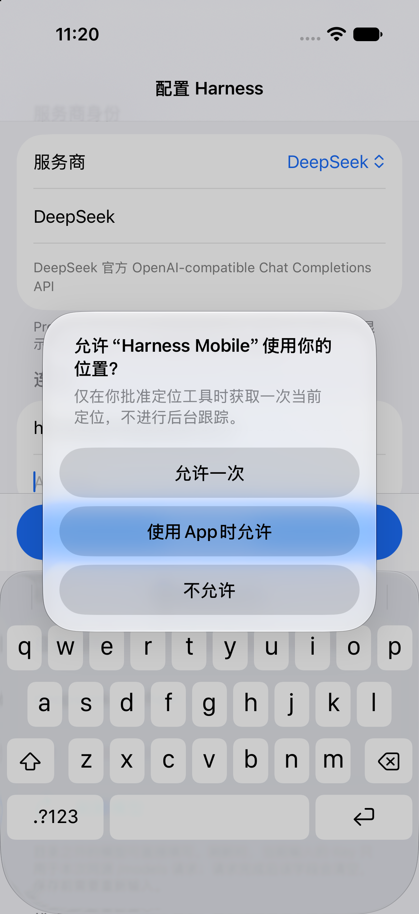
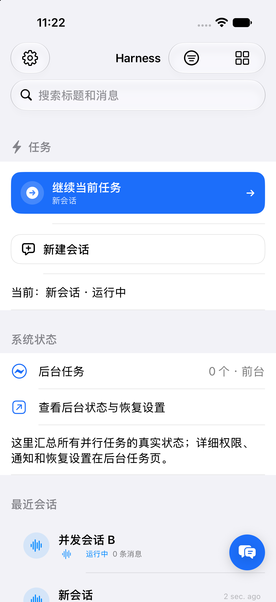
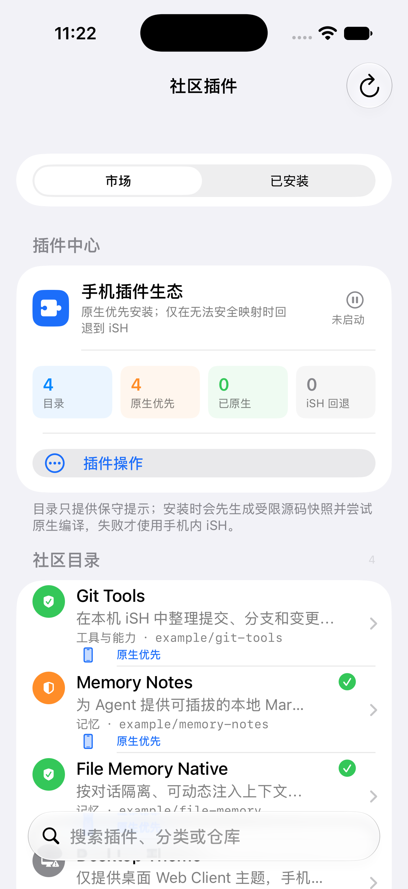
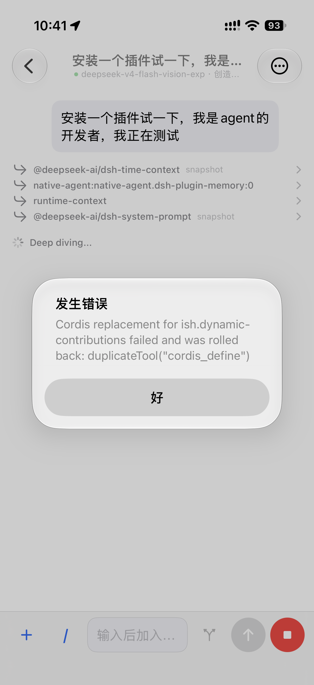
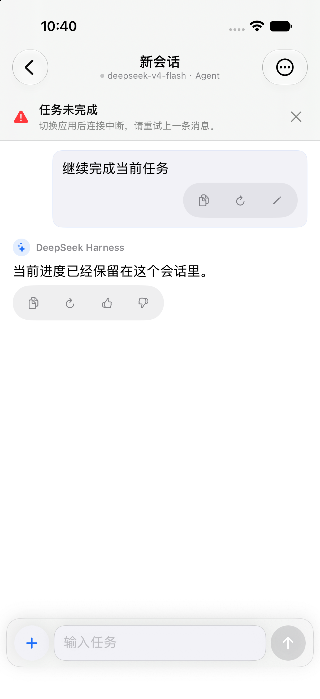
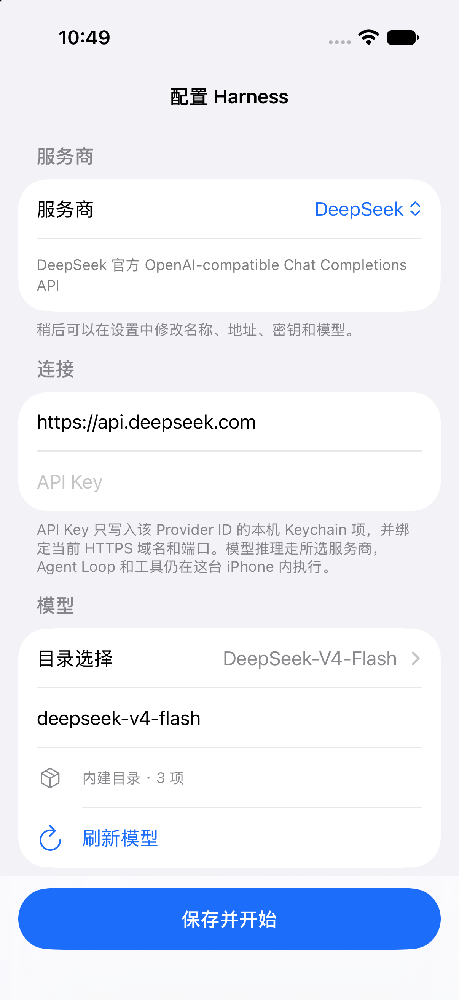
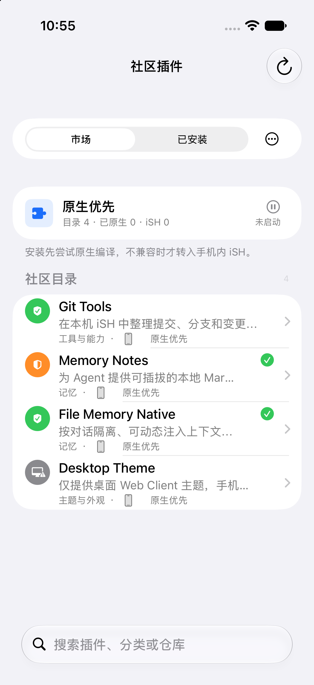
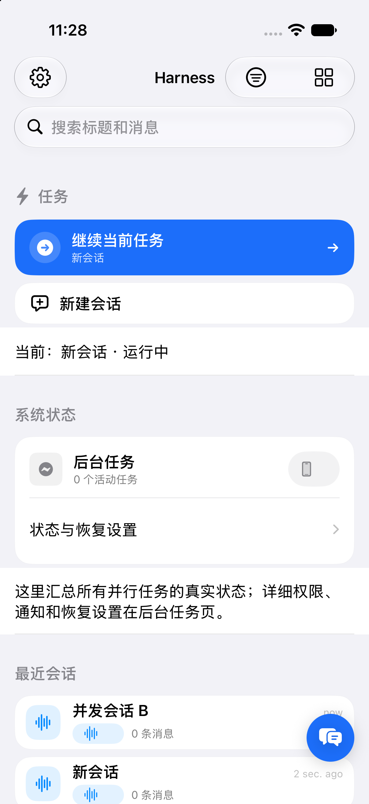
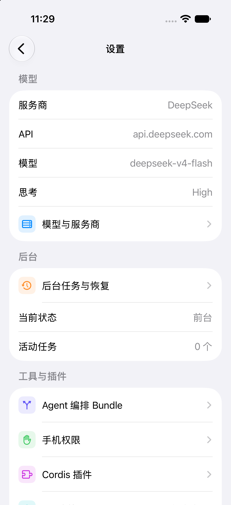

# Harness Mobile 全界面审计与逐页改造计划

> 状态：BATCHED · 模拟器验证通过 · 真机/VoiceOver/深色大字保持 VERIFY
> 建档：2026-08-29
> 目标：以 OpenMinis 的 iOS 信息层级、语义色和轻量材质为参考，统一 Harness Mobile 的全部 SwiftUI 界面；不复制桌面布局，也不牺牲现有开发者能力。

## 审计依据

- 当前 Harness Mobile 源码：25 个主要 View 文件、62 个 View 类型；首页、聊天、插件市场、设置和终端等大文件均按路由与组件做代码审计。
- 当前运行截图：使用 iPhone 17 Pro / iOS 27.0 模拟器、当前工作树 arm64 构建采集。截图只能证明可见布局，不能代替 VoiceOver、Dynamic Type、旋转和真机性能验收。
- 用户提供的 3 张当前界面截图：覆盖聊天加载/告警和插件市场异常态。
- OpenMinis 上游：`OpenMinis/OpenMinis` main，审计 commit `09fc199928de0f26685e766c34e6d541c7a69e5a`。重点参考 `ContentView.swift`、`AIChatView.swift`、`ChatMessageViews.swift`、`ChatInputBar.swift` 与 `UsageStatsView.swift` 的组件边界和系统材质用法。

## 当前证据

### 1. 首次配置（截图审计：第一轮完成）

原页面首次显示就自动聚焦 API Key，键盘会立刻压缩表单；内建服务商还重复显示一个默认“显示名称”，Provider ID 的编辑说明也占据首屏。第一轮已取消自动抢焦点，内建服务商首次配置不再重复显示名称字段，长说明改为稍后可编辑的短提示；服务商、连接、模型和固定主操作在标准 iPhone 首屏形成连续层级。

### 2. 首页/会话（截图审计：改造中）

问题：顶部同时存在设置、筛选、工具、常驻搜索，导航层过重；“继续任务”和右下角“新建”形成重复主操作；系统状态以原始设置行占据较大首屏面积；最近会话与系统状态的容器语言不统一。第一轮先统一卡片、图标、状态胶囊和页面背景，再压缩重复入口。

### 3. 插件市场（截图审计：第一轮完成）

原页面的四块统计宫格和页内“插件操作”占据半个首屏；插件行同时显示来源仓库、分类和安装策略。第一轮已把统计压成“目录/已原生/iSH/Host 状态”单行，把操作放到市场/已安装切换行，并从目录行移除仓库实现细节；首屏现在直接展示完整目录，原生/iSH 路径仍可见，详细仓库和编译诊断保留在详情页。

### 4. 聊天（用户截图 + 代码审计：第一轮完成）

用户截图里的系统 Alert 会覆盖大部分消息区，输入栏也同时排列加号、命令、steer、发送和停止五个等权按钮。第一轮已把错误改为聊天顶部的可关闭页内状态条，保留消息和输入；消息动作收进轻量胶囊，“命令”并入原有加号菜单，标题副行只保留模型和交互模式。复制、重试/重新生成、编辑和反馈仍直接可见且保持 44pt 触控目标。

## OpenMinis 可借鉴的架构

OpenMinis 的优势不是“圆角更多”，而是四个结构选择：

1. 颜色只使用 UIKit 语义色，深色模式和高对比度由系统接管；功能组件不散落硬编码背景色。
2. 搜索、卡片、消息等表面由小型 modifier/component 统一；iOS 26+ 使用系统 `glassEffect`，旧系统使用不透明语义背景与轻阴影，不做仿制玻璃。
3. 列表行、消息块和输入栏是独立组件；大页面只编排状态与导航，避免一个 View 同时决定数据、布局和材质。
4. 底部搜索、浮动操作和输入栏使用 `safeAreaInset`，并给滚动内容留出同等安全边距，避免遮挡最后一行。

Harness 采用同一原则，但保留自己的开发者信息架构：运行后端、轨迹、工具授权和诊断仍可访问，只从高频页面下沉到详情/Inspector。

## 统一视觉基础（UI-012）

| 项目 | 规范 |
| --- | --- |
| 页面背景 | `systemGroupedBackground` |
| 主表面 | `secondarySystemGroupedBackground` |
| 次表面 | `tertiarySystemGroupedBackground` / `tertiarySystemFill` |
| 间距 | 4 / 8 / 12 / 16 / 20 / 24 |
| 圆角 | 小 8、中 12、卡片 18、浮层 22 |
| 图标块 | 32×32，语义 tint + 12% 背景；不使用 emoji 或手绘图标 |
| 正文 | 系统 Dynamic Type：title2/headline/body/subheadline/caption |
| 状态 | 图标 + 文本 + 语义色；颜色不是唯一信息 |
| 触控 | 可操作目标至少 44×44pt；主要动作使用 `Button` |
| 玻璃 | 仅 iOS 26+ 使用系统 Liquid Glass；旧系统保持实体语义表面 |

## 页面清单与顺序

| 顺序 | 页面/流程 | 主要文件 | 当前健康度 | 改造状态 |
| --- | --- | --- | --- | --- |
| 1 | 共享视觉基础 | `Features/Shared/HarnessListChrome.swift` | 已统一语义表面、间距、图标块和状态胶囊 | BATCHED / SIM PASS |
| 2 | 首页与会话列表 | `Features/Sessions/SessionsView.swift` | 已完成首屏层级、浮动控件避让和状态行收口 | BATCHED / SIM PASS |
| 3 | 聊天、消息、输入栏 | `Features/Chat/*` | 已完成错误条、消息动作、输入栏和工具事件层级 | BATCHED / SIM PASS |
| 4 | 设置首页 | `Features/Settings/SettingsView.swift` | 已完成分组标题、危险操作和诊断入口层级 | BATCHED / SIM PASS |
| 5 | 首次配置/Provider | `SetupView.swift`、`ProviderProfilesView.swift` | 已完成首次配置首屏和 Profile 状态/操作层级 | BATCHED / SIM PASS |
| 6 | 插件市场/管理/设置 | `Features/Plugins/*` | 已完成市场、管理、详情、Settings 和 Host 状态层级 | BATCHED / SIM PASS |
| 7 | 后台任务/权限/记忆 | `Features/Settings/*` | 已完成状态行、权限分组、记忆记录和自适应布局 | BATCHED / SIM PASS |
| 8 | 工具总览/工具事件 | `AppRootView.swift`、`NativeToolEventViews.swift` | 已完成工具入口、事件卡片和诊断分区统一 | BATCHED / SIM PASS |
| 9 | Workspace/Console | `Features/Workspace/*`、`Features/Console/*` | 已完成工作区行、控制器和分段切换统一 | BATCHED / SIM PASS |
| 10 | Terminal/iSH | `Features/Terminal/*` | 已完成终端控制区、环境状态和输入浮层统一 | BATCHED / SIM PASS |
| 11 | Trajectory/Work State | `Features/Trajectory/*`、`Features/WorkState/*` | 已完成轨迹、Inspector、目标和待办层级统一 | BATCHED / SIM PASS |
| 12 | 横屏、iPad、深色、高对比度 | 全部路由 | 未形成完整矩阵 | VERIFY |

## 每页完成标准

- 默认、空、加载、错误、运行、完成六种状态至少覆盖该页实际存在的状态。
- 主任务在首屏明确；开发者诊断不丢失，但不与主任务争抢第一层级。
- 最后一行不被搜索、输入栏、浮动按钮或键盘遮挡。
- 较大文本下不截断主要操作；状态不只依赖颜色；VoiceOver 顺序与视觉顺序一致。
- arm64 模拟器构建和相关 UI/SwiftPM 测试通过；真机触控、旋转、后台恢复和长列表性能在完成前保持 `VERIFY`。

## 实施记录

### 2026-08-30 · 全页面 UI 批次收口

- 页面清单 1–11 已逐项完成 UI 改造并拆为四个独立提交：共享基础、聊天/会话、设置/插件、终端/工作区/诊断。
- 当前工作树中剩余未提交修改属于运行时、网络、插件宿主和测试基础设施，不混入 UI 批次。
- 验证：Xcode Beta arm64 generic iOS Simulator `BUILD SUCCEEDED`；SwiftPM `823` tests、`3` skipped、`0` failures；无远程执行审计、上游一致性和 `git diff --check` 通过。真机触控、VoiceOver、后台系统回调和设备性能继续保持 `VERIFY`。

### 2026-08-30 · 聊天与首次配置第一轮

- 删除聊天页全局系统 Alert，复用 `safeAreaInset` 增加页内错误条；错误发生时消息、任务状态和输入栏仍可见。
- 消息操作复用现有复制、重试/重新生成、编辑和反馈回调，只调整为统一胶囊表面；没有新增动作框架。
- 删除独立“/”按钮，把命令入口放进现有附件 `Menu`；标题去掉可在会话选项里查看的重复 Agent 预设名。
- 新增一个 UI 回归：验证错误条存在、系统 Alert 不存在、关闭操作有效。
- 首次配置删除自动 API Key 焦点，隐藏内建服务商重复名称字段，并缩短首次引导的 Provider 说明；复用原生 `Form`、`Section` 和固定保存栏，没有增加步骤状态机。
- 插件市场删除四块统计宫格和页内操作大按钮，用共享图标块与单行摘要替代；操作入口并入模式切换行，目录行删除重复仓库字段。

改造前后证据（同为聊天错误态，标准文字大小、浅色模式）：

验证：`HarnessMobileChatChromeUITests`、`HarnessMobileOnboardingUITests` 和插件市场交互专项各 1/1 通过；arm64 generic iOS Simulator build succeeded；无远程执行审计、上游一致性和 `git diff --check` 通过。插件市场专项初次复跑发现导航栏操作在搜索激活时不可达，入口移回模式切换行后测试通过。SwiftPM 全量两次均为 `822` tests、`3` skipped、同一个 `testPinnedDeepSeekToolSchedulerDifferentialFixture` 在完整套件中 `timedOut`；该夹具单独复跑 1/1 通过，故如实保留为套件级并发抖动待查，不写成全量通过。真机、深色、较大文字和 VoiceOver 仍为 `VERIFY`。

### 2026-08-30 · 插件管理第一轮

- `PluginManagementView` 将 Cordis Runtime 的五行统计压成紧凑摘要：已安装、运行中、Host 插件保留首层数字，工具/Prompt/Client 贡献保留为辅助行。
- 原生插件和 iSH 动态插件行统一复用 `HarnessIconTile` 与 `HarnessStatusPill`；等待依赖、停用、待切换版本从孤立图标变成带文字的状态表达，仍保留导航、滑动操作、启动/停止/重启/卸载能力。
- 新增 `plugin-runtime-summary` UI 标识，并复用 Host 控件专项测试验证摘要、Host 状态和添加插件入口同时可达。
- 验证：arm64 generic iOS Simulator build succeeded；专项 UI 测试源码已更新，真实 Host 启动、长列表、深色/大字和真机触控仍为 `VERIFY`。

### 2026-08-30 · 插件设置与记忆第一轮

- `PluginSettingsView` 接入统一列表背景和紧凑行高；namespace 行改用图标块，“已覆盖”改为带图标状态胶囊，schema 编辑、冲突提示、保存/放弃和只读密钥仍保持原路径。
- `MemoryManagementView` 接入统一列表背景；记忆记录改成图标、正文、范围状态和右侧 44pt 删除按钮的层级布局，保留会话开关、刷新、导出 JSON 和确认删除。
- 验证：arm64 generic iOS Simulator build succeeded；插件设置和记忆的真实 Host/存储数据、深色/大字和 VoiceOver 仍为 `VERIFY`。

### 2026-08-30 · 手机权限与 Agent 编排第一轮

- `PhonePermissionsView` 的权限状态行统一使用语义图标块和状态胶囊，状态仍同时显示文字与图标；刷新、回到 iOS 设置和按能力分组保持不变。
- `AgentProviderBundlesView` 接入统一列表背景；Bundle 开关、启用状态和安装状态分层显示，安装/重装/取消仍是原有操作，固定来源说明继续保留。
- 验证：arm64 generic iOS Simulator build succeeded；真实权限授权、Bundle 下载与 iSH 安装、深色/大字和 VoiceOver 仍为 `VERIFY`。

### 2026-08-30 · 原生 Client 贡献详情第一轮

- `NativeClientContributionsView` 复用统一列表背景和图标块；设置贡献不再使用裸 SF Symbol，Inspector 刷新按钮补齐 44pt 目标，命令和 Inspector 的数据/错误/刷新路径保持不变。
- 验证：arm64 generic iOS Simulator build succeeded；真实原生 Client 数据、长文本、深色/大字和 VoiceOver 仍为 `VERIFY`。

### 2026-08-30 · 任务状态第一轮

- `WorkStateView` 接入统一列表背景；目标行使用状态图标块和状态胶囊，目标操作菜单补齐 44pt 触控目标，恢复、计划、待办、上下文治理和错误状态保持原有顺序与能力。
- 验证：arm64 generic iOS Simulator build succeeded；真实运行中/恢复中状态、Dynamic Type、深色和 VoiceOver 仍为 `VERIFY`。

### 2026-08-30 · 终端与轨迹第一轮

- `ISHTerminalView` 的命令模式统一 segmented 控制、沙箱状态卡、历史记录卡和底部输入浮层的语义表面；黑色交互终端画布保持原样，命令执行、停止、网络开关和清除记录不变。
- `TrajectoryView` 将时间线背景、Harness Trace 条和统计头部切换到共享语义表面；Trace 错误仍以图标和文字表达，搜索、折叠、刷新、分页加载和 Inspector 不变。
- 验证：arm64 generic iOS Simulator build succeeded；终端真实 iSH 输出、轨迹长列表、横屏、深色/大字和 VoiceOver 仍为 `VERIFY`。

### 2026-08-30 · Workspace 与 Console 第一轮

- `WorkspaceView` 的挂载目录和文件行统一使用图标块、读写状态胶囊和 44pt 菜单目标；导入文件、挂载文件夹、重新授权、读写切换、导出和卸载保持不变。
- `ConsoleView` 的任务/插件/轨迹 segmented 控制统一使用共享语义表面，并补齐页面背景，子页面能力和导航不变。
- 验证：arm64 generic iOS Simulator build succeeded；真实文件提供器、书签恢复、长文件列表、横屏、深色/大字和 VoiceOver 仍为 `VERIFY`。

### 2026-08-30 · 诊断日志与工具事件第一轮

- `DiagnosticLogView` 接入统一列表背景，保留当前运行、Cordis Host、stderr、刷新、脱敏导出、性能采样和本地副本路径。
- `ToolEventView` 与 `NativeToolEventViews` 统一工具摘要图标块和 `toolSurface` 语义表面；工具参数、输出、错误、原始内容和 Inspector 入口不变。
- 验证：arm64 generic iOS Simulator build succeeded；长日志、长输出、深色/大字和 VoiceOver 仍为 `VERIFY`。

### 2026-08-30 · 全局细节收口

- 聊天运行统计、Markdown 代码块、社区插件市场目录行和已安装行清理剩余硬编码背景/32pt 图标，统一使用共享语义表面与图标块。
- 这次只改变视觉层，不改变 Markdown 渲染、插件安装策略、搜索过滤或聊天统计数据。
- 验证：arm64 generic iOS Simulator build succeeded；全局 `git diff --check` 通过；深色、大字、VoiceOver、横屏和真机视觉矩阵仍为 `VERIFY`。

### 2026-08-30 · 会话模型与 iSH 环境第二轮

- `SessionModelPickerView` 从默认 grouped form 收口为统一语义列表背景；默认模型摘要、Provider 信息和模型候选增加图标块与状态胶囊，搜索、远程发现、手动模型 ID、能力元数据和保存禁用条件不变。
- `ISHInteractiveEnvironmentView` 的系统、工作目录和执行位置改成同一行级信息层级，网络开关与原有说明保留；终端黑色交互画布不受影响。
- 验证：arm64 generic iOS Simulator build succeeded；深色、大字、VoiceOver、横屏和真实 iSH 交互仍为 `VERIFY`。

### 2026-08-30 · 后台到期恢复状态

- 后台到期后的恢复由 durable run 状态驱动；前台和系统唤醒入口共用一次性 identity claim，避免同一会话重复启动。
- UI 仍保留 `system_expiration`、恢复中和失败状态的现有投影；本轮没有删减后台设置或开发者诊断入口。
- 验证边界：模拟器只能证明状态转换与构建，系统实际唤醒概率、锁屏/热压力和 iPhone 真机后台结果仍为 `VERIFY`。

### 2026-08-30 · 工具事件卡片第三轮

- Search、Web、Job、Diff、Deliverable、Workspace、Work Items 和 Workflow 卡片的标题图标统一复用 `HarnessIconTile`，消除同一页面中裸 SF Symbol、不同尺寸和不同背景的视觉漂移。
- 保留终端黑色输出表面、参数/结果文本选择、展开收起、截断提示、状态色和 Inspector/复制等开发者操作；本轮只改视觉层级。
- 验证：arm64 generic iOS Simulator build succeeded；长输出、Dynamic Type、VoiceOver、横屏和真机仍为 `VERIFY`。

### 2026-08-30 · 设置与权限分组第二轮

- `BackgroundSettingsView`、`PhonePermissionsView`、`MemoryManagementView` 和 `PluginSettingsView` 的 Section 标题统一为图标 + 文本，后台状态、权限分组、记忆范围和 Settings Provider 的信息层级更容易扫描。
- 所有开关、权限请求、刷新、导出、删除、schema 编辑和 Host 启动操作保持原有路径；本轮没有隐藏开发者状态或只读故障信息。
- 验证：arm64 generic iOS Simulator build succeeded，`git diff --check` 通过；真实权限弹窗、Host/存储数据、深色/大字和 VoiceOver 仍为 `VERIFY`。

### 2026-08-30 · 设置、Provider、Workspace 与插件管理第三轮

- 设置首页、Provider Profiles、Workspace、Cordis 插件管理的分组标题统一为语义图标 + 文本，减少默认 Form/List 的视觉割裂。
- 所有导航、挂载、导入导出、Provider 切换、插件启停/卸载和搜索操作保持不变；本轮不隐藏任何开发者诊断或运行状态。
- 验证：arm64 generic iOS Simulator build succeeded，`git diff --check` 通过；真机触控、深色/大字、VoiceOver 和长列表仍为 `VERIFY`。

### 2026-08-30 · 聊天输入与消息身份第三轮

- `ChatInputBar` 的图片/文件就绪提示和输入建议统一使用共享状态胶囊与图标块；`MessageBubble` 的助手身份标记统一使用共享图标块，减少旧的 22pt 裸图标和重复背景。
- 复制、重试/重新生成、编辑、反馈、队列、steer、停止、相机、文件和命令入口均保持原有行为与 44pt 触控目标。
- 验证：arm64 generic iOS Simulator build succeeded，`git diff --check` 通过；真实键盘、Dynamic Type、深色、VoiceOver、旋转和真机触控仍为 `VERIFY`。

### 2026-08-30 · 首页会话列表第三轮

- 首页继续任务、新建会话、工作区层级、会话行和系统状态标题统一复用 `HarnessIconTile` 与语义标题，修正 34/38pt 图标与其他页面不一致的问题。
- 搜索、筛选、排序、继续任务、新建、会话切换、归档、删除和后台设置入口保持原有交互；本轮只调整行级视觉层级。
- 验证：arm64 generic iOS Simulator build succeeded，`git diff --check` 通过；长列表、横屏、Dynamic Type、深色、VoiceOver 和真机触控仍为 `VERIFY`。

### 2026-08-30 · 插件详情与创建表单第二轮

- iSH 插件详情、原生插件详情、依赖列表、工具/Prompt/故障隔离和实验插件创建表单统一为图标 + 文本分组标题，避免从插件列表进入详情后退回默认 Form 风格。
- 插件启停、版本切换、Host 设置、卸载、Prompt 安装、Host-half JavaScript 定义和错误文本选择均保持不变。
- 验证：arm64 generic iOS Simulator build succeeded，`git diff --check` 通过；真实 Host 生命周期、长文本、深色/大字、VoiceOver 和真机触控仍为 `VERIFY`。

### 2026-08-30 · 轨迹与工作状态第二轮

- `WorkStateView` 的目标、计划、待办、上下文治理和当前执行分组统一语义标题，待办/计划条目统一图标块；`TrajectoryView` 的折叠分组和事件行统一图标块。
- 保留目标编辑/转移/清空、恢复运行、轨迹搜索、分页加载、折叠、事件 Inspector 和 Harness Trace Inspector。
- 验证：arm64 generic iOS Simulator build succeeded，`git diff --check` 通过；长轨迹、横屏、深色/大字、VoiceOver 和真机触控仍为 `VERIFY`。

### 2026-08-30 · 工作状态 Dock 与轨迹 Inspector 第三轮

- `ConversationWorkStateDock` 的目标/待办表面改为复用 `harnessCardSurface`，目标与待办图标统一使用 `HarnessIconTile`；编辑、暂停、恢复、开始、更多、保存和取消按钮扩大为 44pt 触控目标。
- `TrajectoryView` 的 Harness Trace、事件、Handler chain、Input、Output、Error 和原始 JSON Inspector 使用语义图标标题；事件行复用 `HarnessIconTile`，不改变搜索、分页、文本选择或 JSON 格式化。
- 本轮遵循 Ponytail 复用原则：没有新增依赖、抽象或替代开发者诊断能力。验证：arm64 generic iOS Simulator build succeeded，`git diff --check` 通过；动态字体、深色、横屏、VoiceOver 和真机触控仍为 `VERIFY`。

### 2026-08-30 · 插件 Settings 深层编辑器第一轮

- `NativeAgentPluginSettingsView` 的默认值 Section、schema 配置和校验区增加语义图标标题；放弃草稿、保存草稿按钮统一为 44pt 触控目标。
- 保留原生与 iSH Settings Provider 的 schema、revision 冲突、只读字段、默认值恢复、保存/放弃和错误投影；未新增依赖或重复编辑器抽象。
- 验证：arm64 generic iOS Simulator build succeeded，`git diff --check` 通过；真实 Host/schema 数据、深色、大字、横屏、VoiceOver 和真机触控仍为 `VERIFY`。

### 2026-08-30 · 社区插件详情第二轮

- 社区插件目录详情与已安装插件详情的插件、来源、运行状态、原生扩展、兼容性、错误和管理区域统一为带语义图标的 Section 标题，减少默认 Form 的无层级感。
- 安装、重装、启停、原生 Client、原生设置、卸载、错误文本选择和兼容性诊断保持原有路径；没有隐藏 iSH 回退或原生能力信息。
- 验证：arm64 generic iOS Simulator build succeeded，`git diff --check` 通过；真实市场数据、Host 生命周期、深色、大字、横屏、VoiceOver 和真机触控仍为 `VERIFY`。

### 2026-08-30 · Provider Profiles 第三轮

- Provider 行右侧的凭据状态、默认 Profile 和“设为默认”入口统一为 `HarnessStatusPill`/固定 44pt 触控目标；编辑、快速测试、切换、删除和协议待接入状态不变。
- 这页仍使用紧凑列表层级，不新增卡片或第三方依赖；状态同时显示图标和文字，避免只靠颜色判断。
- 验证：arm64 generic iOS Simulator build succeeded；真实 Keychain、网络快速测试、深色、大字、横屏、VoiceOver 和真机触控仍为 `VERIFY`。

### 2026-08-30 · 设置首页危险操作分组

- “清空当前会话”和“重置全部模型连接”从“存储与同步”信息区拆到独立的“危险操作”分组，使用红色语义文字、图标和明确 footer；确认弹窗与本机数据边界保持不变。
- 这次只调整信息层级，不隐藏开发者能力，也不改变删除/重置逻辑。
- 验证：arm64 generic iOS Simulator build succeeded；设置页深色、大字、横屏、VoiceOver 和真机交互仍为 `VERIFY`。

### 2026-08-30 · 插件运行时摘要自适应布局

- `PluginRuntimeSummary` 在常规宽度保持三项横排；Dynamic Type 或窄宽无法容纳时自动切换为两行布局，避免“已安装/运行中/Host 插件”互相挤压或截断。
- 摘要数字、图标和贡献统计仍来自真实运行时投影，插件启动、停止、重启、卸载和添加入口不变。
- 验证：arm64 generic iOS Simulator build succeeded；XXXL、横屏、真实 Host 长列表和 VoiceOver 仍为 `VERIFY`。

### 2026-08-30 · 手机权限行自适应布局

- `DevicePermissionRow` 在常规宽度使用说明 + 状态横排；Dynamic Type 或窄屏自动切换为纵排，避免状态胶囊挤压权限用途说明。
- 图标、权限状态、用途说明、刷新和“打开 iOS 设置”入口全部保留；状态仍同时使用图标与文字，不依赖颜色。
- 验证：arm64 generic iOS Simulator build succeeded；真实权限弹窗、XXXL、横屏、VoiceOver 和真机状态仍为 `VERIFY`。

### 2026-08-30 · 设置/权限回归验证

- 使用实际存在的 `HarnessMobileAccessibilityUITests` 与 `HarnessMobileProgressiveDisclosureUITests` 执行模拟器回归，7/7 通过；覆盖首页、终端、聊天、设置、后台设置分组和渐进披露路由。
- 先前误指定不存在的测试类导致 0 tests 的命令不作为证据；本次结果来自真实测试类和实际 UI 流程。

### 2026-08-30 · 后台状态投影第三轮

- `BackgroundSystemProjectionSection` 将活动任务、保活层级、通知/定位/实时活动权限和降级状态统一为图标块 + 状态胶囊 + 说明行；`BackgroundRuntimeStatusSection` 的空闲、运行中、完成和系统中断也统一使用状态胶囊。
- 运行进度、故障证据、隐私说明和所有后台开关仍保留；本轮只改变视觉层级和扫描顺序。
- 验证：arm64 generic iOS Simulator build succeeded；实际系统后台调度、锁屏、热压力、真机长时运行和 VoiceOver 仍为 `VERIFY`。

### 2026-08-30 · 记忆记录元信息自适应布局

- `MemoryRecordRow` 的范围、来源和创建时间在常规宽度保持紧凑横排；大字或窄屏自动换为纵排，避免元信息被截断。
- 记忆正文、导出、刷新、会话开关和删除操作保持不变；删除按钮继续提供独立 44pt 触控目标。
- 验证：arm64 generic iOS Simulator build succeeded；真实记忆存储、长文本、Dynamic Type、深色、VoiceOver 和真机仍为 `VERIFY`。

### 2026-08-30 · 工作状态运行信息第三轮

- `CurrentRunSection` 将 Agent 步骤、运行状态和活动工具整理为清晰的状态行；`WorkStateItemRow` 改用共享状态胶囊，目标/计划/待办的状态表达统一。
- 恢复任务、目标编辑、状态转换、清空目标和错误关闭均保持原有路径；大字下正文和状态不会依赖同一行的紧凑空间。
- 验证：arm64 generic iOS Simulator build succeeded；真实 Agent 长任务、轨迹联动、Dynamic Type、深色、VoiceOver 和真机仍为 `VERIFY`。

### 2026-08-30 · 轨迹统计头部自适应布局

- `TrajectoryMetricsHeader` 的 Duration/Turns/Calls 在常规宽度保持横排；空间不足时自动改为两行，避免长时长或大字号缩放截断。
- 模型、工具、TTFT、输出和缓存指标仍保留横向滚动；搜索、分组折叠、刷新、Harness Trace Inspector 和事件详情不变。
- 验证：arm64 generic iOS Simulator build succeeded；真实长轨迹、Dynamic Type、深色、横屏、VoiceOver 和真机仍为 `VERIFY`。

### 2026-08-30 · 插件详情生命周期与包能力第三轮

- iSH 插件详情的生命周期状态改用语义状态胶囊；Packages 的 Host/Client 能力在大字或窄屏下自动换行，避免版本 ID、用途和能力标签互相挤压。
- 启动、停止、切换版本、Host 设置和卸载路径保持不变；包能力仍来自真实 Host inventory。
- 首次构建发现局部包模型类型名错误，已按项目实际 `ISHPluginHostPackageSummary` 修正；修正后 arm64 generic iOS Simulator build succeeded。

### 2026-08-30 · Workspace 与 Console 自适应收口

- Workspace 挂载目录行的名称与读写状态在常规宽度横排，空间不足时自动纵排；外部目录状态、重新授权、读写切换、卸载和文件导出保持不变。
- Console 分段切换器补充语义提示并继续使用统一表面与安全边距；任务、插件、轨迹三条路由不变。
- 验证：arm64 generic iOS Simulator build succeeded；Workspace 层级 UI 测试、真实文件提供器、Dynamic Type、深色、横屏、VoiceOver 和真机仍为 `VERIFY`。

### 2026-08-30 · Workspace 路由回归

- `HarnessMobileWorkspaceHierarchyUITests.testWorkspaceRootExposesFilesMountsAndSessionStateFromHome` 实际执行并通过 1/1，确认首页到“工具 → 工作区”的路由和 accessibility 标识未受本轮布局调整影响。

### 2026-08-30 · iSH 环境详情自适应布局

- iSH 环境 sheet 的系统、工作目录和执行位置行改为自适应横排/纵排；大字号下路径不会被强制压缩，终端画布、命令输入、清屏、重试和网络开关不变。
- 验证：arm64 generic iOS Simulator build succeeded；真实 iSH 启动、长输出、Dynamic Type、深色、横屏、VoiceOver 和真机仍为 `VERIFY`。

### 2026-08-30 · iSH 控制区回归

- `HarnessMobileISHTerminalUITests.testLocalTerminalExecutesStreamsAndStopsCommands` 实际执行并通过 1/1，确认命令输入、执行、停止和“已停止”状态在本轮控制区布局调整后仍可用。

### 2026-08-30 · 聊天运行状态组件第四轮

- 空会话入口、上下文注入、等待回答、Agent 预设、子 Agent 和后台任务行统一复用 `HarnessIconTile`；子 Agent 打开/停止按钮和状态操作保持 44pt 触控目标。
- 保留继续任务、上下文展开、查看输出、停止任务、模型/预设选择和错误状态；本轮只收口状态组件的视觉层级，不增加新的操作抽象。
- 验证：arm64 generic iOS Simulator build succeeded，`git diff --check` 通过；真实长会话、键盘、Dynamic Type、深色、横屏、VoiceOver 和真机触控仍为 `VERIFY`。

### 2026-08-30 · iSH 终端控制区第二轮

- iSH 交互终端的清屏、命令控制、启动失败态和环境/网络分组统一语义层级；终端黑色画布与 Quick Command 键盘附件保持原有交互。
- 清屏、清理记录、重试、文件浏览、Rootfs 管理、网络开关和命令执行均保留，操作目标不小于 44pt。
- 验证：arm64 generic iOS Simulator build succeeded，`git diff --check` 通过；真实 iSH 启动、长输出、键盘、深色、大字、横屏、VoiceOver 和真机触控仍为 `VERIFY`。

### 2026-08-30 · 会话首页深层分区第三轮

- 首页 Workspace、操作失败、重命名错误分区改为带语义图标的 Section 标题；继续任务入口的主图标与箭头统一触控尺寸。
- 保留会话搜索、范围/排序、Workspace 文件导航、错误关闭和重命名保存/取消；没有改变会话数据或导航结构。
- 验证：arm64 generic iOS Simulator build succeeded，`git diff --check` 通过；长列表、Dynamic Type、深色、横屏、VoiceOver 和真机触控仍为 `VERIFY`。

### 2026-08-30 · 工具详情与原生 Client 第三轮

- `ToolEventView` 的状态、参数、输出、返回值、错误和子工具详情区统一为带语义图标的 Section 标题；`NativeClientContributionsView` 的 Native Client、Settings、Commands 以及插件 Settings 的受保护字段同步收口。
- 保留参数/输出文本选择、Inspector、子工具详情、Settings 导航和 Commands 展示；未新增依赖或改变工具执行路径。
- 验证：arm64 generic iOS Simulator build succeeded，`git diff --check` 通过；长输出、动态字体、深色、横屏、VoiceOver 和真机仍为 `VERIFY`。

### 2026-08-30 · 设置、首次配置与轨迹 Inspector 第四轮

- 设置首页的当前运行/Cordis Host、首次配置的推理区域，以及轨迹事件 Inspector 的事件、原始 JSON、Request header、User、Request context、Assistant、Usage 和 Tool call 分区统一语义图标标题。
- 保留 Provider、Host、模型、协议兼容、请求上下文、用量和原始 JSON 等开发者字段；本轮没有改变配置或诊断行为。
- 验证：arm64 generic iOS Simulator build succeeded，`git diff --check` 通过；真实 Provider/Host、Dynamic Type、深色、横屏、VoiceOver 和真机仍为 `VERIFY`。

### 2026-08-30 · 消息备注与 Work State 编辑第四轮

- 消息反馈备注、目标编辑和执行失败分区统一为带语义图标的 Section 标题，减少短表单的默认 Form 噪声。
- 保留备注文本编辑/字节限制、目标保存/取消和错误关闭操作；未改变反馈、目标或错误状态逻辑。
- 验证：arm64 generic iOS Simulator build succeeded，`git diff --check` 通过；Dynamic Type、深色、横屏、VoiceOver 和真机触控仍为 `VERIFY`。

### 2026-08-30 · 插件市场与 Settings Provider 第五轮

- 插件市场已安装列表、GitHub 安装表单、Settings Provider 状态和原生插件运行方式分区统一语义图标标题，减少默认 Form/List 的视觉割裂。
- 保留插件安装/覆盖、启停、schema 状态、revision、读写权限和运行方式信息；不改变安装策略或配置数据。
- 验证：arm64 generic iOS Simulator build succeeded，`git diff --check` 通过；真实市场/Host 数据、Dynamic Type、深色、横屏、VoiceOver 和真机触控仍为 `VERIFY`。

### 2026-08-30 · 会话列表动态分区第六轮

- 会话列表的“会话/已归档”动态分区统一为带语义图标的 Section 标题，避免首页同一列表中出现无图标的默认分组。
- 保留搜索、范围/排序、归档、删除、切换和继续任务行为；本轮没有改变会话数据或筛选逻辑。
- 验证：arm64 generic iOS Simulator build succeeded，`git diff --check` 通过；长列表、Dynamic Type、深色、横屏、VoiceOver 和真机触控仍为 `VERIFY`。

### 2026-08-29 · 第一轮

- 完成 OpenMinis 上游组件/材质结构审计和当前模拟器证据采集。
- 建立全页面清单；新增统一语义色、间距、圆角、图标块、状态胶囊、卡片和列表行 modifier。
- 首页首批改造把后台状态与会话行收拢为一致卡片，并减少分隔线噪声；设置入口改用统一图标块。
- 仍未完成：聊天错误恢复表面、插件市场信息架构、首次配置焦点管理，以及其余页面逐项改造。

改造后证据：

验证：SwiftPM 全量测试退出码 0；arm64 generic iOS Simulator build succeeded。截图验证只覆盖当前模拟器、标准文字大小和浅色模式，真机/深色/较大文字/VoiceOver 仍为 `VERIFY`。

### 2026-08-30 · 模拟器首屏像素复核与浮动控件避让

- 重新安装当前 arm64 构建并用 iOS 27 UI Audit 模拟器截取首页首屏；发现右下角“新建会话”浮动按钮会覆盖最近会话列表的最后一行，固定 76pt 底部留白在大字/紧凑高度下不足。
- `SessionsView` 将列表滚动内容底部留白提升到 132pt，确保浮动按钮及其阴影不覆盖会话行；截图证据：`Docs/UIAuditEvidence/2026-08-30/home-accessibility-floating-control.png`。
- 同轮真实 UI 测试：聊天错误 banner、聊天/轨迹模式切换、Dynamic Type XXXL 宽表格共 3 项通过；本轮构建后仍需真机深色、大字、横屏和 VoiceOver 验收，状态保持 `VERIFY`。

### 2026-08-30 · 聊天命令入口与深色大字横屏复核

- 无障碍矩阵发现聊天页的“命令”只存在于“添加内容”菜单内部，XXXL 横屏下不可被 UI 自动化和 VoiceOver 作为独立操作发现。`ChatInputBar` 现在提供独立的 44pt `/` 快捷按钮；图片、相机、文件仍保留在添加内容菜单中。
- 修复后 `testChatAtAccessibilityXXXLInDarkLandscape` 通过；同时复跑首页、终端、设置三页的 `AccessibilityXXXLInDarkLandscape`，共 4 页全部通过。
- 证据：`Docs/UIAuditEvidence/2026-08-30/chat-xxxl-dark-landscape.png`、`home-xxxl-dark-landscape.png`、`settings-xxxl-dark-landscape.png`、`terminal-xxxl-dark-landscape.png`。当前模拟器截图覆盖深色、XXXL 和横屏；真实 iPhone、VoiceOver 实机朗读与插件详情/轨迹页面仍为 `VERIFY`。

### 2026-08-30 · 社区插件市场编译状态第七轮

- 市场进行中、失败/重试和原生编译轨迹统一使用语义图标块与状态胶囊；错误操作按钮固定最小 44pt，窄屏下诊断、步骤详情和来源文本保持自然换行。
- 详细编译日志继续使用等宽、可选择文本；重试、关闭、结构化诊断、步骤折叠、日志展开、插件安装/卸载和 GitHub 导入能力均保留。
- 验证：Xcode Beta arm64 generic iOS Simulator build succeeded，`git diff --check` 通过；社区市场真实目录、编译失败/成功态、Dynamic Type、深色、横屏、VoiceOver 和真机触控仍为 `VERIFY`。
- 实际 UI 回归：`HarnessMobilePluginManagementUITests` 3 项通过，覆盖可搜索市场/已安装切换/操作菜单、编译失败步骤与详细日志/结构化诊断、Host 控制与 JS 编辑器可达；同类真实市场网络探针按约定跳过。

### 2026-08-30 · Native Client 贡献详情第二轮

- Native Client 的激活代际、Inspector 加载中/失败、命令列表和输入提示统一使用语义图标块与状态胶囊；长描述、错误和命令参数在窄屏下自然换行并支持文本选择。
- 保留 Inspector 刷新与读取、Settings 导航、命令展示、Scope/Digest 和插件未运行空状态；本轮只调整视觉层级。
- 验证：Xcode Beta arm64 generic iOS Simulator build succeeded，`git diff --check` 通过；真实 Inspector 数据、Dynamic Type、深色、横屏、VoiceOver 和真机触控仍为 `VERIFY`。
