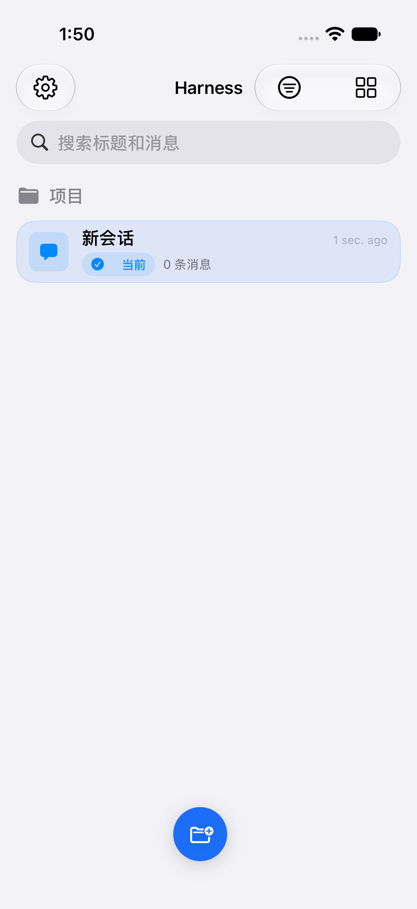
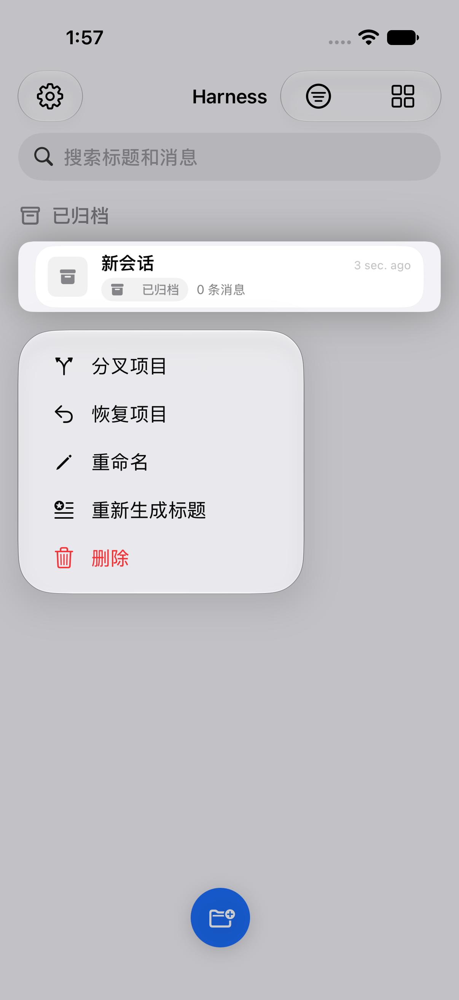
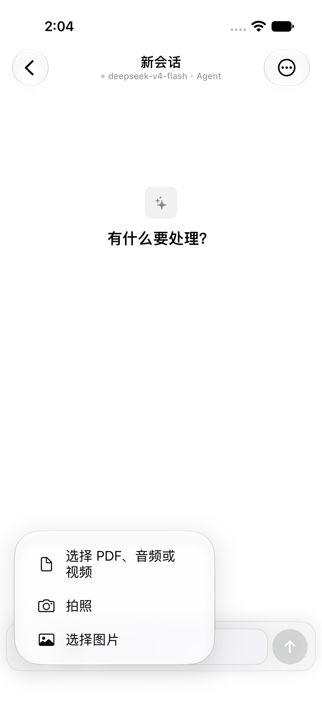
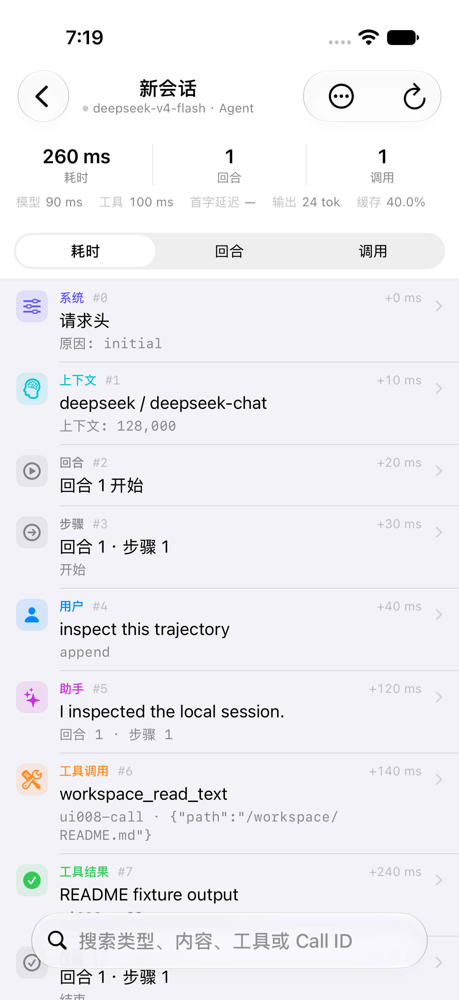
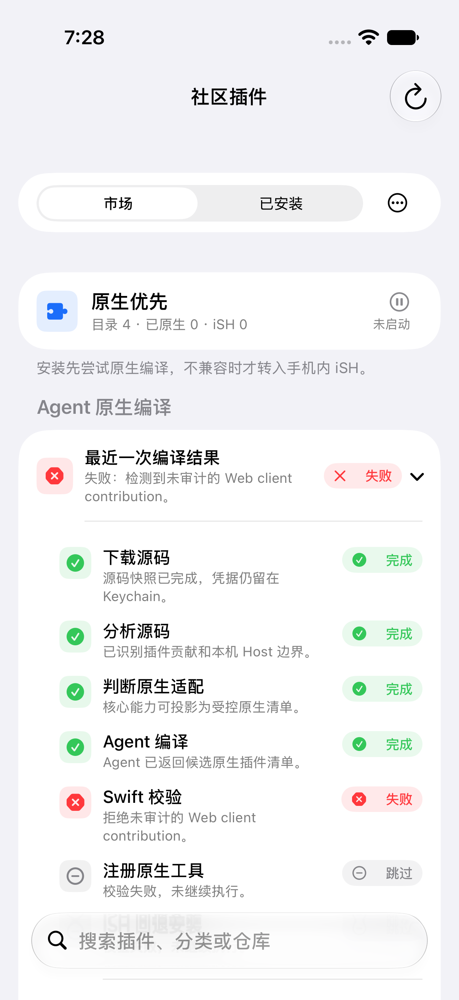
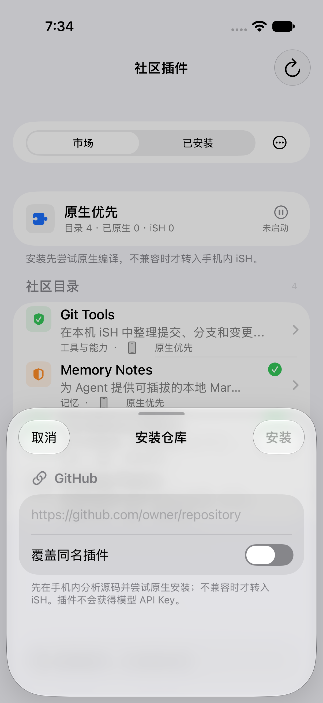

<div align="center">

# Harness Mobile

**把 DeepSeek Harness 的 Agent 工作流带到 iPhone：推理走你自己的模型 API，工具、插件与命令默认在设备本机执行。**

[](#快速开始)
[](#架构)
[](#界面与工作流)
[](#本机执行边界)
[](https://github.com/deepseek-ai/deepseek-harness)
[](LICENSE)

`iOS` · `SwiftUI` · `DeepSeek` · `OpenAI-compatible` · `Anthropic` · `Cordis` · `iSH` · `OpenMinis` · `Agent`

</div>

> [!WARNING]
> 这是面向个人 Xcode 侧载与开发调试的实验性项目，不是 App Store 发行版。请使用独立、限额、可撤销的模型 API Key；不要把密钥、私密日志或工作区内容提交到 Issue。

Harness Mobile 不是网页壳，也不会把命令悄悄转发到服务器。它是一个原生 SwiftUI Agent 客户端：模型推理由用户配置的 HTTPS API 完成；Agent loop、文件工作区、会话、轨迹、iOS 工具、Cordis Host-half 插件和 Linux 命令默认都在 iPhone 上运行。D-011 定义的 e2b、webhook、ACP 远程后端必须显式配置并显示状态，当前仍按能力目录保留 TODO/VERIFY。

<p align="center">
  
  
  
</p>

<p align="center"><sub>项目优先首页 · 项目归档/恢复 · 聚焦附件的聊天输入（iOS 27.0 Simulator）</sub></p>

<p align="center">
  
  
  
</p>

<p align="center"><sub>Agent 轨迹 · 原生插件编译诊断 · GitHub 仓库安装边界（iOS 27.0 Simulator）</sub></p>

## 为什么做它

桌面 Harness 的核心体验并不只是一个聊天窗口，而是模型、工具、上下文、轨迹、工作区与插件共同组成的可观察 Agent loop。Harness Mobile 选择把这条 loop 保留在手机上，并按 iOS 的能力边界重新实现。

- **BYOK 模型层**：DeepSeek、OpenAI-compatible 与 Anthropic 请求适配；模型与 API Key 可按会话选择。
- **本机行动层**：文件、照片 OCR、位置、通知、联系人、日历等由原生工具处理；Linux 命令在内嵌 iSH ARM64 Alpine guest 里执行。
- **可演进 Harness**：支持 Cordis Host-half JavaScript 包、原生 Client Sidecar、动态 Tool / Prompt 贡献、生命周期、设置与可追溯轨迹。
- **iPhone 工作流**：长对话虚拟化、会话/子 Agent、实时活动、持续处理和失败后的本地诊断导出。

## 快速开始

### 1. 前置条件

- macOS + **Xcode Beta**
- iOS 18+ 设备或 arm64 iOS Simulator
- 一个兼容的模型 API（DeepSeek、OpenAI-compatible 或 Anthropic）

### 2. 打开与运行

```sh
git clone https://github.com/liulingfei-1/deepseek-harness-ios.git
cd deepseek-harness-ios
open HarnessMobile.xcodeproj
```

在 Xcode 中选择已连接的 iPhone 或 arm64 Simulator，然后运行 `HarnessMobile`。首次启动按引导填写：

1. Provider / API Base URL；
2. API Key（仅存入本机 Keychain）；
3. 模型名称；
4. 思考模式或服务默认模式。

### 3. 命令行构建与测试

项目固定使用 Xcode Beta。SwiftPM 构建缓存必须放在 `/tmp`，不要在仓库根目录创建 `.build` 或 `DerivedData`。

```sh
DEVELOPER_DIR=/Applications/Xcode-beta.app/Contents/Developer \
  swift test --build-path /tmp/hm-build

DEVELOPER_DIR=/Applications/Xcode-beta.app/Contents/Developer \
  xcodebuild -project HarnessMobile.xcodeproj \
  -scheme HarnessMobile \
  -sdk iphonesimulator \
  -destination 'generic/platform=iOS Simulator' \
  ARCHS=arm64 ONLY_ACTIVE_ARCH=YES build

./Scripts/audit-no-remote-execution.sh
./Scripts/check-upstream-parity.sh
```

`HarnessISH.xcframework` 没有 x86_64 slice，因此 Xcode 构建必须指定 `ARCHS=arm64 ONLY_ACTIVE_ARCH=YES`。

## 能力一览

| 模块 | 当前能力 |
| --- | --- |
| 模型与流式 | DeepSeek thinking / reasoning replay、OpenAI-compatible SSE、Anthropic Messages、自动模型发现、图片输入与 provider 级重试 |
| Agent loop | 多轮工具调用、取消/恢复、任务状态、计划、todo、上下文注入、会话与受限本地子 Agent |
| 工作区 | App-private 文件工作区、读写编辑搜索、导入文件/图片、会话文件引用与轨迹关联 |
| 设备工具 | 相机/照片 OCR、位置、运动、通知、认证、通讯录、日历、提醒事项、语音、蓝牙及更多 iOS capability provider |
| 命令沙箱 | 内嵌 OpenMinis/iSH ARM64 Alpine，`shell_execute`、stdout/stderr、超时、取消与 guest 网络开关 |
| 插件 | Cordis Host-half、市场/GitHub/ZIP 安装、iSH 内 Node Host、动态 Tool/Prompt、设置热更新、启停/替换/回滚 |
| 可观测性 | append-only trajectory、run/turn/step、工具耗时、诊断导出、脱敏日志与插件代次 |
| iOS 工作流 | SwiftUI 原生聊天、长会话窗口化、Live Activity、Continued Processing、完成通知、App Intents |

完整工具、权限与平台限制见 [移动能力矩阵](Docs/MOBILE_CAPABILITIES.md)。桌面/Web 对照和每一个剩余差距见 [桌面兼容清单](Docs/DESKTOP_PARITY.md)。

## 界面与工作流

```text
Projects      项目优先首页、搜索、新建、归档、恢复、重命名与分叉
Chat          对话、附件、@文件/@会话引用、模型与权限、计划/Agent 模式
Tools         工作区、iSH 终端、任务/轨迹、插件与设置入口
Workspace     私有文件浏览、导入、编辑与 Agent 文件工具
Console       目标/计划/todo、Job、Trajectory 与诊断
Settings      Provider、后台、手机权限、插件市场与插件设置
```

当前没有独立 Project 持久化模型：首页以会话标题作为项目名称，避免同时维护两套数据真源；打开项目后进入对应对话，工具和诊断保留在二级入口。

工具卡片有专用的紧凑呈现，长对话与流式输出走窗口化/增量渲染，避免把全部历史视图同时重算。对于每次模型或工具调用，轨迹中保留输入输出摘要、耗时、轮次、缓存/使用量信息与插件处理链；凭据形态的字段和内容会在持久化前脱敏。

## 架构

```text
SwiftUI
  └─ AppModel (@MainActor)
      └─ AgentRuntime (actor)
          ├─ Provider adapters ── HTTPS ──> your model API
          ├─ LocalToolRegistry ────────────> native iOS tools
          ├─ HarnessISH ───────────────────> on-device iSH Alpine
          │                                  └─ Node.js / Cordis Host
          ├─ Workspace + Session + Trace ──> app-private storage
          └─ ActivityKit / notifications ──> iOS task projection
```

更多设计取舍见 [架构与执行边界](Docs/ARCHITECTURE.md)。

## 本机执行边界

Harness Mobile 的明确承诺是：**没有远程命令执行回退。**

| 可以做 | 不会做 |
| --- | --- |
| 使用你配置的模型 API 推理 | 将 shell / plugin 命令转发到项目服务器 |
| 在设备进程中运行 Swift Agent、原生工具和持久化 | 启动桌面宿主子进程或服务器 Executor |
| 在内嵌 iSH guest 中运行 Linux 命令和 Host-half JS 插件 | 下载后动态链接 Swift framework、native addon 或机器码 |
| 将 OCR/文件等**获批文本结果**交给当前模型 | 让 API Key 进入 iSH、插件、会话快照或诊断日志 |

模型 API Key 放在 iOS Keychain；插件 Host 和 iSH 都拿不到它。iOS 系统权限（照片、定位、NFC 等）仍由系统控制，Harness 的永久授权不能绕过系统弹窗或前台交互要求。

## 插件与扩展

社区插件安装遵循 **native-first → iSH Host-half → 明确降级** 的路径：

1. 市场、GitHub 仓库/子目录或本地 ZIP 提供源码；
2. 能映射为原生 Tool / Prompt / Native Client Sidecar 的部分优先接入 Swift Runtime；
3. 其余可运行的 Cordis Host-half JavaScript 包在手机 iSH Node Host 中运行；
4. Browser Client-half、React slot、原生 `.node` addon 或下载的 Swift/机器码没有等价运行时，会显示原因而不是伪装安装成功。

插件可声明原生 inspector、设置链接和 slash command；更新采用 generation、dispose 与 rollback，避免失败替换把现有插件一起带崩。协议与清单示例见 [Native Client Plugins](Docs/NATIVE_CLIENT_PLUGINS.md)，iSH Host 细节见 [Plugin Host](Docs/ISH_PLUGIN_HOST.md)。

## 与桌面 Harness 的关系

本项目不是官方 DeepSeek Harness 客户端，也不宣称 1:1 复制桌面 Web UI。它复用、对照并持续追踪上游的 Agent 语义，同时为 iOS 做了原生替代。

- **已覆盖核心路径**：Provider、会话、工具循环、工作区、轨迹、计划、图片输入、插件 Host-half、Jobs/受限子 Agent 与本机 shell。
- **仍在补齐**：完整桌面信息架构、更多 workflow/worker 合约、桌面级 Skill registry、LSP 与持续交互式 PTY。
- **默认不做**：Remote Executor、服务器工具回退、任意 Web/HTTP 工具和下载原生代码执行；e2b/webhook/ACP 只按 D-011 作为显式配置能力推进，未配置时不存在。

升级上游时请先跑 `./Scripts/check-upstream-parity.sh`，再按 [升级说明](Docs/UPGRADING.md) 和 [修补清单](Docs/DESKTOP_PARITY_REMEDIATION.md) 逐项更新；不要仅因 package 版本变化而声称兼容。

## 项目结构

```text
HarnessMobile/
  App/                 AppModel、启动、生命周期、Agent 入口
  Core/Agent/          Agent loop、上下文、压缩、子 Agent
  Core/Network/        Provider wire、SSE、模型发现与重试
  Core/Plugins/        Cordis、Native Agent、iSH Host bridge
  Core/Tools/          文件、工作区、iOS capability、iSH 命令
  Core/Storage/        会话、工作区、诊断、轨迹
  Features/            SwiftUI Chat / Files / Plugins / Trajectory
  Resources/PluginHost iSH 内 Node/Cordis Host 与市场安装管线
HarnessMobileTests/    XCTest、wire fixture、Node smoke 测试
Docs/                  架构、能力、兼容、升级与证据
Vendor/                固定的上游/兼容实现与补丁
```

`project.yml` 是 XcodeGen 的工程真源；生成后的 `HarnessMobile.xcodeproj` 同样提交，因此仅用 Xcode 也能直接打开。

## 路线图

- [x] BYOK provider、多协议流式、模型发现与 Keychain 隔离
- [x] iSH 本机命令沙箱与 Cordis Host-half
- [x] 工作区、文件上下文、图片输入、轨迹与诊断导出
- [x] 社区插件市场、原生 Sidecar、安装/更新/回滚基础设施
- [x] Live Activity、持续处理、长会话渲染与任务恢复
- [ ] 完成桌面 Web 的剩余工作区/Jobs/Inspect 信息架构对齐
- [ ] 扩展 workflow/worker、Skill registry 与更多插件协议适配
- [ ] 以 iPhone 16 Pro 持续验证真实 API、插件、后台、热与内存压力场景

路线图状态以 [桌面兼容清单](Docs/DESKTOP_PARITY.md) 和 [修补日志](Docs/DESKTOP_PARITY_REMEDIATION.md) 为准。

## 贡献与反馈

欢迎提交 bug、兼容性证据、插件适配与 UI 改进。开始前请阅读：

- [CONTRIBUTING.md](CONTRIBUTING.md)：构建、测试、提交和验收规则；
- [SECURITY.md](SECURITY.md)：敏感问题与凭据报告边界；
- [AI Engineering Playbook](Docs/AI_ENGINEERING_PLAYBOOK.md)：AI 协作下的大型代码库工作方式；
- [Third-Party Notices](THIRD_PARTY_NOTICES.md)：上游来源、许可证与分发义务。

提交 Issue 时请附上已脱敏的 `Harness-Diagnostics-*.log`、复现步骤、设备/系统版本、选用 provider 以及是否在前后台切换后发生；**绝不要附 API Key、Authorization header、私人文件内容或未脱敏会话导出。**

## 许可证与致谢

本项目整体采用 [GNU General Public License v3.0](LICENSE)。项目整合并修改了 GPLv3 的 on-device iSH 与 OpenMinis 组件；iSH 的附加分发条款保存在 [LICENSES/ISH-LICENSE.IOS](LICENSES/ISH-LICENSE.IOS)，完整上游声明见 [LICENSES/ISH-LICENSE.md](LICENSES/ISH-LICENSE.md)。分发源代码或构建产物前，请同时阅读 [Third-Party Notices](THIRD_PARTY_NOTICES.md)，并履行对应的源码提供与通知义务。

特别感谢 [DeepSeek Harness](https://github.com/deepseek-ai/deepseek-harness)、[OpenMinis](https://github.com/OpenMinis/OpenMinis) 与 [iSH ARM64](https://github.com/OpenMinis/ish-arm64) 的开源工作。
